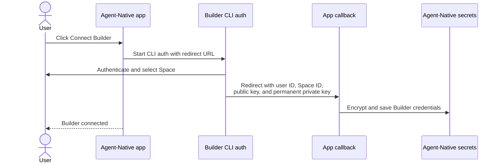
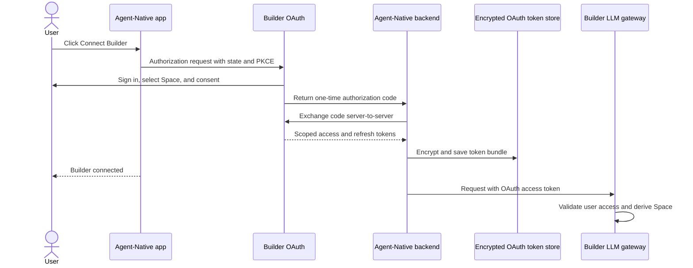

# Builder OAuth Migration for Agent-Native

## Summary

Agent-Native currently connects a Builder account through Builder's CLI
authentication flow. That flow was designed for a local CLI, not a hosted,
multi-user web application.

CLI auth creates a permanent, unrestricted private key for a Builder Space and
returns that key through a browser callback URL. Builder limits callback
domains because redirecting this callback to an attacker-controlled site would
expose a full-admin key.

This causes the reported Railway failure:

1. The user opens **Connect Builder** from an Agent-Native app deployed at
   `*.up.railway.app`.
2. Agent-Native asks Builder CLI auth to return to the Railway deployment.
3. Railway is not an accepted CLI-auth callback domain.
4. Builder rejects the callback and falls back to `localhost:10110`.
5. The browser cannot reach that local address, so the connection never
   completes.

Adding Railway to the callback allowlist is not the correct general fix. Any
user can create a Railway deployment, and the callback contains a reusable
full-admin private key.

## Current Flow

For Tony's Railway deployment, Builder rejects `Callback` and redirects to
`localhost:10110` instead.

### Security properties of the current credentials

- The private key has full administrative access to the selected Space.
- It does not expire.
- It is not restricted by OAuth scopes.
- It is returned through the browser callback URL.
- Callback-domain restrictions are the primary protection against redirecting
  the key to an attacker.

Agent-Native encrypts the key after receiving it, but encrypted storage does not
remove the risk of transporting an unrestricted key through a browser URL.

## Required Fix

Replace Builder CLI auth with Builder OAuth for new Agent-Native connections.

The OAuth flow should:

1. Authenticate the Builder user.
2. Ask the user to consent to narrowly defined scopes.
3. Return a short-lived, single-use authorization code.
4. Exchange that code for tokens from the Agent-Native backend.
5. Store access and refresh tokens in Agent-Native's encrypted OAuth token
   store.
6. Refresh expiring tokens automatically.
7. Revoke the connection when the user disconnects Builder.
8. Let Builder APIs validate the user and derive the Space from the OAuth token.

OAuth removes the permanent private key from the browser callback. It also
provides expiration, refresh, revocation, and scope boundaries.

## Where to Implement It

The Agent-Native integration belongs primarily in the
`BuilderIO/agent-native` repository.

### Existing OAuth foundation to reuse

| Area                       | Location                                                        | Purpose                                                    |
| -------------------------- | --------------------------------------------------------------- | ---------------------------------------------------------- |
| OAuth token API            | `packages/core/src/oauth-tokens/index.ts`                       | Public token lifecycle exports                             |
| Encrypted token storage    | `packages/core/src/oauth-tokens/store.ts`                       | Encrypt and persist access/refresh tokens                  |
| Token lifecycle            | `packages/core/src/oauth-tokens/lifecycle.ts`                   | Resolve, save, revoke, and inspect credentials             |
| OAuth 2.1 client reference | `packages/core/src/mcp-client/oauth-client.ts`                  | Discovery, PKCE, refresh, revocation, and guarded requests |
| Builder MCP catalog entry  | `packages/core/src/client/resources/mcp-integration-catalog.ts` | Existing `mcp.builder.io` integration                      |

`https://mcp.builder.io/mcp/publish` already exercises Builder's OAuth-enabled
remote MCP flow and is the best in-repository reference to trace first.

### CLI-auth code to replace or retire

| Area                                   | Location                                                                                    | Required change                                                           |
| -------------------------------------- | ------------------------------------------------------------------------------------------- | ------------------------------------------------------------------------- |
| CLI-auth URLs and signed state         | `packages/core/src/server/builder-browser.ts`                                               | Add OAuth authorization helpers and retire CLI-auth callback construction |
| Connect and callback routes            | `packages/core/src/server/core-routes-plugin.ts`                                            | Start OAuth, process callback, and perform the code exchange              |
| Existing Builder credential resolution | `packages/core/src/server/credential-provider.ts`                                           | Resolve OAuth access instead of requiring `BUILDER_PRIVATE_KEY`           |
| Client connection state                | `packages/core/src/client/settings/useBuilderStatus.ts`                                     | Launch OAuth and report connected, expired, and revoked states            |
| Onboarding connection UI               | `packages/core/src/client/onboarding/OnboardingPanel.tsx` and related connection components | Keep the Connect Builder experience while changing its underlying flow    |
| Desktop Builder connection handling    | `packages/desktop-app/src/main/index.ts`                                                    | Update popup/callback handling if the new OAuth flow affects desktop      |

Tests that currently exercise CLI auth should be replaced or supplemented with
OAuth coverage, especially:

- `packages/core/src/server/builder-browser.spec.ts`
- `packages/core/src/server/core-routes-plugin.spec.ts`
- `packages/core/src/client/settings/useBuilderStatus.spec.tsx`
- OAuth token lifecycle and refresh tests

Because this changes publishable `@agent-native/core` behavior, the
implementation also requires a core changeset.

## Builder-Platform Work

Builder OAuth support exists, but the following contract must be available for
Agent-Native:

- authorization and token endpoints;
- Agent-Native client registration;
- PKCE and client-authentication requirements;
- required scopes;
- Space-selection behavior;
- access-token lifetime;
- refresh-token behavior;
- revocation;
- token claims needed by the LLM gateway.

The Builder LLM gateway must accept OAuth access tokens, validate the user's
current access, and derive the Space identity from the validated token instead
of trusting a client-supplied Space ID.

Any missing provider or gateway behavior belongs in the Builder platform
repository where the new OAuth implementation lives. Kyle or the Builder team
must identify that repository and the relevant implementation files.

## Migration and Rollout

1. Existing CLI-auth private-key connections keep working as runtime fallback.
2. All new connections and reconnects use OAuth.
3. Prefer OAuth credentials when both OAuth and legacy credentials exist; do
   not fall back to legacy keys when OAuth custody exists but is unusable.
4. Surface reconnect when OAuth expires or is revoked.
5. Disconnect revokes remote tokens when possible and deletes local custody.
6. Measure remaining legacy connections.
7. Remove CLI-auth hosted paths only after existing users have migrated.

There is no automatic conversion from a private key to an OAuth grant. Existing
users must complete OAuth consent.

## Implementation status

Shipped in Agent-Native core on this branch:

- PKCE OAuth connect / callback / status / disconnect under `/_agent-native/builder/*`
- Encrypted per-user custody for `builder:ai:invoke` against `https://api.builder.io`
- Builder AI engine prefers refreshed OAuth bearer tokens and omits legacy
  `apiKey` / identity headers when OAuth is used
- Legacy stored `BUILDER_*` private/public key pairs remain a runtime fallback
- Connect Builder UI and templates open the app-local OAuth trampoline (no
  `cliAuthUrl`)
- Callback URLs are same-origin HTTPS (loopback HTTP only in development), with
  no fixed domain allowlist — Railway and other hosted origins work via Builder
  dynamic client registration

Desktop-local Builder CLI auth and the desktop **Restart to Update** bug remain
out of scope.

## Reference Work

- Ask Alice for the Agent-Native template OAuth implementation and associated
  PRs covering scopes, launch, consent, and token retrieval.
- Trace the existing Builder MCP OAuth flow against
  `https://mcp.builder.io/mcp/publish`.
- Obtain the relevant Builder OAuth and LLM gateway files from Kyle.

## Separate Issue

The desktop **Restart to Update** rendering/state bug is unrelated to Builder
OAuth and should be investigated and shipped separately.
