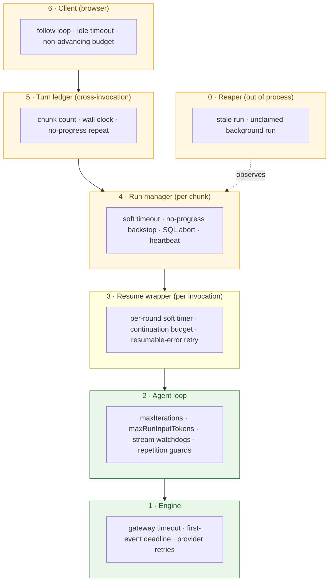
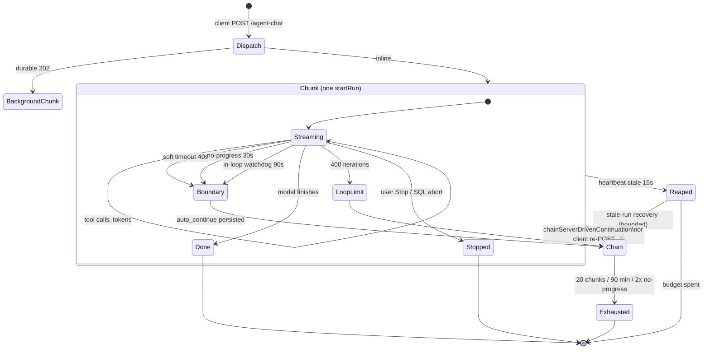
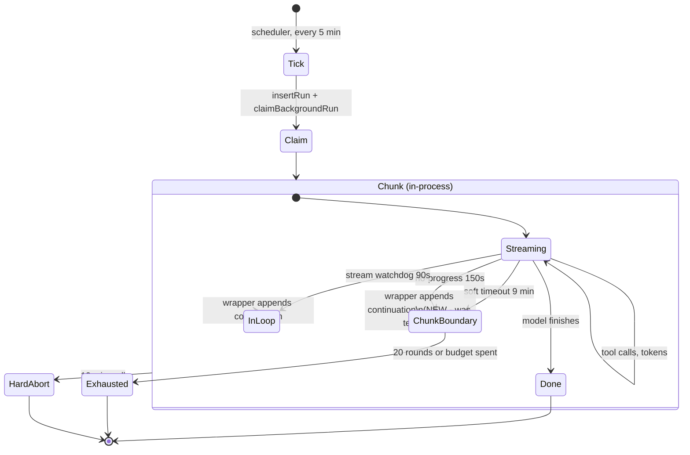

# Agent run stop conditions: map, archaeology, and cleanup plan

**Scope:** every condition that can end an agent turn in `@agent-native/core`,
across the four entry points (main chat, A2A/MCP, agent teams, background
automations).
**Written:** 2026-08-21, against `packages/core@0.168.5`.
**Why:** the same class of bug — a healthy run killed by a watchdog — has been
patched at least six times in four months. This maps the machine so we can
argue about it as a whole instead of one constant at a time.

---

## 1. The question, answered up front

> In theory this is a loop of LLM calls calling tools. None of these checks
> should be needed. Why are they?

**In theory, three stop conditions are enough**, and all three are inside
`runAgentLoop` (`agent/production-agent.ts:4881`):

| Stop | Meaning |
| --- | --- |
| The model returns no tool calls | The turn is done. |
| `maxIterations` (400) | Budget: this turn has taken too many rounds. |
| `maxRunInputTokens` (20M) | Budget: this turn has cost too much. |

Everything else — and there are **~40 more** — exists because of four facts
about the world the loop runs in. None of them is about the loop:

1. **The process gets killed.** A hosted foreground invocation dies at ~57-60s;
   a background function at 15 min. The turn is longer than the process, so the
   turn must be *chunked* and *resumed*. This is the single largest source of
   machinery: soft timeouts, `auto_continue`, continuation budgets, the run
   ledger, the client's follow loop.
2. **The transport lies.** A gateway can hold a socket open and stream nothing,
   or drop mid-stream after a partial tool-call. "Still connected" is not
   "still working", so liveness needs its own watchers.
3. **The model loops.** Twenty-seven identical `run-code` calls is not deep
   work. Repetition, not volume, has to be bounded.
4. **A dead process writes no outcome.** If the isolate is killed, nobody
   records the failure — so a *separate* observer (heartbeat + reaper) has to
   decide the run is dead from outside.

So: the checks are needed. **What is badly architected is not that they exist —
it is that they were each added at a different layer, watching a different
clock, with their ordering written in prose and enforced by nothing.** Section 6
is the evidence; section 7 is what to do about it.

---

## 2. Layer map

Every stop lives at one of six layers. The layer determines who, if anyone, can
recover it.

The green layers are the ones whose stops are *about the work*. The amber ones
are all about the host. That ratio is the architecture problem in one picture.

---

## 3. Complete stop inventory

Columns: **Fires when** · **Effect** · **Who recovers it** · **Verdict**.

### Layer 2 — the agent loop (`production-agent.ts`)

| Stop | Fires when | Effect | Recovered by | Verdict |
| --- | --- | --- | --- | --- |
| Normal finish | Model returns no tool calls | `done` | — | **Keep.** The real one. |
| `maxIterations` (400) | 400 rounds in one chunk | `loop_limit` | Turn ledger / client | **Keep.** |
| `maxRunInputTokens` (20M) | Turn input tokens exceeded | tripwire, terminal | nobody (by design) | **Keep.** |
| `MODEL_STREAM_NO_PROGRESS_TIMEOUT_MS` (90s) | 90s between engine frames | `auto_continue{no_progress}` + break | resume wrapper | **Keep.** Recoverable, in-loop. |
| `ACTION_PREPARATION_NO_PROGRESS_TIMEOUT_MS` (90s) | 90s of a tool's args not growing | same | resume wrapper | **Keep.** |
| `FOREGROUND_FIRST_MODEL_EVENT_TIMEOUT_MS` (25s) | No first frame, hosted foreground only | same | resume wrapper | **Keep**, but see §6.2. |
| `ACTION_PREPARATION_ZERO_BYTE_RESTART_LIMIT` (2) | Args stream restarts twice at 0 bytes | same | resume wrapper | **Keep.** |
| `stream_ended` | Stream closes with partial tool input or no content | `auto_continue{stream_ended}` | resume wrapper | **Keep.** |
| `MAX_IDENTICAL_TOOL_CALLS` (8) | Same (tool,args) 8× | terminal stop | nobody | **Keep.** |
| `MAX_IDENTICAL_TOOL_ERRORS` (3) | Same (tool,args,error) 3× | error injected | model | **Keep.** |
| `MAX_SAME_ERROR_ACROSS_ARGUMENTS` (6) | Same (tool,error), any args, 6× | terminal stop | nobody | **Keep.** |
| `MAX_WRITE_TOOL_INTERRUPTIONS` (2) | Write tool re-interrupted twice | terminal stop | nobody | **Keep.** |
| `MAX_RETRIES` (3) / `BUILDER_GATEWAY_ERROR_MAX_RETRIES` (1) | Engine error | in-loop retry | itself | **Keep.** |

### Layer 3 — resume wrapper (`run-loop-with-resume.ts`)

| Stop | Fires when | Effect | Recovered by | Verdict |
| --- | --- | --- | --- | --- |
| Per-round soft timer | `roundTimeoutMs` elapsed | abort round | itself → next round | **Keep.** |
| `MAX_RUN_LOOP_CONTINUATIONS` (6) / background (20) | Rounds exhausted | `RUN_BUDGET_EXHAUSTED` error | nobody | **Keep.** |
| `SELF_CHAIN_MIN_CONTINUATION_BUDGET_MS` (8s) | <8s of budget left | stop before starting a round | nobody | **Keep.** |
| Resumable engine error | gateway timeout / socket hang up / 5xx | append continuation, retry | itself | **Keep.** |
| `MAX_BACKGROUND_RATE_LIMIT_CONTINUATIONS` (1) + 20s delay | transient 429/529, background only | one cooled retry | itself | **Keep.** |

### Layer 4 — run manager (`run-manager.ts`)

| Stop | Fires when | Effect | Recovered by | Verdict |
| --- | --- | --- | --- | --- |
| Soft timeout (40s fg / 13 min bg / 9 min automation) | chunk budget elapsed | `auto_continue{run_timeout}` + checkpoint + abort | HTTP chain, or in-invocation (new) | **Keep.** |
| No-progress backstop (150s, 30s effective fg) | 150s no *forwarded* progress **and** nothing in flight | same, reason `no_progress` | as above | **Keep — but this is the problem child.** §6.1. |
| SQL abort check (3s poll) | row no longer `running`, or Stop pressed | abort turn | nobody (intended) | **Keep.** |
| Heartbeat (1.5s) | — | writes liveness | — | **Keep.** |
| Per-tool ceiling = soft timeout − 5s | tool exceeds it | tool error | model | **Keep.** |

### Layer 5 — turn ledger (`production-agent.ts`, cross-invocation)

| Stop | Fires when | Effect | Verdict |
| --- | --- | --- | --- |
| `MAX_BACKGROUND_RUN_CONTINUATIONS` (20) | 20 chunks in one turn | refuse to chain | **Keep.** Cost ceiling. |
| `turnRunCount > 20 + 5` | ledger says 25 runs | terminal | **Merge** with the above — two bounds on one quantity. |
| `MAX_TURN_WALL_CLOCK_MS` (90 min) | turn older than 90 min | terminal | **Keep.** |
| `MAX_CONSECUTIVE_NO_PROGRESS_CONTINUATIONS` (2) | 2 chunks ending on the same error with nothing produced | stop chaining | **Keep.** |
| `MAX_NESTED_SELF_DISPATCH_DEPTH` (6) | dispatch recursion | terminal | **Keep.** |

### Layer 0 — reaper (`run-store.ts`, another isolate)

| Stop | Fires when | Effect | Verdict |
| --- | --- | --- | --- |
| `RUN_STALE_MS` (15s) fg / `BACKGROUND_RUN_STALE_MS` (90s) | heartbeat older than window | `error:stale_run` | **Keep.** |
| `BACKGROUND_PROCESSING_RUN_STALE_MS` (45s) | claimed worker went quiet | same | **Keep.** |
| `UNCLAIMED_BACKGROUND_RUN_GRACE_MS` (25s) | 202 returned, nobody claimed | `background_worker_never_started` | **Keep.** |
| `IN_FLIGHT_RUN_STALE_GRACE_MS` (14.5 min) | grace while a tool is in flight | suspends reap | **Keep.** |
| `STALE_RUN_RECOVERY_*` (25 runs / 3 no-progress / 20s) | recovery budget | stop recovering | **Keep.** |

### Layer 6 — client (`client/agent-chat-adapter.ts`)

| Stop | Fires when | Effect | Verdict |
| --- | --- | --- | --- |
| `BACKGROUND_FOLLOW_IDLE_TIMEOUT_MS` (210s) | no active run for the turn | give up following | **Keep.** |
| `BACKGROUND_FOLLOW_ATTACH_WATCHDOG_MS` (90s) | reattach never lands | re-poll | **Keep.** |
| `MAX_NON_ADVANCING_CONTINUATIONS` (3) | 3 rounds that produced nothing new | end turn | **Keep.** Best-designed bound in the stack — it reads *progress*, not a clock, and it replaced five separate budgets. |
| `MAX_TOTAL_TRANSIENT_CONTINUATIONS` (12) | 12 failure-driven rounds | end turn | **Keep.** |
| `MAX_LOOP_LIMIT_CONTINUATIONS` (25) | 25 work-boundary rounds | end turn | **Keep.** |
| `MAX_FOLLOWED_BACKGROUND_RUNS` (24) / `MAX_BACKGROUND_FOLLOW_WALL_TIME_MS` (95 min) | client backstop above server bounds | end turn | **Keep.** |
| `MAX_REPEATED_BACKGROUND_TERMINAL_REASONS` (3) | same terminal reason 3× | end turn | **Keep.** |

### Layer 1 — engine

| Stop | Fires when | Effect | Verdict |
| --- | --- | --- | --- |
| Builder gateway timeout (45s fg / 14 min bg) | request deadline | resumable error | **Keep.** |
| `FIRST_STREAM_EVENT_TIMEOUT_MS` (120s) | no first frame | abort | **DELETE or lower** — unreachable, §6.2. |

---

## 4. Foreground turn state machine

The important shape: **`Boundary` is not a failure.** It is the normal way a
turn crosses a process wall. Everything in the amber layers exists to get from
`Boundary` back to `Chunk`.

## 5. Background automation state machine

Before the current branch, the `ChunkBoundary --> Chunk` edge did not exist:
the checkpoint aborted the turn-level controller, which is the same signal the
wrapper's `while (!signal.aborted)` is gated on. Every one of the recovery
mechanisms below it was unreachable. That is the whole of Finding 1 in the
Marisco brief, and it accounted for **37% of that deployment's analyst runs**.

---

## 6. Findings

### 6.1 The no-progress backstop is a special-case stack, and it is still growing

`RUN_NO_PROGRESS_HARD_TIMEOUT_MS` was introduced on **2026-07-02**
(`b68e4f72a`, "Make durable background chat recovery server-owned"). Since then
it has been patched at least five times, every time by **adding an exclusion**:

| Date | Commit | What was excluded |
| --- | --- | --- |
| 2026-07-02 | `c213eb81b` | Window extended for durable background |
| 2026-07-02 | `b4c0b9d71` | `clear` events stopped counting as progress |
| 2026-07-26 | `52cce19f6` | Checkpoint made durable (`checkpointRunBoundary`) |
| 2026-07-30 | `c0e7d64b7` | Foreground value derived from soft timeout instead of flat |
| 2026-08-20 | `483f03d22` | **`inFlightWorkDelta`** — suspend while a model stream is open |

`483f03d22` landed the day before this document. Its own comment explains why
the previous four were not enough:

> *this clock and the loop's `lastModelStreamProgressAt` measure DIFFERENT
> events. An extended-thinking phase bumps the inner clock on every engine frame
> while forwarding nothing… runs whose worst gap crossed 150s died while still
> streaming, some by a single second.*

That is the diagnosis, and it generalises past the fix that was applied to it.
**The backstop watches the wrong signal.** It counts events the loop *forwards
to the client*, which is a rendering concern, and infers liveness from it. Every
patch has been a new exclusion for a case where forwarding and working diverge:
keepalives, `clear`, zero-byte prep, and now the model stream. There will be
more, because the list of ways to work without forwarding is open-ended.

**The client already solved this exact problem, better.**
`MAX_NON_ADVANCING_CONTINUATIONS` (client, 3) reads *advance* — did this round
produce something new? — instead of a clock, and its comment records that it
"replaced five separate budgets… each of which existed because the rung above it
had a hole the next one patched." The server backstop is at exactly the stage
those five were at.

**Proposal.** Invert the backstop's default: rather than "no forwarded event for
N seconds means dead unless one of five exclusions applies", make it "a run is
alive while any *declared unit of work* is open." `inFlightWorkDelta` is already
that declaration — the fix from yesterday is the right primitive applied as an
exception. Promote it: work brackets (model stream, tool call, agent call) are
the liveness signal; the timer is only the bound on a bracket that never closes,
and each bracket already has its own tighter bound. The backstop then becomes a
bound on *unbracketed* time, which is a small and enumerable set.

### 6.2 `FIRST_STREAM_EVENT_TIMEOUT_MS` (120s) is unreachable

All three engines wrap their stream in a 120s first-event deadline. Every one of
them is called from `runAgentLoop`, whose own `MODEL_STREAM_NO_PROGRESS_TIMEOUT_MS`
(90s) watches the same event and fires first — and on the hosted foreground lane
`FOREGROUND_FIRST_MODEL_EVENT_TIMEOUT_MS` (25s) and the Builder gateway timeout
(45s) both fire before that. The 120s bound cannot fire on any current path.

**Action:** delete it, or lower it below 90s and delete the loop-level one. Two
bounds on the identical event is one bound plus a maintenance cost.

### 6.3 Two bounds on one quantity: chunks per turn

`MAX_BACKGROUND_RUN_CONTINUATIONS` (20) gates chaining, and five lines of
different code checks `turnRunCount > MAX_BACKGROUND_RUN_CONTINUATIONS + 5`.
The `+ 5` is slack for redispatches the first bound does not see.
`STALE_RUN_RECOVERY_MAX_TURN_RUNS` (25) is a third spelling of the same number.

**Action:** one function, `resolveTurnRunBudget()`, returning both the chain
bound and the ledger bound, with the slack named.

### 6.4 The ordering invariants were prose until this branch

The source is full of ordering arguments — `FOREGROUND_FIRST_MODEL_EVENT <
HOSTED_SOFT_TIMEOUT < MODEL_STREAM_NO_PROGRESS < RUN_NO_PROGRESS`, the
three-site invariant in `agent-chat-adapter.ts`, the client-above-server
invariant — and until this branch none was checked. One was already violated in
the shipped build: the automation path took a 13-minute chunk budget under its
own 10-minute hard abort, making its recoverable boundary dead code.

`app-config/run-lifecycle-invariants.ts` (this branch) asserts eight of them at
configuration resolve time. **Gap: the client-side chain is still unasserted in
the same place** — it lives in a comment plus one spec. Those numbers should
come from the same resolver the server uses, projected into the bundle.

### 6.5 Gaps — things nothing bounds

| Gap | Why it matters |
| --- | --- |
| **Time spent inside the loop between frames** | The model-stream bound covers *waiting for the engine*, not a hang while the loop processes a frame it already has. `inFlightWorkDelta`'s own comment admits this. Only the chunk soft timeout covers it. |
| **Wall clock for a non-chat turn** | `MAX_TURN_WALL_CLOCK_MS` is enforced on the chat continuation path. An automation is bounded only by its 10-minute hard abort — no equivalent per-turn ceiling across recovered chunks. |
| **Cost, as opposed to tokens** | `maxRunInputTokens` bounds one turn's input. Nothing bounds spend across a chained turn in currency, which is the unit a deployment actually budgets. |
| **Boundary rate** | Until this branch, nothing counted boundaries. A 37% terminal-boundary rate was invisible for two releases. Now emitted as `agent_run_boundary`; **it still needs a dashboard and an alert**, or it is invisible in a second way. |

### 6.6 Deletion candidates, ranked

1. `FIRST_STREAM_EVENT_TIMEOUT_MS` — unreachable (§6.2).
2. The `+ 5` ledger bound — fold into one turn-run budget (§6.3).
3. `DEFAULT_BACKGROUND_RUN_SOFT_TIMEOUT_MS` — an alias for
   `BACKGROUND_SOFT_TIMEOUT_CEILING_MS`; two names, one number.
4. `BACKGROUND_RUN_STUCK_MS` — was a third copy of the 10-minute automation
   abort; already folded into `resolveBackgroundRunHardTimeoutMs()` on this branch.
5. The five exclusion branches in `shouldBumpProgressForEvent` — deletable *if*
   §6.1 lands, because bracketed liveness subsumes all of them.

---

## 7. Plan

Ordered so each step makes the next one measurable.

| # | Step | Why now |
| --- | --- | --- |
| 1 | **Ship the current branch** (chunk-scoped checkpoints, automation tracing, boundary counters, config + invariants) | Stops the bleeding and, critically, makes boundaries countable. Nothing below is verifiable without that. |
| 2 | **Put `agent_run_boundary` on a dashboard**, split by `recovered` | One number — recovered vs terminal — answers "is any of this working?" |
| 3 | **Delete §6.2 and §6.3** | Pure removal, no behaviour change, shrinks the surface before restructuring it. |
| 4 | **Invert the backstop to bracketed liveness (§6.1)** | The structural fix. Do it after (2) so the boundary rate proves it. |
| 5 | **Delete the exclusion branches the inversion subsumes** | The point of (4). Skipping this leaves both mechanisms and doubles the confusion. |
| 6 | **Project the client bounds from the server resolver (§6.4)** | Closes the last unasserted invariant chain. |
| 7 | **Add a per-turn wall clock to the automation path (§6.5)** | The one genuine missing bound. |

**Non-goal:** reducing the number of constants for its own sake. Most of them
are load-bearing and well-argued. The win is not fewer numbers — it is fewer
*clocks*: today six layers each measure liveness their own way, and every bug in
this class has come from two of them disagreeing about whether the same run was
alive.
