# Store registry: release-owned schema, verify-only runtime

**Status:** Proposal for the framework working group, with a reference
implementation in the working tree.
**Scope:** `packages/core` framework stores. Template-owned tables are in scope
for a follow-up (see [Open questions](#open-questions)).

---

## Summary

Every framework store used to own its schema through an `ensure*Table()`
function that ran on the request path: probe the catalog, create what is
missing, backfill, widen columns, then memoize for the life of the process. We
serve from serverless functions, so the life of the process is one cold start,
and those checks ran on every cold start of every app.

This proposal makes schema a **release artifact** instead of a runtime concern:

- Each store declares its tables once, as an ordered list of named, idempotent
  migrations, with `defineStore()`.
- A generated registry lists every store. The release step applies pending
  migrations once per database and records them in a ledger table,
  `_an_store_migrations`.
- Hosted request runtimes never issue DDL. The first time a process touches any
  store, it reads the ledger with **one query**, shared by every store, and
  fails loudly with `SchemaNotMigratedError` if the deploy's migrations were not
  applied.
- Local development and self-hosted servers keep today's self-provisioning
  behavior through the same migration definitions.

### At a glance

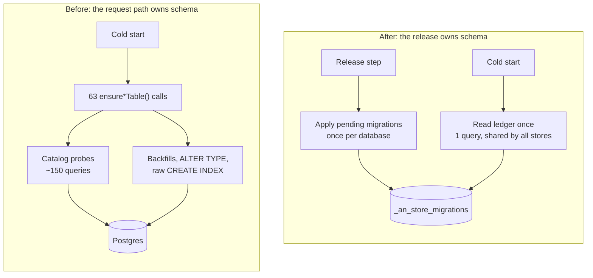
```mermaid
flowchart LR
  subgraph before["Before: the request path owns schema"]
    direction TB
    B1["Cold start"] --> B2["63 ensure*Table() calls"]
    B2 --> B3["Catalog probes<br/>~150 queries"]
    B2 --> B4["Backfills, ALTER TYPE,<br/>raw CREATE INDEX"]
    B3 --> DB1[("Postgres")]
    B4 --> DB1
  end
  subgraph after["After: the release owns schema"]
    direction TB
    A0["Release step"] --> A1["Apply pending migrations<br/>once per database"]
    A1 --> DB2[("_an_store_migrations")]
    A3["Cold start"] --> A4["Read ledger once<br/>1 query, shared by all stores"]
    A4 --> DB2
  end
  before ~~~ after
```

---

## Problem

### The pattern

```ts
let _initPromise: Promise<void> | undefined;
export async function ensureTable(): Promise<void> {
  if (!_initPromise) {
    _initPromise = (async () => {
      await ensureTableExists(TABLE, CREATE_SQL);
      await ensureColumnExists(TABLE, "x", "ALTER TABLE ... ADD COLUMN ...");
      await ensureIndexExists("idx", "CREATE INDEX ...");
      await client.execute("UPDATE ... backfill ...");
    })();
  }
  return _initPromise;
}
```

Core had **63 stores** written this way and **664 `await ensure*()` call
sites**. This is what the first call to each store did on a cold start:

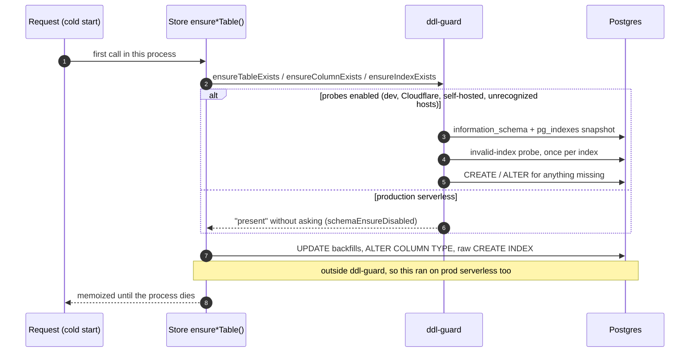
```mermaid
sequenceDiagram
  autonumber
  participant R as Request (cold start)
  participant S as Store ensure*Table()
  participant G as ddl-guard
  participant DB as Postgres
  R->>S: first call in this process
  S->>G: ensureTableExists / ensureColumnExists / ensureIndexExists
  alt probes enabled (dev, Cloudflare, self-hosted, unrecognized hosts)
    G->>DB: information_schema + pg_indexes snapshot
    G->>DB: invalid-index probe, once per index
    G->>DB: CREATE / ALTER for anything missing
  else production serverless
    G-->>S: "present" without asking (schemaEnsureDisabled)
  end
  S->>DB: UPDATE backfills, ALTER COLUMN TYPE, raw CREATE INDEX
  Note over S,DB: outside ddl-guard, so this ran on prod serverless too
  S-->>R: memoized until the process dies
```

### What it cost

I measured one cold start that touches every framework store, against a
database that was already fully migrated:

| Runtime                                                                                | Statements per cold start | Of which                                                                                                                                              |
| -------------------------------------------------------------------------------------- | ------------------------- | ----------------------------------------------------------------------------------------------------------------------------------------------------- |
| Probes enabled (long-lived Node, `netlify dev`, Cloudflare, any host not env-detected) | ~220                      | 2 full `information_schema.columns` + `pg_indexes` reads, 148 per-index invalid-index probes, 23 backfill writes, ~35 DDL / `ALTER`, plus the rest    |
| Production serverless (Netlify, Vercel, Lambda)                                        | ~50                       | Backfills and DDL that bypass the probe short-circuit (below)                                                                                         |
| **This proposal, hosted**                                                              | **1**                     | `SELECT store_id, name FROM _an_store_migrations`                                                                                                     |

Warm requests were already free in every case, because of the per-process memo.
The cost is per cold start, and cold starts are the thing serverless has most
of.

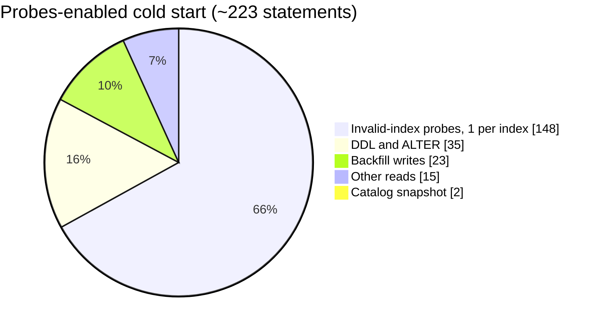
```mermaid
pie showData title Probes-enabled cold start (~223 statements)
  "Invalid-index probes, 1 per index" : 148
  "DDL and ALTER" : 35
  "Backfill writes" : 23
  "Other reads" : 15
  "Catalog snapshot" : 2
```

Some of the leftover production statements were not only slow but hazardous:

- `provider-api/corpus-jobs-store.ts` ran 10, and `staged-datasets-store.ts` 5,
  unconditional `ALTER TABLE ... ALTER COLUMN ... TYPE BIGINT` statements per
  cold start, with errors swallowed. `ALTER COLUMN TYPE` takes an `ACCESS
  EXCLUSIVE` lock even when the column is already `BIGINT`, so one cold start
  could queue every reader of the table behind it.
- `extensions/store.ts` ran `INSERT INTO tools ... SELECT FROM extensions`, a
  full-table `UPDATE tool_data SET scope_key = ...`, and a `DROP INDEX IF
  EXISTS` per cold start.
- `a2a-continuations-store.ts` and `oauth-tokens/store.ts` ran two `UPDATE`
  backfills each per cold start.
- `extensions/slots/store.ts` and `review/suggestions/store.ts` issued raw
  `CREATE TABLE` / `CREATE INDEX IF NOT EXISTS`. `CREATE INDEX IF NOT EXISTS`
  takes a `SHARE` lock on the table before it checks whether the index exists.

### Why the existing mitigations are bandaids

Three mechanisms were added over time. Each compensates for the one below it,
and none of them makes schema have a single owner.

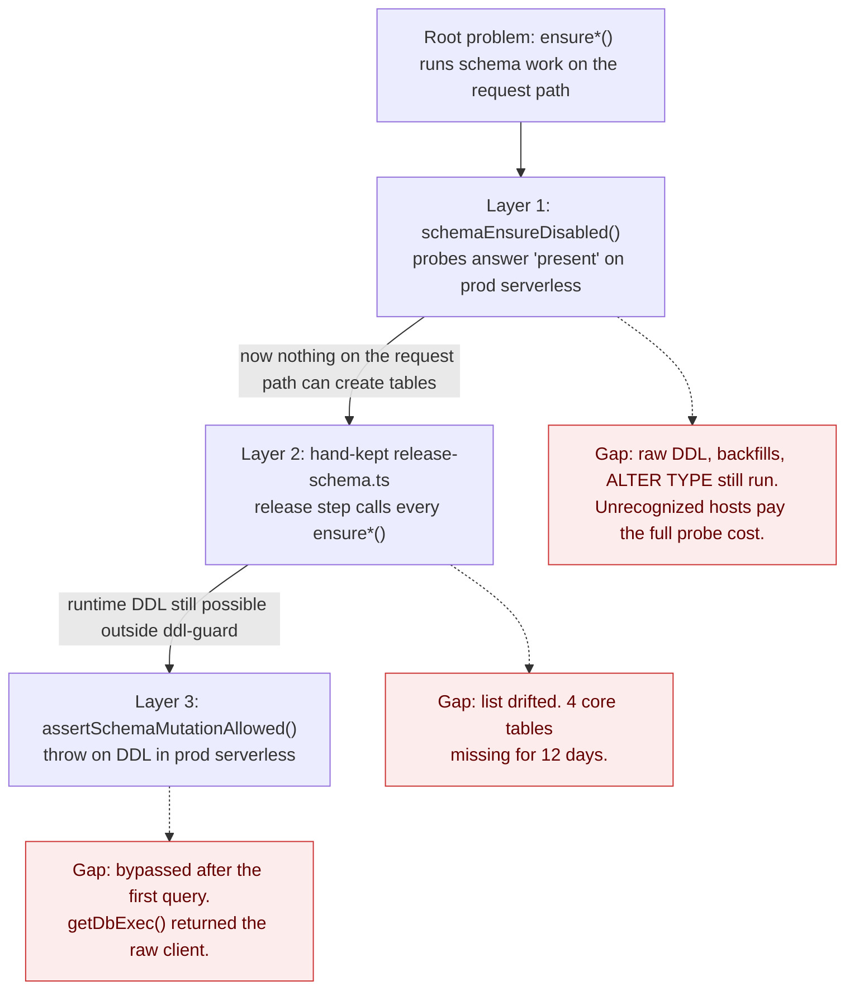
```mermaid
flowchart TD
  P["Root problem: ensure*() runs schema work on the request path"] --> L1
  L1["Layer 1: schemaEnsureDisabled()<br/>probes answer 'present' on prod serverless"] -->|"now nothing on the request path can create tables"| L2
  L2["Layer 2: hand-kept release-schema.ts<br/>release step calls every ensure*()"] -->|"runtime DDL still possible outside ddl-guard"| L3
  L3["Layer 3: assertSchemaMutationAllowed()<br/>throw on DDL in prod serverless"]
  L1 -.-> G1["Gap: raw DDL, backfills, ALTER TYPE still run.<br/>Unrecognized hosts pay the full probe cost."]
  L2 -.-> G2["Gap: list drifted. 4 core tables<br/>missing for 12 days."]
  L3 -.-> G3["Gap: bypassed after the first query.<br/>getDbExec() returned the raw client."]
  classDef gap fill:#fdecec,stroke:#c33,color:#600
  class G1,G2,G3 gap
```

1. **`schemaEnsureDisabled()`** (`db/ddl-guard.ts`). On production serverless,
   every table/column/index probe answers "present" without asking the
   database. The ensure calls stay on the hot path; they just stop doing
   anything, based on environment sniffing. Anything outside the ddl-guard
   helpers (raw DDL, backfills, `ALTER TYPE`) still runs. Hosts the sniff does
   not recognize, such as Cloudflare, pay the full probe cost.
2. **`server/release-schema.ts`.** Because runtime could no longer create
   tables, the release step had to call every store's `ensure*()`. That list was
   hand-maintained, needed its own guard to stay complete, and still went
   stale: `settings`, `application_state`, `app_secrets` and `resources` were
   missing from it for twelve days while deploys reported success. It also
   reused runtime code as migration code, which is how backfills and `ALTER
   TYPE` ended up running on every cold start.
3. **`assertSchemaMutationAllowed()`** (`db/client.ts`). Throws on DDL in a
   production serverless request, but only for the first query in a process:
   `getDbExec()` returned the raw, unguarded client once initialized. The same
   `CREATE TABLE` threw or silently ran depending on query order.

#### How it got here

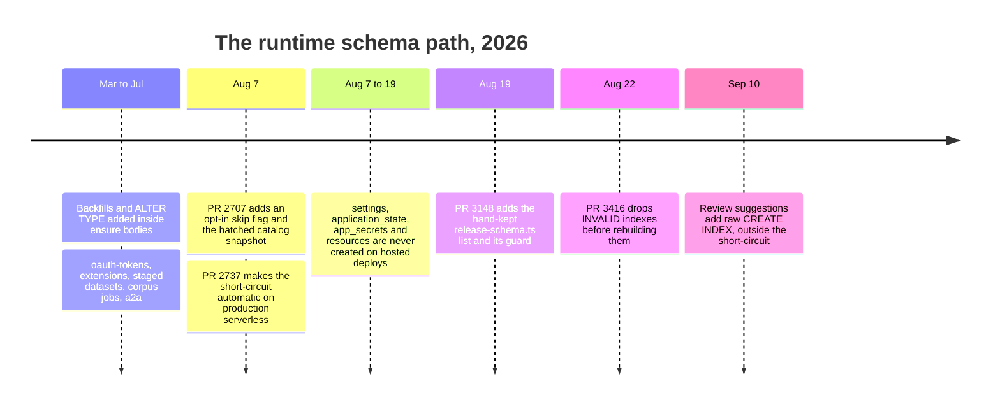
```mermaid
timeline
  title The runtime schema path, 2026
  Mar to Jul : Backfills and ALTER TYPE added inside ensure bodies : oauth-tokens, extensions, staged datasets, corpus jobs, a2a
  Aug 7 : PR 2707 adds an opt-in skip flag and the batched catalog snapshot : PR 2737 makes the short-circuit automatic on production serverless
  Aug 7 to 19 : settings, application_state, app_secrets and resources are never created on hosted deploys
  Aug 19 : PR 3148 adds the hand-kept release-schema.ts list and its guard
  Aug 22 : PR 3416 drops INVALID indexes before rebuilding them
  Sep 10 : Review suggestions add raw CREATE INDEX, outside the short-circuit
```

#### What `schemaEnsureDisabled()` did protect, and what it did not

It is fair to say the short-circuit removed real cost. On Netlify, Vercel and
Lambda every probe made through the ddl-guard helpers answered without a
query, which is most of the difference between ~220 and ~50 statements in the
table above. It did not protect:

- **Anything outside ddl-guard.** Most leftover statements predate the
  short-circuit (March through July) and it never covered them. The review
  suggestions indexes were added a month after it, which shows the model's
  weakness: every new raw statement goes straight back onto the hot path.
- **Hosts the environment sniff does not recognize.** Cloudflare, `netlify
  dev`, and self-hosted or long-lived Node paid the full probe cost.
- **Correctness.** Answering "present" without looking is what left four core
  tables uncreated on hosted deploys between PR 2737 and PR 3148.

| Hosted cold start                                 | Before (short-circuit on)     | After (ledger)        |
| ------------------------------------------------- | ----------------------------- | --------------------- |
| Touches only stores built entirely on ddl-guard   | 0 queries                     | 1 query               |
| Touches every framework store                     | ~50 statements, some locking  | 1 query               |
| Deploy whose schema was never migrated            | undetected until a query fails | `SchemaNotMigratedError` |

The first row is the one case where the old path was cheaper. The single
ledger read is the price of detecting a missing migration instead of assuming
it ran.

---

## Goals

- Zero DDL, zero backfills, and zero per-object probes on any hosted request
  path.
- One schema-related query per process on hosted runtimes, total, not per
  store.
- A missing migration is a loud, typed failure, not a `relation does not
  exist` from an unrelated request or a silently empty table.
- One definition of each store's schema. No hand-kept list that can drift.
- No change to how local development feels: a fresh `pglite:` database still
  provisions itself on first use.
- Every step additive and reversible. No schema is dropped or renamed.

## Non-goals

- Replacing the existing versioned migration lists (`runMigrations(...)` for
  agent runs, chat threads, oauth tokens, org, and others). They keep running in
  the release step after the store pass. Consolidation is an open question.
- Changing how templates own their tables in `server/plugins/db.ts`.
- Removing the 664 `await ensure*()` call sites in this change. They now cost a
  resolved promise; removing them is a mechanical follow-up.

---

## Design

### Components

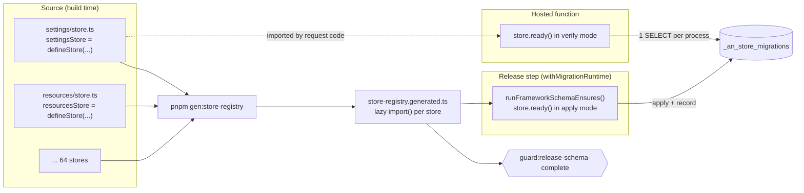
```mermaid
flowchart LR
  subgraph src["Source (build time)"]
    M1["settings/store.ts<br/>settingsStore = defineStore(...)"]
    M2["resources/store.ts<br/>resourcesStore = defineStore(...)"]
    M3["... 64 stores"]
  end
  GEN["pnpm gen:store-registry"]
  REG["store-registry.generated.ts<br/>lazy import() per store"]
  GUARD{{"guard:release-schema-complete"}}
  M1 --> GEN
  M2 --> GEN
  M3 --> GEN
  GEN --> REG
  REG --> GUARD
  subgraph rel["Release step (withMigrationRuntime)"]
    RUN["runFrameworkSchemaEnsures()<br/>store.ready() in apply mode"]
  end
  REG --> RUN
  RUN -->|"apply + record"| L[("_an_store_migrations")]
  subgraph fn["Hosted function"]
    RDY["store.ready() in verify mode"]
  end
  M1 -.->|"imported by request code"| RDY
  RDY -->|"1 SELECT per process"| L
```

### `defineStore()`

`packages/core/src/db/store-registry.ts`:

```ts
export const installationsStore = defineStore({
  id: "integration_installations",
  migrations: [
    { name: "baseline", run: async () => { /* create table + indexes */ } },
    { name: "widen-bigint", run: (exec) => widenIntColumnsToBigInt(...) },
    { name: "backfill-owner", sql: "UPDATE ... WHERE owner IS NULL" },
  ],
});

export function ensureTable(): Promise<void> {
  return installationsStore.ready();
}
```

Rules, enforced by `defineStore` at module load:

- `id` is unique across the registry and stable forever.
- Migration names are unique within a store, stable forever, and append-only.
  Changing what a store needs means adding a migration, not editing one.
- Each migration has `sql`, `run`, or both, and must be idempotent. The ledger
  makes steady state run-once; idempotency makes a first run that races
  another process safe.

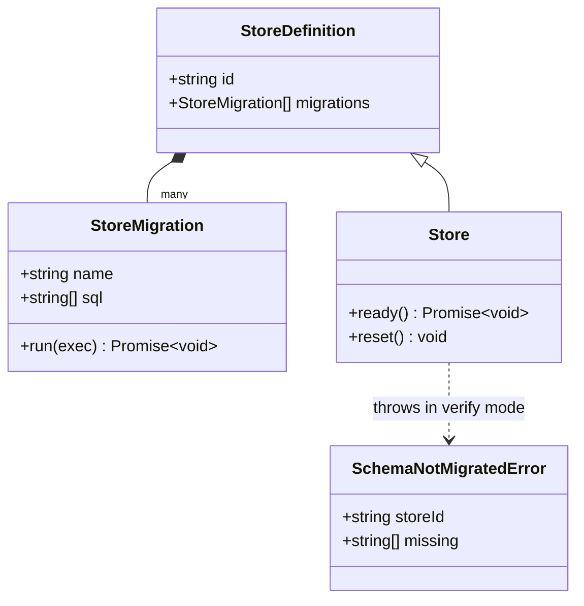
```mermaid
classDiagram
  class StoreDefinition {
    +string id
    +StoreMigration[] migrations
  }
  class StoreMigration {
    +string name
    +string[] sql
    +run(exec) Promise~void~
  }
  class Store {
    +ready() Promise~void~
    +reset() void
  }
  class SchemaNotMigratedError {
    +string storeId
    +string[] missing
  }
  StoreDefinition <|-- Store
  StoreDefinition "1" *-- "many" StoreMigration
  Store ..> SchemaNotMigratedError : throws in verify mode
```

`sql` also accepts a single string. `sql` and `run` are each optional, but a
migration needs at least one.

### The ledger

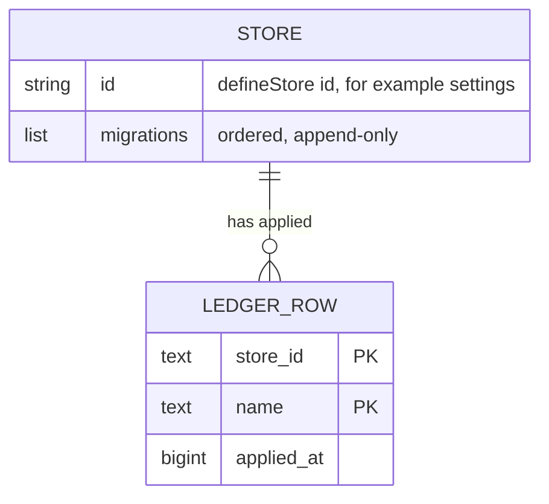
```mermaid
erDiagram
  STORE ||--o{ LEDGER_ROW : "has applied"
  STORE {
    string id "defineStore id, for example settings"
    list migrations "ordered, append-only"
  }
  LEDGER_ROW {
    text store_id PK
    text name PK
    bigint applied_at
  }
```

`LEDGER_ROW` is the `_an_store_migrations` table. `STORE` exists only in code.
A migration moves through these states:

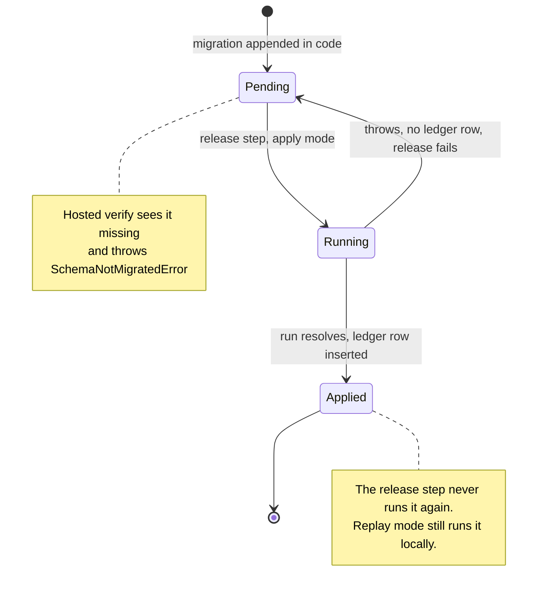
```mermaid
stateDiagram-v2
  [*] --> Pending: migration appended in code
  Pending --> Running: release step, apply mode
  Running --> Applied: run resolves, ledger row inserted
  Running --> Pending: throws, no ledger row, release fails
  Applied --> [*]
  note right of Pending
    Hosted verify sees it missing
    and throws SchemaNotMigratedError
  end note
  note right of Applied
    The release step never runs it again.
    Replay mode still runs it locally.
  end note
```

### Readiness modes

`store.ready()` is memoized per process and per mode. The mode is decided by
who owns the schema, not by which platform we think we are on:

| Mode       | When                                                                                                                         | What `ready()` does                                                                                                  |
| ---------- | ---------------------------------------------------------------------------------------------------------------------------- | -------------------------------------------------------------------------------------------------------------------- |
| **apply**  | Inside `withMigrationRuntime()` (the release step, `scripts/migrate-production.ts`)                                          | Applies this store's pending migrations and records each in `_an_store_migrations`.                                  |
| **verify** | The schema is release-owned: a production serverless function, or `migration.releaseMigrations` on a non-local database | Reads the ledger once per process (shared by all stores). Throws `SchemaNotMigratedError` naming missing migrations. |
| **replay** | Everything else: local dev, tests, self-hosted Node without a release step                                                   | Runs every migration in order, as the old ensure body did. Idempotent.                                               |

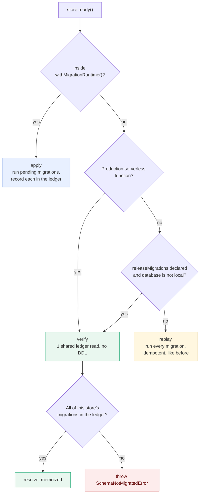
```mermaid
flowchart TD
  A["store.ready()"] --> B{"Inside withMigrationRuntime()?"}
  B -->|yes| APPLY["apply<br/>run pending migrations,<br/>record each in the ledger"]
  B -->|no| C{"Production serverless function?"}
  C -->|yes| VERIFY["verify<br/>1 shared ledger read, no DDL"]
  C -->|no| D{"releaseMigrations declared<br/>and database is not local?"}
  D -->|yes| VERIFY
  D -->|no| REPLAY["replay<br/>run every migration,<br/>idempotent, like before"]
  VERIFY --> E{"All of this store's<br/>migrations in the ledger?"}
  E -->|yes| OK["resolve, memoized"]
  E -->|no| ERR["throw SchemaNotMigratedError"]
  classDef release fill:#e8f0ff,stroke:#36c
  classDef hosted fill:#e9f7ef,stroke:#2a7
  classDef local fill:#fff7e0,stroke:#c90
  classDef gap fill:#fdecec,stroke:#c33,color:#600
  class APPLY release
  class VERIFY,OK hosted
  class REPLAY local
  class ERR gap
```

`migration.releaseMigrations` already exists as a declared app config field
(`AGENT_NATIVE_RELEASE_MIGRATIONS`, baked into the server bundle by
`deploy/build.ts`). The production-serverless check remains only as a backstop
for apps that deploy serverless without declaring it, since DDL there is
forbidden anyway.

### The registry is generated, not a side effect

`scripts/gen-store-registry.ts` scans `packages/core/src` for
`export const X = defineStore({ id: "..." })` and writes
`src/db/store-registry.generated.ts`: an explicit list of lazy `import()`s.

- **Why not self-registration on import:** `package.json#sideEffects` is a
  narrow allow-list, so a bundler may drop an import kept only for its
  registration. The symptom would be a table missing in production months
  later.
- **Why lazy imports:** `server/index.ts` re-exports the release entry point.
  A static list would pull every store module into every cold start to serve a
  step that runs once per deploy.
- **Why codegen and not a glob:** core builds with `tsc`, which has no
  `import.meta.glob`.

`guard:release-schema-complete` now fails when the generated file is stale,
when two stores share an id, or when any module executes DDL without being
reachable from the registry or `release-migrations.ts`.

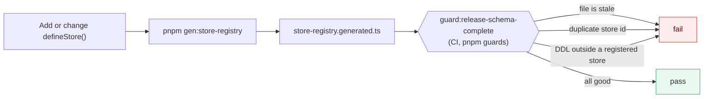
```mermaid
flowchart LR
  DEV["Add or change defineStore()"] --> GEN["pnpm gen:store-registry"]
  GEN --> FILE["store-registry.generated.ts"]
  FILE --> CI{{"guard:release-schema-complete<br/>(CI, pnpm guards)"}}
  CI -->|"file is stale"| FAIL["fail"]
  CI -->|"duplicate store id"| FAIL
  CI -->|"DDL outside a registered store"| FAIL
  CI -->|"all good"| PASS["pass"]
  classDef bad fill:#fdecec,stroke:#c33,color:#600
  classDef good fill:#e9f7ef,stroke:#2a7
  class FAIL bad
  class PASS good
```

### Release flow

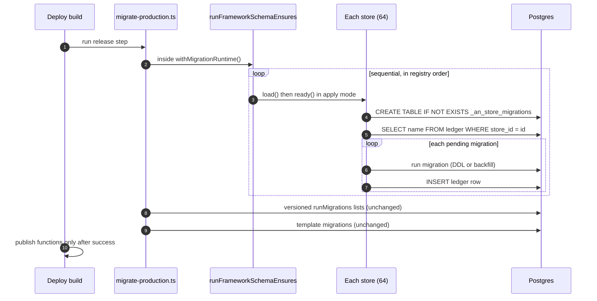
```mermaid
sequenceDiagram
  autonumber
  participant CI as Deploy build
  participant MP as migrate-production.ts
  participant RS as runFrameworkSchemaEnsures
  participant ST as Each store (64)
  participant DB as Postgres
  CI->>MP: run release step
  MP->>RS: inside withMigrationRuntime()
  loop sequential, in registry order
    RS->>ST: load() then ready() in apply mode
    ST->>DB: CREATE TABLE IF NOT EXISTS _an_store_migrations
    ST->>DB: SELECT name FROM ledger WHERE store_id = id
    loop each pending migration
      ST->>DB: run migration (DDL or backfill)
      ST->>DB: INSERT ledger row
    end
  end
  MP->>DB: versioned runMigrations lists (unchanged)
  MP->>DB: template migrations (unchanged)
  CI->>CI: publish functions only after success
```

`runFrameworkSchemaEnsures()` now refuses to run outside `withMigrationRuntime`.
Before, it ran and silently created nothing.

### Request flow (hosted)

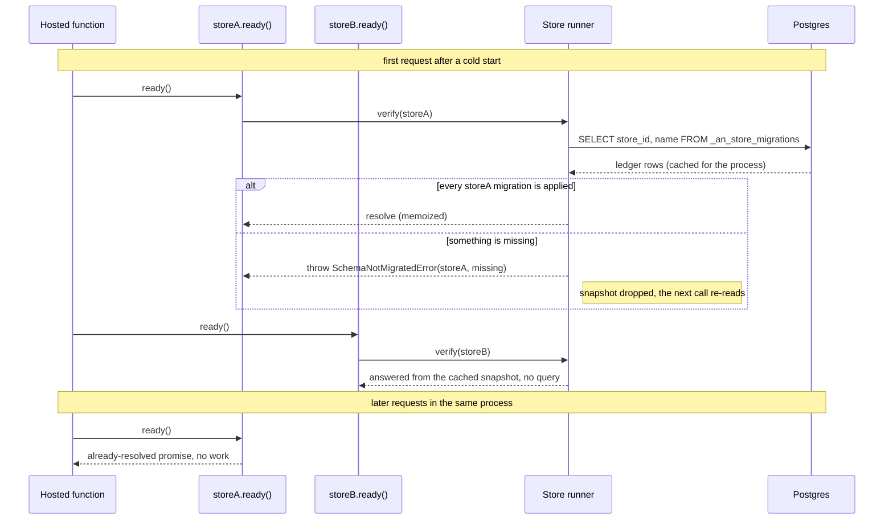
```mermaid
sequenceDiagram
  participant F as Hosted function
  participant A as storeA.ready()
  participant B as storeB.ready()
  participant R as Store runner
  participant DB as Postgres
  Note over F,DB: first request after a cold start
  F->>A: ready()
  A->>R: verify(storeA)
  R->>DB: SELECT store_id, name FROM _an_store_migrations
  DB-->>R: ledger rows (cached for the process)
  alt every storeA migration is applied
    R-->>A: resolve (memoized)
  else something is missing
    R-->>A: throw SchemaNotMigratedError(storeA, missing)
    Note right of R: snapshot dropped, the next call re-reads
  end
  F->>B: ready()
  B->>R: verify(storeB)
  R-->>B: answered from the cached snapshot, no query
  Note over F,DB: later requests in the same process
  F->>A: ready()
  A-->>F: already-resolved promise, no work
```

### Client guard fix

`getDbExec()` now always returns the same guarded proxy instead of handing out
the raw client after the first query. Every statement goes through
`assertSchemaMutationAllowed`, argument sanitizing, and missing-table
annotation, whatever the query order.

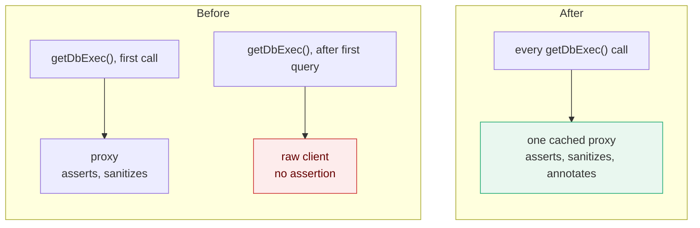
```mermaid
flowchart LR
  subgraph before["Before"]
    direction TB
    b1["getDbExec(), first call"] --> bp["proxy<br/>asserts, sanitizes"]
    b2["getDbExec(), after first query"] --> braw["raw client<br/>no assertion"]
  end
  subgraph after["After"]
    direction TB
    a1["every getDbExec() call"] --> ap["one cached proxy<br/>asserts, sanitizes, annotates"]
  end
  before ~~~ after
  classDef bad fill:#fdecec,stroke:#c33,color:#600
  classDef good fill:#e9f7ef,stroke:#2a7
  class braw bad
  class ap good
```

---

## What changed in the reference implementation

| Area                                  | Change                                                                                                                                                                                                                   |
| ------------------------------------- | ------------------------------------------------------------------------------------------------------------------------------------------------------------------------------------------------------------------------ |
| `db/store-registry.ts` (new)          | `defineStore`, readiness modes, ledger, `SchemaNotMigratedError`, `schemaIsReleaseOwned()`                                                                                                                               |
| `db/runtime-facts.ts` (new)           | `retryOnDdlRace` and `isProductionServerlessFunctionRuntime` moved out of `client.ts` (re-exported from there) so the runner does not couple to every `vi.mock("../db/client.js")`                                       |
| `db/store-registry.generated.ts` (new) | 64 stores                                                                                                                                                                                                                |
| `guards/store-registry-codegen.ts` (new), `scripts/gen-store-registry.ts` (new) | Discovery and rendering, shared by the generator and the guard                                                                                                                                                           |
| `guards/release-schema-complete.ts`   | Checks against the generated registry, plus staleness and duplicate ids                                                                                                                                                  |
| `server/release-schema.ts`            | Hand-kept list of 62 entries replaced by the generated registry; asserts migration runtime                                                                                                                              |
| `db/client.ts`                        | `getDbExec()` returns the cached guarded proxy                                                                                                                                                                           |
| 63 store modules                      | `_initPromise` bodies became `defineStore` migrations; `ensure*()` names and signatures kept and delegate to `ready()`. Backfills, `ALTER TYPE`, and legacy index drops split into their own named migrations, in order |
| `corpus-jobs-store`, `staged-datasets-store` | 15 unconditional `ALTER COLUMN TYPE` replaced by `widenIntColumnsToBigInt`, which only alters columns that are still `integer`                                                                                     |
| `identity-sso-store`, `workspace-connections/groups` | Env-sniffing early returns removed; the runner owns that decision                                                                                                                                           |
| Dead code                             | Unreachable legacy DDL after `return;` removed from several stores                                                                                                                                                       |

---

## Rollout

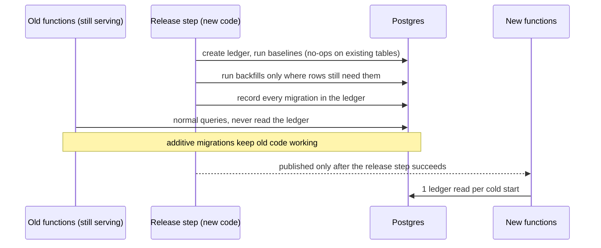
```mermaid
sequenceDiagram
  participant Old as Old functions (still serving)
  participant Rel as Release step (new code)
  participant DB as Postgres
  participant New as New functions
  Rel->>DB: create ledger, run baselines (no-ops on existing tables)
  Rel->>DB: run backfills only where rows still need them
  Rel->>DB: record every migration in the ledger
  Old->>DB: normal queries, never read the ledger
  Note over Old,DB: additive migrations keep old code working
  Rel-->>New: published only after the release step succeeds
  New->>DB: 1 ledger read per cold start
```

1. **First deploy with this change.** The release step creates
   `_an_store_migrations` and runs every store's migrations. On an existing
   database each baseline is a no-op (every statement is `IF NOT EXISTS` or
   probe-guarded), backfills touch only rows that still need them, and the
   ledger is filled. Functions are published only after the release step, so no
   new function ever sees an empty ledger.
2. **Old functions still serving during the deploy** never read the ledger and
   keep working, because every migration is additive.
3. **Beta.** The beta publish step runs the same `runFrameworkReleaseMigrations`,
   so the beta database gets its ledger the same way.
4. **Local and self-hosted.** Replay mode keeps today's behavior. Nothing to do.
5. **A deploy whose release step did not run** (misconfigured app) now gets a
   `SchemaNotMigratedError` naming the store and missing migrations on first
   use, instead of `relation does not exist` somewhere else or, worse, a
   `CREATE TABLE` that only succeeds depending on query order.

---

## Upgrade paths: framework users on old databases

This is a framework, so most databases were not created by the current version.
An app is scaffolded once and then upgrades `@agent-native/core` on its own
schedule, sometimes skipping many releases (see the `upgrade-agent-native`
skill). The code already carries the scars: `widen-columns.ts` exists because
long-lived databases kept `INTEGER` timestamp columns, `extensions/store.ts`
copies rows out of a misnamed table from an earlier version, and several
stores add columns that older databases never had.

The release step has to bring any of these starting points to the same place:

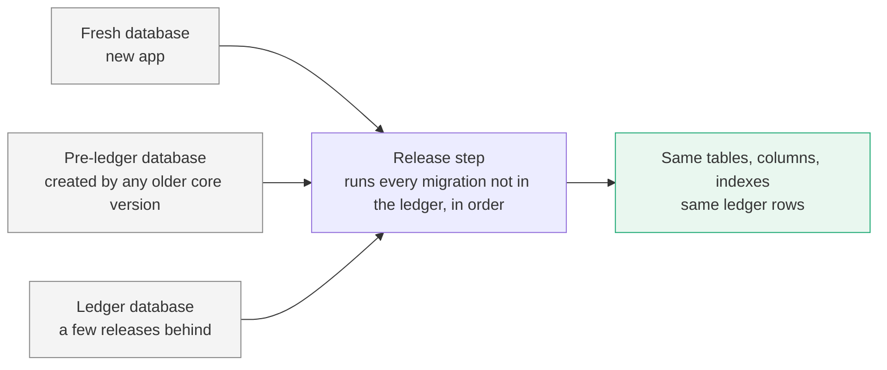
```mermaid
flowchart LR
  F["Fresh database<br/>new app"] --> R
  O["Pre-ledger database<br/>created by any older core version"] --> R
  B["Ledger database<br/>a few releases behind"] --> R
  R["Release step<br/>runs every migration not in the ledger, in order"] --> S["Same tables, columns, indexes<br/>same ledger rows"]
  classDef start fill:#f4f4f4,stroke:#888
  classDef done fill:#e9f7ef,stroke:#2a7
  class F,O,B start
  class S done
```

That puts three rules on every store migration:

1. **A baseline converges, it does not just create.** A pre-ledger database
   has no ledger rows, so every store's `baseline` runs against whatever shape
   the table already has. That is why baselines are the old ensure bodies:
   `CREATE TABLE IF NOT EXISTS`, then `ADD COLUMN IF NOT EXISTS` for every
   column ever added, then widening. Squashing a baseline into one clean
   `CREATE TABLE` with today's columns would silently skip every column an old
   database is missing.
2. **Append-only.** A database several releases behind runs exactly the
   migrations it has not recorded, in order. Editing an applied migration never
   reaches it.
3. **Idempotent and additive.** Two release steps can race on a first run, and
   old functions keep serving while the release runs.

### Measured: an Aug 19 database upgraded to this change

I built a database with the release step from PR 3148 (Aug 19, the first
commit with release-time schema creation), ran this change's release step on
it, then compared it with a freshly created database:

| Check                                           | Result                                          |
| ----------------------------------------------- | ----------------------------------------------- |
| Tables, old → upgraded → fresh                  | 139 → 181 → 181                                 |
| Added by the upgrade                            | 42 tables, 389 columns, 124 indexes             |
| Ledger rows, upgraded vs fresh                  | 96 vs 96                                        |
| Second release on the upgraded database         | 0 migrations applied, ledger unchanged          |
| Indexes missing from the upgraded database      | none                                            |

The comparison also found drift that exists independently of this change,
because the old ensure bodies had the same gaps:

- **`tool_shares.notified_at` and `data_program_shares.notified_at`** exist on
  fresh databases but are never added to older ones. Sharing code writes
  `notified_at` and logs a warning when it cannot. Each needs an appended
  `ADD COLUMN IF NOT EXISTS` migration in its store.
- **`context_directives.created_at`, `updated_at`, `active`** are `INTEGER` on
  fresh databases (`CONTEXT_XRAY_MIGRATIONS`) but `BIGINT` on the older one.
  `created_at` stores `Date.now()`, which overflows a 32-bit integer, so
  fresh databases are the broken side here.
- **Migration bookkeeping `version` columns** differ between `INTEGER` and
  `BIGINT`. Harmless.

Nothing checks for drift like this today. Open question 9 proposes a
permanent upgrade test.

---

## Risks

| Risk                                                                                | Mitigation                                                                                                                                                                                                                                                                          |
| ----------------------------------------------------------------------------------- | ----------------------------------------------------------------------------------------------------------------------------------------------------------------------------------------------------------------------------------------------------------------------------------- |
| Someone edits an already-applied migration instead of appending one                 | Names are validated but contents are not yet checksummed. Existing databases will not see the edit. Open question below proposes a checksum column.                                                                                                                                 |
| A hosted app that never runs a release step                                         | Same failure as today (tables never exist), but now typed and named. `scripts/migrate-production.ts` exists in every template.                                                                                                                                                      |
| Ledger read fails (database unreachable)                                            | Throws the underlying error and drops the snapshot, so the next request retries. Never coerced into "migrated".                                                                                                                                                                     |
| `workspace-connections/groups` in a hosted runtime used to return silently when unmigrated | Now throws `SchemaNotMigratedError`. This is intended: a silent return hid a missing table.                                                                                                                                                                                  |
| `sync_version` (`poll.ts`) used to be created only when hosted realtime transport was on | Now created and seeded unconditionally by the `sync_events` store, because the release step's environment may not match the functions'. It is one small additive table, and the allocator already reseeds a missing row. |

---

## Open questions

The questions map onto a phased roadmap. Phase 1 is this change.

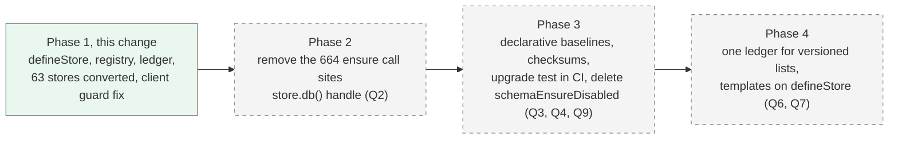
```mermaid
flowchart LR
  P1["Phase 1, this change<br/>defineStore, registry, ledger,<br/>63 stores converted, client guard fix"]
  P2["Phase 2<br/>remove the 664 ensure call sites<br/>store.db() handle (Q2)"]
  P3["Phase 3<br/>declarative baselines, checksums,<br/>upgrade test in CI, delete schemaEnsureDisabled (Q3, Q4, Q9)"]
  P4["Phase 4<br/>one ledger for versioned lists,<br/>templates on defineStore (Q6, Q7)"]
  P1 --> P2 --> P3 --> P4
  classDef done fill:#e9f7ef,stroke:#2a7
  classDef next fill:#f4f4f4,stroke:#888,stroke-dasharray: 5 5
  class P1 done
  class P2,P3,P4 next
```

1. **Should replay mode use the ledger too?** Today replay re-runs every
   migration once per process, which matches the old behavior, keeps tests that
   mock `getDbExec` unchanged, and avoids a ledger table in unit-test fakes. Using
   the ledger locally would make backfills run once per database everywhere, at
   the cost of one more query per store per dev process and broader test churn.
2. **Remove the 664 call sites.** Options: keep `await ensure*()` (now a
   resolved promise), or codemod to a store-scoped handle such as
   `await installationsStore.db()` that returns the executor after `ready()`.
   The handle would make "which tables does this code touch" answerable from
   the registry and let a guard forbid raw `getDbExec()` in store modules.
3. **Declarative baselines.** Baselines still call the ddl-guard helpers so a
   release against a busy production table does not take `SHARE` locks for an
   index that already exists. Converting them to plain SQL would let us delete
   `schemaEnsureDisabled()`, the probe snapshot, and most of `ddl-guard.ts`, but
   needs a release-time `lock_timeout` policy instead.
4. **Migration checksums.** Record a hash of each `sql` migration in the ledger
   and fail the release when an applied migration's text changed.
5. **Advisory lock at release.** Two release steps against one database (beta
   and production sharing a schema owner) currently rely on idempotency. A
   `pg_advisory_xact_lock` per store would serialize them.
6. **One ledger.** Fold the versioned `runMigrations` lists (`_org_migrations`,
   `agent_run_migrations`, ...) into store migrations so there is one ledger and
   one runner.
7. **Templates.** Extend the generator to `templates/*/server/**` so app-owned
   tables use `defineStore` too, and move each template's
   `server/plugins/db.ts` onto the same runner.
8. **Verify eagerly or lazily?** The ledger is read on first store use. Reading it
   during server boot would surface a missing release earlier, at the cost of a
   query on cold starts that never touch the database.
9. **Upgrade convergence in CI.** Check in a schema dump produced by an old
   release (for example the oldest core version we still support), run the
   current release step on it in PGlite, and fail when its tables, columns,
   types, or indexes differ from a fresh database. The one-off version of this
   test found the drift listed under [Upgrade paths](#upgrade-paths-framework-users-on-old-databases).
   It also constrains question 3: a declarative baseline must still converge
   an old table, not only create a new one.

---

## Future work (out of scope for this proposal)

The registry and ledger make four longer-running problems solvable. None of
them is part of this change. They are listed so the working group can judge the
design against where it needs to go.

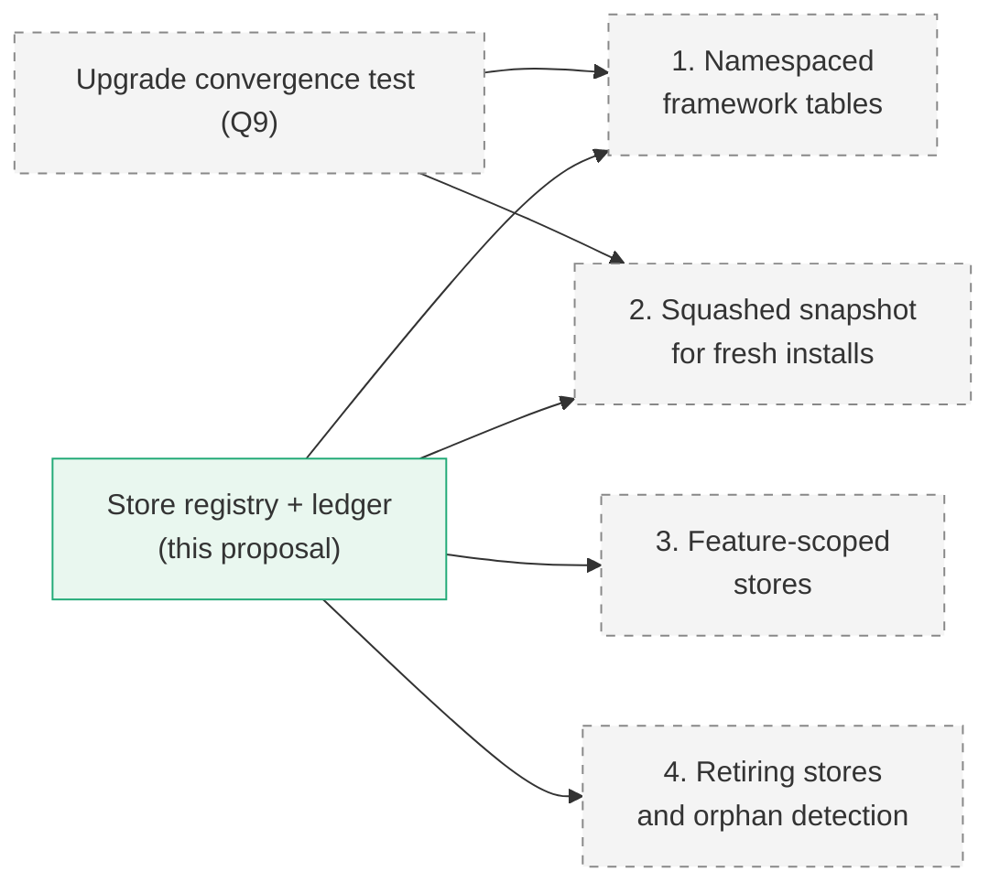
```mermaid
flowchart LR
  L["Store registry + ledger<br/>(this proposal)"] --> N["1. Namespaced<br/>framework tables"]
  L --> S["2. Squashed snapshot<br/>for fresh installs"]
  L --> F["3. Feature-scoped<br/>stores"]
  L --> R["4. Retiring stores<br/>and orphan detection"]
  Q9["Upgrade convergence test (Q9)"] --> S
  Q9 --> N
  classDef done fill:#e9f7ef,stroke:#2a7
  classDef next fill:#f4f4f4,stroke:#888,stroke-dasharray: 5 5
  class L done
  class N,S,F,R,Q9 next
```

### 1. A naming convention for framework tables

**Problem.** Framework tables share the `public` schema with app tables and use
generic names: `settings`, `resources`, `notifications`, `progress`, `usage`,
`tools`, plus Better Auth's `user`, `session`, `account`. A fresh database has
about 180 tables, and nothing tells a user or a template author which ones the
app owns. An app that defines its own `notifications` table collides with the
framework today, and nothing warns about it until something breaks.

Two ways to fix it:

| | Postgres schema (`agent_native.settings`) | Name prefix (`an_settings`) |
| --- | --- | --- |
| Separation | Real: `\dt public.*` shows only app tables | Visual only: all tables still in `public`, sorted together |
| Collisions | None, different namespace | Unlikely, still one namespace |
| App tooling | Drizzle `schemaFilter: ["public"]` keeps app migrations off framework tables; `pg_dump -n` per owner | Needs a `tablesFilter` glob |
| Uninstall / reset | `DROP SCHEMA agent_native CASCADE` is one reviewed step | Table-by-table |
| Raw SQL (hundreds of statements) | Must qualify names, or rely on `search_path` | Must rename every reference |
| `search_path` | Not safe to rely on: transaction-mode poolers (Neon, PgBouncer) do not keep session settings, so qualify explicitly | Not involved |
| Catalog probes | 21 core modules name the `public` schema (catalog probes such as `table_schema = 'public'`, plus `public.`-qualified queries) and need a schema parameter | Unchanged |
| Drizzle | `pgSchema("agent_native").table(...)` | Rename the table string |
| Moving existing tables | `ALTER TABLE ... SET SCHEMA` is metadata-only but briefly takes `ACCESS EXCLUSIVE` | `ALTER TABLE ... RENAME`, same lock |
| Better Auth tables | Needs verification that its adapter can target a non-`public` schema | Renamable through its `modelName` option |

**Recommendation to debate: a Postgres schema, with explicitly qualified names.**
It is the only option that actually removes framework tables from the app's
view and from app tooling. The cost is mostly mechanical, and the registry
gives it one home: `defineStore` gains a `schema` (default `agent_native` for
framework stores) and hands out qualified table names, so raw SQL builds names
through the store instead of string literals. A guard can then fail on an
unqualified framework table name in new code.

**Moving tables without breaking rolling deploys.** Either approach renames
tables that old functions are still querying during a deploy, and it conflicts
with the "additive only" rule in AGENTS.md. It needs an explicit exception, and
a two-release plan with compatibility views:

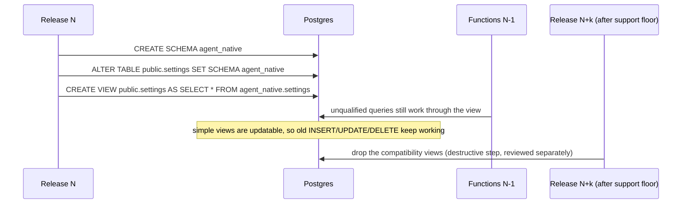
```mermaid
sequenceDiagram
  participant Rel1 as Release N
  participant DB as Postgres
  participant Old as Functions N-1
  participant Rel2 as Release N+k (after support floor)
  Rel1->>DB: CREATE SCHEMA agent_native
  Rel1->>DB: ALTER TABLE public.settings SET SCHEMA agent_native
  Rel1->>DB: CREATE VIEW public.settings AS SELECT * FROM agent_native.settings
  Old->>DB: unqualified queries still work through the view
  Note over DB: simple views are updatable, so old INSERT/UPDATE/DELETE keep working
  Rel2->>DB: drop the compatibility views (destructive step, reviewed separately)
```

A cheaper first step: new stores go into `agent_native` from day one, existing
stores move later. The drawback is that for a while there are two conventions.

### 2. Fresh installs replay the whole history

**Problem.** A new app today runs 96 store migrations plus every versioned
list, including backfills that do nothing on empty tables. It costs seconds,
once per deploy, so it is not a performance problem. The problem is that the
list only grows, and every historical step stays load-bearing forever.

**Proposal.** A squashed snapshot per release line, as in Rails `schema.rb`,
Django `squashmigrations`, and Prisma baselining:

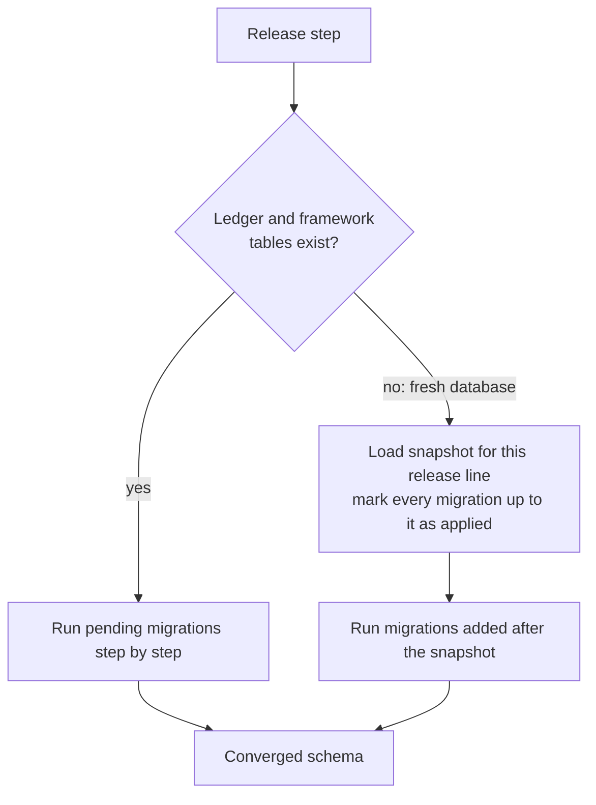
```mermaid
flowchart TD
  A["Release step"] --> B{"Ledger and framework<br/>tables exist?"}
  B -->|"no: fresh database"| C["Load snapshot for this release line<br/>mark every migration up to it as applied"]
  B -->|yes| D["Run pending migrations step by step"]
  C --> E["Run migrations added after the snapshot"]
  D --> F["Converged schema"]
  E --> F
```

Once snapshots exist, a supported-version floor lets migrations older than the
oldest supported release be deleted. Apps older than the floor upgrade one
release line at a time. The upgrade convergence test (Q9) is a prerequisite: it
is what proves a snapshot matches the step-by-step path.

### 3. Every app gets every framework table

**Problem.** An app that never uses extensions, A2A, remote devices, usage
budgets, or review suggestions still gets their tables.

**Proposal.** `defineStore` declares the feature it belongs to, and the release
step migrates only stores for features the app config enables. Turning a
feature on later is a config change and a redeploy, and that release creates
its tables. A disabled feature's store fails with `SchemaNotMigratedError` if
code touches it, rather than with a missing relation. Core stores (auth,
settings, application state, resources, sync) are always on.

### 4. Retiring stores and finding orphans

**Problem.** Additive-only is right for rolling deploys, but there is no way
to retire a table after a refactor. The old `extensions` table lived on after
the rename to `tools`, and every future refactor will leave something behind.

**Proposal.**

```mermaid
stateDiagram-v2
  [*] --> Active: defineStore
  Active --> Retired: marked retired in code
  Retired --> Orphaned: removed from the registry
  Orphaned --> Dropped: owner runs prune (opt-in)
  note right of Retired
    Fresh installs no longer create it.
    Existing databases keep it.
  end note
  note right of Orphaned
    Ledger has the store id,
    registry does not.
  end note
```

- A retired store stays in the registry with a `retired` marker. Snapshots
  (item 2) stop creating it and nothing new reads it.
- The ledger makes orphans visible: a store id in `_an_store_migrations` with
  no registered store. `agent-native db prune --dry-run` lists them with row
  counts, and only an explicit, reviewed command drops anything. The framework
  never drops tables on its own.
- A rename is a new store, a copy migration, and then retiring the old store.
  This is what the `extensions` → `tools` rename did by hand.

---

## Verification done

- `db/store-registry.spec.ts` against PGlite: apply runs once per database and
  records the ledger; a failed migration is not recorded; verify issues exactly
  one query for multiple stores and no DDL; missing migrations throw a typed
  error naming them; DDL through `getDbExec()` is rejected in a hosted runtime
  even after the client is initialized; replay provisions a fresh database.
- `server/release-schema.cold-start.spec.ts`: after a real release pass on
  PGlite, a simulated hosted cold start readies all 64 stores with exactly one
  statement, the ledger read.
- One-off upgrade check: a database built by the Aug 19 release step upgrades
  to the same tables, indexes, and ledger as a fresh one, and a second release
  applies nothing. Results and the drift it found are under
  [Upgrade paths](#upgrade-paths-framework-users-on-old-databases).
- Full `packages/core` suite: 1,223 files and 18,100 tests pass. The 2 failing
  files (`review/suggestions/pglite-transaction.integration.spec.ts`,
  `server/agent-chat-plugin.lifecycle.spec.ts`) fail the same way on the
  unchanged base commit.
- `guard:release-schema-complete` passes with the generated registry.
- `tsc --noEmit` for `packages/core`.

Two behaviors changed to keep the ledger honest: at release, `widenIntColumnsToBigInt`
and the optional `resources_visibility_expires_idx` build now throw instead of
swallowing errors, so a failed step is retried on the next release rather than
recorded as applied. Outside the release step they still degrade quietly, as
before.
