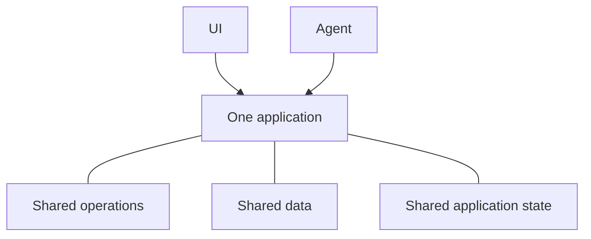

# ما هو Agent-Native؟

Agent-Native هو إطار عمل TypeScript مفتوح المصدر لبناء تطبيقات تخدم الأشخاص
ووكلاء الذكاء الاصطناعي معًا. تعرّف وظائف تطبيقك مرة واحدة على شكل
[إجراءات](/docs/actions-overview) — دوال مكتوبة الأنواع تستدعيها واجهة React
من الكود ويستخدمها الوكلاء كأدوات.

## لماذا نبني التطبيقات بهذه الطريقة

صُمّمت معظم التطبيقات حول شخص يعمل عبر واجهة المستخدم. تؤدي إضافة وكيل إلى
إدخال طريقة أخرى لاستخدام المنتج. ولكي يعملا كمنتج واحد، يجب أن تتحقق ثلاثة
أمور:

- **يحتاج الوكيل إلى الوصول إلى المنتج.** إذا تلقى مجموعة أصغر ومنفصلة من
  الأدوات، سيظل مقيدًا. وستنتهي أيضًا بصيانة تنفيذين يبتعدان عن بعضهما مع
  تغير التطبيق.
- **ما زال الناس يحتاجون إلى واجهة مستخدم للتطبيق.** تعمل الدردشة جيدًا
  لتفويض العمل، لكنها ليست مثالية دائمًا لتصفح المعلومات أو مقارنة الخيارات
  أو مراجعة التغييرات أو مشاركة النتائج مع الفريق.
- **يجب أن ينتقل العمل بينهما.** ينبغي أن يتمكن الشخص من فحص عمل الوكيل أو
  تغييره، وأن يتمكن الوكيل من المتابعة من هناك دون البدء من جديد.

بنية Agent-Native مبنية حول هذه المتطلبات. يمكن للناس العمل مباشرة عبر واجهة
المستخدم أو تفويض نتيجة إلى الوكيل، ثم الانتقال بين الطريقتين دون فقدان التقدم.

<Video
  src="https://cdn.builder.io/o/assets%2Fc5b47d20f6a943e485717e5895739988%2Fc88d506c160142ae9b8618616ceedcea%2Fcompressed?apiKey=c5b47d20f6a943e485717e5895739988&token=c88d506c160142ae9b8618616ceedcea&alt=media&optimized=true"
  alt="مقارنة بين شخص يستخدم تطبيقًا مباشرةً والعمل عبر وكيل ذكاء اصطناعي في التطبيق نفسه."
  align="full"
  caption="شاهد مقدمة مدتها أربع دقائق إلى بنية Agent-Native."
/>

## كيف يعمل Agent-Native

يمنح تطبيق Agent-Native الأشخاص والوكلاء طريقتين للعمل مع المنتج نفسه:

- **واجهة المستخدم** تمنح الأشخاص طريقة مألوفة لتصفح العمل وتحريره ومراجعته
  ومشاركته.
- **الوكيل** يتولى العمل الذي يفوّضه الأشخاص إليه.

ثلاثة أسس مشتركة تجعل هذا ممكنًا:

- **العمليات المشتركة.** يشغّلها الأشخاص عبر واجهة المستخدم، بينما يستدعيها
  الوكلاء مباشرةً. يعرّف Agent-Native كل عملية مرة واحدة على شكل
  [إجراء](/docs/actions-overview).
- **[البيانات المشتركة](/docs/server-database)** تحتفظ بالعمل والمعلومات التي
  يحتاج التطبيق إلى حفظها. بحسب التطبيق، قد تكون سجلات عملاء أو خطط مشروعات
  أو محادثات أو تقارير. تقرأ واجهة المستخدم والوكيل هذه البيانات المشتركة
  ويحدّثانها.
- **[حالة التطبيق المشتركة](/docs/context-awareness)** تصف ما يحدث الآن، مثل
  الصفحة الحالية أو السجل المحدد أو العرض النشط. يمنح الإطار الحالة ذات الصلة
  للوكيل كسياق، ليعرف ما الذي يعمل عليه الشخص.

لا ينقر الوكيل عبر واجهة المستخدم. بل يستدعي الإجراءات نفسها التي تستخدمها
واجهة المستخدم، مع التحقق والصلاحيات والتنفيذ نفسه.

على سبيل المثال، يمكن لشخص تعيين تذكرة دعم عبر واجهة المستخدم أو أن يطلب من
الوكيل فعل ذلك. يشغّل كلا المسارين الإجراء نفسه ويحدّثان التذكرة نفسها. يمكن
للشخص فحص النتيجة أو تغييرها في واجهة المستخدم، ثم السماح للوكيل بالمتابعة من
هناك.

## متى تستخدم Agent-Native؟

تكون Agent-Native مناسبة عندما:

- ينبغي للوكيل تنفيذ عمل حقيقي في التطبيق، وليس الإجابة عن الأسئلة فقط.
- يحتاج الأشخاص إلى واجهة مستخدم لفحص العمل أو تحريره أو الموافقة عليه أو
  مشاركته.
- ينبغي أن ينتقل العمل بين واجهة المستخدم والوكيل دون فقدان التقدم أو السياق.

إذا كنت تحتاج فقط إلى استجابة مولّدة واحدة، فاستدعِ نموذجًا مباشرة. وإذا كان
سير العمل يتبع تسلسلًا ثابتًا ومتوقعًا، فإن منطق التطبيق العادي أو الأتمتة
أبسط. استخدم Agent-Native عندما تحتاج واجهة المستخدم والوكيل معًا إلى دور
مستمر في العمل نفسه.

## الخطوات التالية

<Cards>

### [البدء](/docs/getting-started)

أنشئ تطبيقًا واستدعِ الإجراء نفسه من الوكيل وواجهة المستخدم.

### [المفاهيم الأساسية](/docs/key-concepts)

تعرّف على كيفية توافق الإجراءات وبيانات SQL وسياق التطبيق والوصول والمزامنة
المباشرة معًا.

### [أسطح الوكيل](/docs/agent-surfaces)

اطّلع على كيفية دعم النموذج نفسه لتطبيقات تقودها واجهة مستخدم أو دردشة أو
أتمتة أو وكيل آخر.

### [التطبيقات](/docs/cloneable-saas)

انطلق من منتج SaaS كامل بدلاً من البناء تدريجيًا انطلاقًا من Chat.

</Cards>
