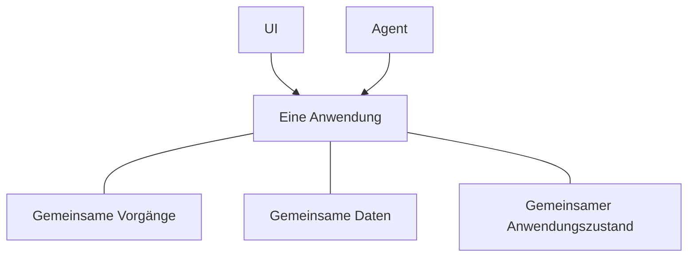

# Was ist Agent-Native?

Agent-Native ist ein Open-Source-TypeScript-Framework zum Entwickeln von Apps,
die sowohl Menschen als auch KI-Agenten dienen. Sie definieren die Funktionalität
Ihrer App einmal als [Aktionen](/docs/actions-overview) – typisierte Funktionen,
die Ihre React-UI aus Code aufruft und die Agenten als Tools verwenden.

## Warum Apps auf diese Weise bauen

Die meisten Anwendungen sind darauf ausgelegt, dass eine Person über die UI
arbeitet. Ein Agent eröffnet einen weiteren Weg, das Produkt zu nutzen. Damit
beide als ein Produkt funktionieren, müssen drei Dinge gelten:

- **Der Agent braucht Zugriff auf das Produkt.** Erhält er eine kleinere,
  getrennte Auswahl an Tools, bleibt er eingeschränkt. Außerdem müssen Sie zwei
  Implementierungen pflegen, die sich mit der Zeit auseinanderentwickeln.
- **Menschen brauchen weiterhin eine Anwendungs-UI.** Chat eignet sich gut, um
  Arbeit zu delegieren, aber nicht immer zum Durchsuchen von Informationen,
  Vergleichen von Optionen, Prüfen von Änderungen oder Teilen von Ergebnissen
  im Team.
- **Arbeit muss zwischen beiden wechseln können.** Eine Person sollte die Arbeit
  des Agenten prüfen oder ändern können, und der Agent sollte von dort aus
  weitermachen können, ohne von vorn zu beginnen.

Die Agent-Native-Architektur ist um diese Anforderungen herum aufgebaut.
Menschen können direkt über die UI arbeiten oder dem Agenten ein Ergebnis
delegieren und zwischen beiden wechseln, ohne Fortschritt zu verlieren.

<Video
  src="https://cdn.builder.io/o/assets%2Fc5b47d20f6a943e485717e5895739988%2Fc88d506c160142ae9b8618616ceedcea%2Fcompressed?apiKey=c5b47d20f6a943e485717e5895739988&token=c88d506c160142ae9b8618616ceedcea&alt=media&optimized=true"
  alt="Ein Vergleich zwischen einer Person, die eine Anwendung direkt nutzt, und der Arbeit über einen KI-Agenten in derselben Anwendung."
  align="full"
  caption="Sehen Sie eine vierminütige Einführung in die Agent-Native-Architektur."
/>

## So funktioniert Agent-Native

Eine Agent-Native-Anwendung gibt Menschen und Agenten zwei Möglichkeiten,
mit demselben Produkt zu arbeiten:

- **Die UI** ermöglicht es Menschen auf vertraute Weise, Arbeit zu durchsuchen,
  zu bearbeiten, zu prüfen und zu teilen.
- **Der Agent** übernimmt Arbeit, die Menschen an ihn delegieren.

Drei gemeinsame Grundlagen ermöglichen das:

- **Gemeinsame Vorgänge.** Menschen lösen sie über die UI aus, während Agenten
  sie direkt aufrufen. Agent-Native definiert jeden Vorgang einmal als
  [Aktion](/docs/actions-overview).
- **[Gemeinsame Daten](/docs/server-database)** enthalten die Arbeit und
  Informationen, die die Anwendung erhalten muss – beispielsweise Kundendaten,
  Projektpläne, Unterhaltungen oder Berichte. UI und Agent lesen und
  aktualisieren beide diese Daten.
- **[Gemeinsamer Anwendungszustand](/docs/context-awareness)** beschreibt, was
  gerade geschieht, etwa die aktuelle Seite, den ausgewählten Datensatz oder die
  aktive Ansicht. Das Framework stellt dem Agenten relevante Zustände als
  Kontext bereit, sodass er weiß, woran die Person arbeitet.

Der Agent klickt sich nicht durch die UI. Er ruft dieselben Aktionen wie die UI
auf – mit derselben Validierung, denselben Berechtigungen und derselben
Implementierung.

Beispielsweise kann eine Person über die UI ein Support-Ticket zuweisen oder
den Agenten darum bitten. Beide Wege führen dieselbe Aktion aus und aktualisieren
dasselbe Ticket. Die Person kann das Ergebnis in der UI prüfen oder ändern und
den Agenten anschließend von dort aus weiterarbeiten lassen.

## Wann sollten Sie Agent-Native verwenden?

Agent-Native eignet sich gut, wenn:

- der Agent echte Arbeit in der App erledigen soll, statt nur Fragen zu beantworten;
- Menschen eine UI brauchen, um die Arbeit zu prüfen, zu bearbeiten, freizugeben
  oder zu teilen;
- Arbeit zwischen UI und Agent wechseln soll, ohne Fortschritt oder Kontext zu verlieren.

Wenn Sie nur eine einzelne generierte Antwort benötigen, rufen Sie ein Modell
direkt auf. Folgt der Ablauf einer festen, vorhersehbaren Reihenfolge, sind
gewöhnliche Anwendungslogik oder Automatisierung einfacher. Verwenden Sie
Agent-Native, wenn UI und Agent beide dauerhaft an derselben Arbeit beteiligt
sein sollen.

## Nächste Schritte

<Cards>

### [Erste Schritte](/docs/getting-started)

Erstellen Sie eine App und rufen Sie dieselbe Aktion über Agent und UI auf.

### [Schlüsselkonzepte](/docs/key-concepts)

Erfahren Sie, wie Aktionen, SQL-Daten, Anwendungskontext, Zugriff und Live-Sync
zusammenspielen.

### [Agent-Oberflächen](/docs/agent-surfaces)

Sehen Sie, wie dasselbe Modell Apps unterstützt, die von einer UI, einem Chat,
einer Automatisierung oder einem anderen Agenten geführt werden.

</Cards>
