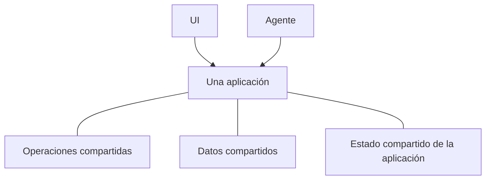

# ¿Qué es Agent-Native?

Agent-Native es un framework TypeScript de código abierto para crear aplicaciones
que sirven tanto a personas como a agentes de IA. Defines la funcionalidad de tu
aplicación una vez como [acciones](/docs/actions-overview): funciones tipadas que
tu UI de React llama desde el código y que los agentes usan como herramientas.

## Por qué crear aplicaciones de esta forma

La mayoría de las aplicaciones se diseñan para que una persona trabaje en la UI.
Incorporar un agente añade otra forma de usar el producto. Para que ambos formen
un solo producto, deben cumplirse tres condiciones:

- **El agente necesita acceso al producto.** Si recibe un conjunto de herramientas
  más pequeño e independiente, seguirá estando limitado. Además, tendrás que
  mantener dos implementaciones que se separan a medida que cambia la aplicación.
- **Las personas siguen necesitando una UI de aplicación.** El chat funciona bien
  para delegar trabajo, pero no siempre para consultar información, comparar
  opciones, revisar cambios o compartir resultados con un equipo.
- **El trabajo debe poder pasar entre ambos.** Una persona debe poder inspeccionar
  o cambiar el trabajo del agente, y el agente debe poder continuar desde ahí sin
  empezar de nuevo.

La arquitectura de Agent-Native se basa en estos requisitos. Las personas pueden
trabajar directamente mediante la UI o delegar un resultado al agente, y pasar
de uno a otro sin perder el progreso.

<Video
  src="https://cdn.builder.io/o/assets%2Fc5b47d20f6a943e485717e5895739988%2Fc88d506c160142ae9b8618616ceedcea%2Fcompressed?apiKey=c5b47d20f6a943e485717e5895739988&token=c88d506c160142ae9b8618616ceedcea&alt=media&optimized=true"
  alt="Una comparación entre una persona que usa una aplicación directamente y el trabajo mediante un agente de IA en la misma aplicación."
  align="full"
  caption="Ve una introducción de cuatro minutos a la arquitectura de Agent-Native."
/>

## Cómo funciona Agent-Native

Una aplicación Agent-Native ofrece a personas y agentes dos formas de trabajar
con el mismo producto:

- **La UI** ofrece a las personas una forma familiar de explorar, editar, revisar
  y compartir trabajo.
- **El agente** se encarga del trabajo que las personas le delegan.

Tres bases compartidas lo hacen posible:

- **Operaciones compartidas.** Las personas las activan desde la UI, mientras que
  los agentes las llaman directamente. Agent-Native define cada operación una vez
  como una [acción](/docs/actions-overview).
- **Los [datos compartidos](/docs/server-database)** contienen el trabajo y la
  información que la aplicación debe conservar, como registros de clientes,
  planes de proyecto, conversaciones o informes. La UI y el agente leen y
  actualizan esos datos.
- **El [estado compartido de la aplicación](/docs/context-awareness)** describe
  lo que ocurre ahora, como la página actual, el registro seleccionado o la vista
  activa. El framework proporciona al agente el estado relevante como contexto,
  para que sepa en qué está trabajando la persona.

El agente no hace clic por la UI. Llama a las mismas acciones que la UI, con la
misma validación, permisos e implementación.

Por ejemplo, una persona puede asignar un ticket de soporte desde la UI o pedirle
al agente que lo haga. Ambas vías ejecutan la misma acción y actualizan el mismo
ticket. La persona puede inspeccionar o cambiar el resultado en la UI y dejar
que el agente continúe desde ahí.

## ¿Cuándo deberías usar Agent-Native?

Agent-Native es adecuado cuando:

- el agente debe hacer trabajo real en la aplicación, no solo responder preguntas;
- las personas necesitan una UI para inspeccionar, editar, aprobar o compartir el trabajo;
- el trabajo debe pasar entre la UI y el agente sin perder progreso ni contexto.

Si solo necesitas una respuesta generada, llama a un modelo directamente. Si el
flujo de trabajo sigue una secuencia fija y predecible, la lógica de aplicación o
la automatización habituales son más simples. Usa Agent-Native cuando tanto la
UI como el agente deban desempeñar un papel continuo en el mismo trabajo.

## Próximos pasos

<Cards>

### [Primeros pasos](/docs/getting-started)

Crea una aplicación y llama a la misma acción desde el agente y la UI.

### [Conceptos clave](/docs/key-concepts)

Aprende cómo encajan las acciones, los datos SQL, el contexto de la aplicación,
el acceso y la sincronización en tiempo real.

### [Superficies de agente](/docs/agent-surfaces)

Descubre cómo el mismo modelo admite aplicaciones lideradas por una UI, chat,
automatización u otro agente.

</Cards>
