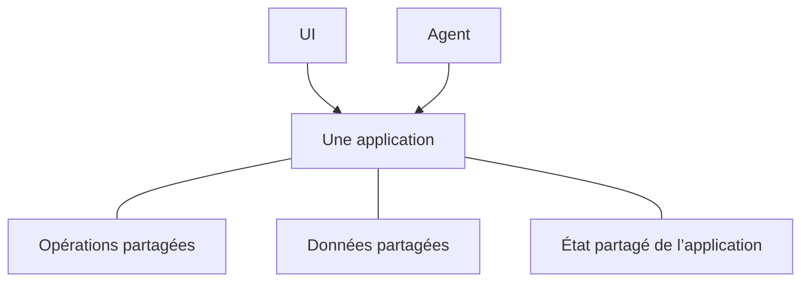

# Qu’est-ce qu’Agent-Native ?

Agent-Native est un framework TypeScript open source pour créer des applications
qui servent à la fois les personnes et les agents IA. Vous définissez une seule
fois les fonctionnalités de votre application sous forme d’[actions](/docs/actions-overview) :
des fonctions typées que votre UI React appelle depuis le code et que les agents
utilisent comme outils.

## Pourquoi créer des applications ainsi

La plupart des applications sont conçues pour qu’une personne travaille dans
l’UI. Ajouter un agent introduit une autre façon d’utiliser le produit. Pour que
les deux constituent un seul produit, trois conditions doivent être réunies :

- **L’agent doit avoir accès au produit.** Avec un ensemble d’outils distinct et
  plus réduit, il reste limité, et vous maintenez deux implémentations qui
  divergent à mesure que l’application évolue.
- **Les personnes ont toujours besoin d’une UI d’application.** Le chat convient
  pour déléguer du travail, mais pas toujours pour consulter des informations,
  comparer des options, examiner des modifications ou partager les résultats.
- **Le travail doit pouvoir passer de l’un à l’autre.** Une personne doit pouvoir
  examiner ou modifier le travail de l’agent, et l’agent doit pouvoir reprendre
  à partir de là sans recommencer.

L’architecture Agent-Native répond à ces exigences. Les personnes peuvent
travailler dans l’UI ou déléguer un résultat à l’agent, puis passer de l’un à
l’autre sans perdre leur progression.

<Video
  src="https://cdn.builder.io/o/assets%2Fc5b47d20f6a943e485717e5895739988%2Fc88d506c160142ae9b8618616ceedcea%2Fcompressed?apiKey=c5b47d20f6a943e485717e5895739988&token=c88d506c160142ae9b8618616ceedcea&alt=media&optimized=true"
  alt="Une personne utilise directement une application et travaille avec un agent IA dans cette même application."
  align="full"
  caption="Regardez une introduction de quatre minutes à l’architecture Agent-Native."
/>

## Comment fonctionne Agent-Native

Une application Agent-Native donne aux personnes et aux agents deux manières de
travailler avec le même produit :

- **L’UI** permet de parcourir, modifier, examiner et partager le travail.
- **L’agent** gère le travail que les personnes lui délèguent.

Trois fondations partagées rendent cela possible :

- **Opérations partagées.** Les personnes les déclenchent depuis l’UI et les
  agents les appellent directement. Agent-Native définit chaque opération une
  seule fois sous forme d’[action](/docs/actions-overview).
- **Les [données partagées](/docs/server-database)** contiennent le travail et
  les informations que l’application doit conserver : fiches client, plans de
  projet, conversations ou rapports. L’UI et l’agent les lisent et les mettent
  tous deux à jour.
- **L’[état partagé de l’application](/docs/context-awareness)** décrit ce qui
  se passe maintenant, comme la page en cours, l’enregistrement sélectionné ou
  la vue active. Le framework fournit l’état pertinent à l’agent comme contexte.

L’agent ne clique pas dans l’UI. Il appelle les mêmes actions que l’UI, avec la
même validation, les mêmes autorisations et la même implémentation.

Par exemple, une personne peut attribuer un ticket de support dans l’UI ou
demander à l’agent de le faire. Les deux chemins exécutent la même action et
mettent à jour le même ticket. La personne peut examiner le résultat dans l’UI,
le modifier, puis laisser l’agent poursuivre.

## Quand utiliser Agent-Native ?

Agent-Native convient lorsque :

- l’agent doit effectuer un véritable travail dans l’application, pas seulement répondre ;
- les personnes ont besoin d’une UI pour examiner, modifier, approuver ou partager le travail ;
- le travail doit circuler entre l’UI et l’agent sans perdre progression ni contexte.

Pour une seule réponse générée, appelez directement un modèle. Pour un flux fixe
et prévisible, une logique d’application ou une automatisation classique est plus
simple. Utilisez Agent-Native lorsque l’UI et l’agent ont tous deux un rôle
continu dans le même travail.

## Étapes suivantes

<Cards>

### [Démarrage](/docs/getting-started)

Créez une application et appelez la même action depuis l’agent et l’UI.

### [Concepts clés](/docs/key-concepts)

Découvrez comment les actions, les données SQL, le contexte d’application,
l’accès et la synchronisation en direct s’articulent.

### [Surfaces d’agent](/docs/agent-surfaces)

Découvrez comment le même modèle prend en charge des applications pilotées par
une UI, le chat, une automatisation ou un autre agent.

</Cards>
