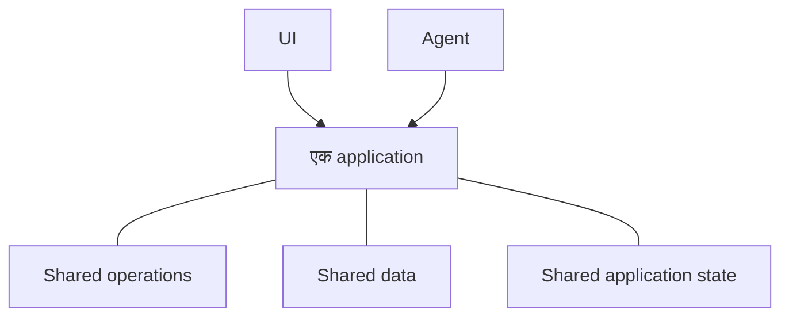

# Agent-Native क्या है?

Agent-Native एक open-source TypeScript framework है, जो ऐसे ऐप बनाने के लिए है
जो लोगों और AI agents, दोनों को सेवा देते हैं। आप अपने ऐप की functionality एक बार
[actions](/docs/actions-overview)—typed functions के रूप में define करते हैं, जिन्हें
आपका React UI code से call करता है और agents tools के रूप में उपयोग करते हैं।

## ऐप्स इस तरह क्यों बनाएं

अधिकांश applications किसी व्यक्ति के UI के जरिए काम करने के लिए design की जाती हैं।
Agent जोड़ने से product उपयोग करने का एक और तरीका आता है। दोनों को एक product की तरह
काम करने के लिए तीन बातें सही होनी चाहिए:

- **Agent को product तक access चाहिए।** अगर उसे छोटा, अलग tool set मिले, तो वह सीमित
  रहता है। साथ ही, application बदलने पर अलग-अलग होने वाले दो implementations बनाए रखने पड़ते हैं।
- **लोगों को फिर भी application UI चाहिए।** Chat से काम delegate करना अच्छा होता है,
  लेकिन information browse करने, options compare करने, changes review करने या team के साथ
  results share करने के लिए हमेशा नहीं।
- **काम को दोनों के बीच move होना चाहिए।** व्यक्ति को agent के काम को inspect या change
  करने में सक्षम होना चाहिए, और agent को वहीं से फिर काम जारी रखने में—बिना फिर से शुरू किए।

Agent-Native architecture इन्हीं requirements के इर्द-गिर्द बनाई गई है। लोग UI में सीधे
काम कर सकते हैं या agent को outcome delegate कर सकते हैं, फिर progress खोए बिना दोनों
के बीच move कर सकते हैं।

<Video
  src="https://cdn.builder.io/o/assets%2Fc5b47d20f6a943e485717e5895739988%2Fc88d506c160142ae9b8618616ceedcea%2Fcompressed?apiKey=c5b47d20f6a943e485717e5895739988&token=c88d506c160142ae9b8618616ceedcea&alt=media&optimized=true"
  alt="एक ही application में कोई व्यक्ति सीधे काम कर रहा है और AI agent के जरिए काम कर रहा है—इसकी तुलना।"
  align="full"
  caption="Agent-Native architecture का चार मिनट का परिचय देखें।"
/>

## Agent-Native कैसे काम करता है

Agent-Native application लोगों और agents को एक ही product के साथ काम करने के दो तरीके देता है:

- **UI** लोगों को work browse, edit, review और share करने का परिचित तरीका देता है।
- **Agent** लोगों द्वारा delegate किया गया काम संभालता है।

तीन shared foundations इसे संभव बनाते हैं:

- **Shared operations.** लोग इन्हें UI से trigger करते हैं, जबकि agents इन्हें सीधे call करते हैं।
  Agent-Native हर operation को एक बार [action](/docs/actions-overview) के रूप में define करता है।
- **[Shared data](/docs/server-database)** उस work और information को रखता है जिसे application को preserve करना होता है।
  Application के अनुसार यह customer records, project plans, conversations या reports हो सकते हैं। UI और agent दोनों इस shared data को read और update करते हैं।
- **[Shared application state](/docs/context-awareness)** बताता है कि इस समय क्या हो रहा है, जैसे current page,
  selected record या active view। Framework relevant state को context के रूप में agent को देता है, ताकि उसे पता रहे कि व्यक्ति किस पर काम कर रहा है।

Agent UI में click करके काम नहीं करता। वह UI के समान actions को उसी validation, permissions और
implementation के साथ call करता है।

उदाहरण के लिए, कोई व्यक्ति UI से support ticket assign कर सकता है या agent से ऐसा करने को कह सकता है।
दोनों paths एक ही action चलाते हैं और उसी ticket को update करते हैं। व्यक्ति UI में result inspect या change
कर सकता है, फिर agent को वहीं से काम जारी रखने दे सकता है।

## Agent-Native का उपयोग कब करना चाहिए?

Agent-Native तब अच्छा fit है जब:

- Agent को ऐप में असली काम करना हो, केवल सवालों के जवाब नहीं देने हों।
- लोगों को काम inspect, edit, approve या share करने के लिए UI चाहिए।
- UI और agent के बीच काम को progress या context खोए बिना move होना चाहिए।

अगर केवल एक generated response चाहिए, तो सीधे model को call करें। अगर workflow fixed और predictable
sequence का पालन करता है, तो सामान्य application logic या automation सरल है। Agent-Native तब उपयोग करें
जब UI और agent दोनों को एक ही work में लगातार भूमिका चाहिए।

## अगले कदम

<Cards>

### [शुरुआत करें](/docs/getting-started)

ऐप बनाएं और उसी action को agent और UI से call करें।

### [मुख्य अवधारणाएं](/docs/key-concepts)

जानें कि actions, SQL data, application context, access और live sync साथ में कैसे काम करते हैं।

### [Agent Surfaces](/docs/agent-surfaces)

देखें कि यही model UI, chat, automation या दूसरे agent द्वारा चलाए जाने वाले apps को कैसे support करता है।

</Cards>
