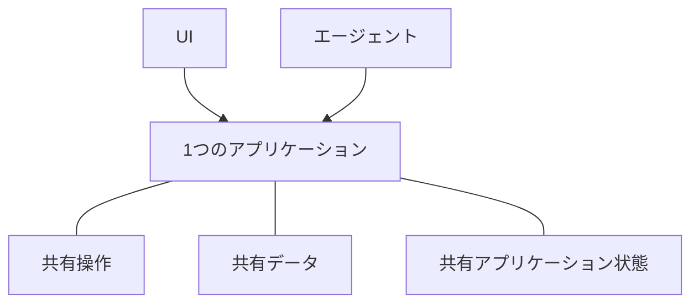

# Agent-Nativeとは？

Agent-Nativeは、人とAIエージェントの両方に対応するアプリを構築するための
オープンソースのTypeScriptフレームワークです。アプリの機能を一度だけ
[アクション](/docs/actions-overview)として定義します。アクションは型付き関数で、
React UIはコードから呼び出し、エージェントはツールとして使います。

## なぜこの方法でアプリを構築するのか

ほとんどのアプリケーションは、人がUIを通じて作業することを前提に設計されています。
エージェントを追加すると、製品を使うもう一つの方法が生まれます。両者が一つの製品として機能するには、次の3つが必要です。

- **エージェントが製品にアクセスできること。** より小さな別のツールセットしか受け取らなければ、エージェントは制約されたままです。また、アプリケーションの変化とともにずれていく2つの実装を保守することになります。
- **人には依然としてアプリケーションUIが必要なこと。** チャットは作業を委任するには適していますが、情報の閲覧、選択肢の比較、変更の確認、チームとの結果共有には必ずしも適していません。
- **作業が両者の間を移動できること。** 人はエージェントの作業を確認または変更でき、エージェントは最初からやり直すことなく、そこから続けられるべきです。

Agent-Nativeアーキテクチャは、これらの要件を中心に作られています。人はUIで直接作業することも、成果をエージェントに委任することもでき、進行を失わずに両者の間を行き来できます。

<Video
  src="https://cdn.builder.io/o/assets%2Fc5b47d20f6a943e485717e5895739988%2Fc88d506c160142ae9b8618616ceedcea%2Fcompressed?apiKey=c5b47d20f6a943e485717e5895739988&token=c88d506c160142ae9b8618616ceedcea&alt=media&optimized=true"
  alt="同じアプリケーションで、人が直接利用する場合とAIエージェントを介して利用する場合の比較。"
  align="full"
  caption="Agent-Nativeアーキテクチャの4分間の紹介をご覧ください。"
/>

## Agent-Nativeの仕組み

Agent-Nativeアプリケーションは、人とエージェントに同じ製品を操作する2つの方法を提供します。

- **UI**は、人が作業を閲覧、編集、確認、共有するための親しみやすい方法を提供します。
- **エージェント**は、人が委任した作業を処理します。

これを可能にする3つの共有基盤があります。

- **共有操作。** 人はUIを通じて操作を実行し、エージェントは直接呼び出します。Agent-Nativeは各操作を一度だけ[アクション](/docs/actions-overview)として定義します。
- **[共有データ](/docs/server-database)**は、アプリケーションが保存する必要がある作業や情報を保持します。アプリケーションによっては、顧客レコード、プロジェクト計画、会話、レポートなどです。UIとエージェントの両方がこの共有データを読み取り、更新します。
- **[共有アプリケーション状態](/docs/context-awareness)**は、現在のページ、選択中のレコード、アクティブなビューなど、今起きていることを表します。フレームワークは関連する状態をコンテキストとしてエージェントに渡すため、人が何に取り組んでいるかを把握できます。

エージェントはUIをクリックして操作するわけではありません。UIと同じアクションを、同じ検証、権限、実装で呼び出します。

たとえば、人はUIからサポートチケットを担当者に割り当てることも、エージェントに依頼することもできます。どちらの経路でも同じアクションが実行され、同じチケットが更新されます。人はUIで結果を確認または変更してから、エージェントにそこから作業を続けさせられます。

## Agent-Nativeを使うべきとき

次の場合、Agent-Nativeは適しています。

- エージェントに、質問への回答だけでなくアプリで実際の作業をさせたい。
- 人が作業を確認、編集、承認、共有するためのUIが必要である。
- UIとエージェントの間で、進行やコンテキストを失わずに作業を移動させたい。

生成された応答が1つだけ必要なら、モデルを直接呼び出してください。ワークフローが固定された予測可能な手順に従うなら、通常のアプリケーションロジックまたは自動化の方がシンプルです。UIとエージェントの両方が同じ作業で継続的な役割を持つ場合に、Agent-Nativeを使ってください。

## 次のステップ

<Cards>

### [はじめに](/docs/getting-started)

アプリを作成し、同じアクションをエージェントとUIから呼び出します。

### [主要な概念](/docs/key-concepts)

アクション、SQLデータ、アプリケーションコンテキスト、アクセス、ライブ同期がどのように連携するかを学びます。

### [エージェントサーフェス](/docs/agent-surfaces)

同じモデルが、UI、チャット、自動化、別のエージェント主導のアプリをどのように支えるかを確認します。

### [テンプレート](/docs/cloneable-saas)

Chat から一つずつ積み上げるのではなく、完成した SaaS プロダクトを起点として始めます。

</Cards>
