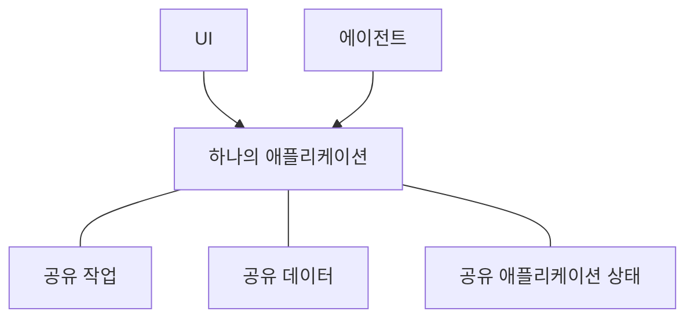

# Agent-Native란?

Agent-Native는 사람과 AI 에이전트 모두를 지원하는 앱을 만들기 위한 오픈 소스
TypeScript 프레임워크입니다. 앱의 기능을 한 번만 [액션](/docs/actions-overview)으로
정의합니다. 액션은 React UI가 코드에서 호출하고 에이전트가 도구로 사용하는 타입이 지정된 함수입니다.

## 왜 이 방식으로 앱을 만들까요

대부분의 애플리케이션은 사람이 UI를 통해 작업하도록 설계되었습니다. 에이전트를 추가하면 제품을 사용하는 또 하나의 방법이 생깁니다. 둘이 하나의 제품으로 작동하려면 세 가지가 필요합니다.

- **에이전트가 제품에 접근할 수 있어야 합니다.** 더 작고 별도의 도구 모음만 받으면 에이전트는 제약된 상태에 머뭅니다. 또한 애플리케이션이 바뀌면서 서로 어긋나는 두 구현을 유지하게 됩니다.
- **사람에게는 여전히 애플리케이션 UI가 필요합니다.** 채팅은 작업을 위임하기에는 좋지만, 정보를 탐색하거나, 옵션을 비교하거나, 변경 사항을 검토하거나, 팀과 결과를 공유하는 데 항상 적합한 것은 아닙니다.
- **작업이 둘 사이에서 이동해야 합니다.** 사람은 에이전트의 작업을 검사하거나 변경할 수 있어야 하고, 에이전트는 처음부터 다시 시작하지 않고 거기서 계속할 수 있어야 합니다.

Agent-Native 아키텍처는 이러한 요구 사항을 중심으로 만들어졌습니다. 사람은 UI에서 직접 작업하거나 결과를 에이전트에게 위임할 수 있고, 진행 상황을 잃지 않은 채 둘 사이를 오갈 수 있습니다.

<Video
  src="https://cdn.builder.io/o/assets%2Fc5b47d20f6a943e485717e5895739988%2Fc88d506c160142ae9b8618616ceedcea%2Fcompressed?apiKey=c5b47d20f6a943e485717e5895739988&token=c88d506c160142ae9b8618616ceedcea&alt=media&optimized=true"
  alt="같은 애플리케이션에서 사람이 직접 사용하는 경우와 AI 에이전트를 통해 작업하는 경우의 비교."
  align="full"
  caption="Agent-Native 아키텍처를 소개하는 4분짜리 영상을 시청하세요."
/>

## Agent-Native 작동 방식

Agent-Native 애플리케이션은 사람과 에이전트에게 같은 제품에서 작업하는 두 가지 방식을 제공합니다.

- **UI**는 사람이 작업을 탐색하고, 편집하고, 검토하고, 공유할 수 있는 익숙한 방법을 제공합니다.
- **에이전트**는 사람이 위임한 작업을 처리합니다.

세 가지 공유 기반이 이를 가능하게 합니다.

- **공유 작업.** 사람은 UI를 통해 작업을 실행하고, 에이전트는 직접 호출합니다. Agent-Native는 각 작업을 한 번만 [액션](/docs/actions-overview)으로 정의합니다.
- **[공유 데이터](/docs/server-database)**는 애플리케이션이 보존해야 하는 작업과 정보를 담습니다. 애플리케이션에 따라 고객 레코드, 프로젝트 계획, 대화 또는 보고서일 수 있습니다. UI와 에이전트 모두 이 공유 데이터를 읽고 업데이트합니다.
- **[공유 애플리케이션 상태](/docs/context-awareness)**는 현재 페이지, 선택된 레코드 또는 활성 뷰처럼 지금 일어나는 일을 설명합니다. 프레임워크는 관련 상태를 컨텍스트로 에이전트에 제공하므로 사람이 무엇을 작업 중인지 알 수 있습니다.

에이전트는 UI를 클릭해서 작업하지 않습니다. UI와 같은 액션을 같은 검증, 권한, 구현으로 호출합니다.

예를 들어 사람은 UI에서 지원 티켓을 할당하거나 에이전트에게 그렇게 하도록 요청할 수 있습니다. 두 경로 모두 같은 액션을 실행하고 같은 티켓을 업데이트합니다. 사람은 UI에서 결과를 검사하거나 변경한 뒤 에이전트가 거기서 계속 작업하도록 할 수 있습니다.

## Agent-Native를 사용해야 하는 경우

다음과 같은 경우 Agent-Native가 적합합니다.

- 에이전트가 질문에만 답하는 것이 아니라 앱에서 실제 작업을 해야 합니다.
- 사람이 작업을 검사, 편집, 승인 또는 공유할 UI가 필요합니다.
- UI와 에이전트 사이에서 진행 상황이나 컨텍스트를 잃지 않고 작업이 이동해야 합니다.

생성된 응답 하나만 필요하다면 모델을 직접 호출하세요. 워크플로가 고정되고 예측 가능한 순서를 따른다면 일반 애플리케이션 로직이나 자동화가 더 단순합니다. UI와 에이전트 모두가 같은 작업에서 지속적인 역할을 해야 할 때 Agent-Native를 사용하세요.

## 다음 단계

<Cards>

### [시작하기](/docs/getting-started)

앱을 만들고 같은 액션을 에이전트와 UI에서 호출합니다.

### [핵심 개념](/docs/key-concepts)

액션, SQL 데이터, 애플리케이션 컨텍스트, 접근 권한, 라이브 동기화가 어떻게 함께 작동하는지 알아봅니다.

### [에이전트 서피스](/docs/agent-surfaces)

같은 모델이 UI, 채팅, 자동화 또는 다른 에이전트가 주도하는 앱을 어떻게 지원하는지 알아봅니다.

</Cards>
