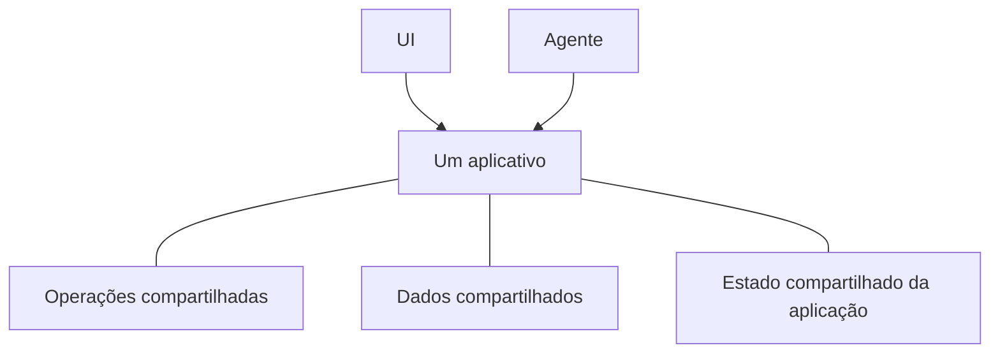

# O que é Agent-Native?

Agent-Native é um framework TypeScript de código aberto para criar apps que atendem tanto pessoas quanto agentes de IA. Você define a funcionalidade do app uma vez como [ações](/docs/actions-overview) — funções tipadas que sua UI React chama pelo código e os agentes usam como ferramentas.

## Por que criar apps dessa forma

A maioria dos aplicativos é projetada em torno de uma pessoa trabalhando pela UI. Adicionar um agente introduz outra forma de usar o produto. Para que ambos funcionem como um único produto, três coisas precisam ser verdadeiras:

- **O agente precisa acessar o produto.** Se ele receber um conjunto menor e separado de ferramentas, continuará limitado. Você também acabará mantendo duas implementações que se afastam à medida que o aplicativo muda.
- **As pessoas ainda precisam de uma UI de aplicativo.** O chat funciona bem para delegar trabalho, mas nem sempre para navegar informações, comparar opções, revisar alterações ou compartilhar resultados com uma equipe.
- **O trabalho precisa transitar entre os dois.** Uma pessoa deve poder inspecionar ou alterar o trabalho do agente, e o agente deve poder continuar dali sem recomeçar.

A arquitetura Agent-Native é criada em torno desses requisitos. As pessoas podem trabalhar diretamente pela UI ou delegar um resultado ao agente, e depois transitar entre os dois sem perder o progresso.

<Video
  src="https://cdn.builder.io/o/assets%2Fc5b47d20f6a943e485717e5895739988%2Fc88d506c160142ae9b8618616ceedcea%2Fcompressed?apiKey=c5b47d20f6a943e485717e5895739988&token=c88d506c160142ae9b8618616ceedcea&alt=media&optimized=true"
  alt="Uma comparação entre uma pessoa usando um aplicativo diretamente e trabalhando pelo agente de IA no mesmo aplicativo."
  align="full"
  caption="Assista a uma introdução de quatro minutos à arquitetura Agent-Native."
/>

## Como Agent-Native funciona

Um aplicativo Agent-Native oferece às pessoas e aos agentes duas maneiras de trabalhar com o mesmo produto:

- **A UI** oferece às pessoas uma forma familiar de navegar, editar, revisar e compartilhar trabalho.
- **O agente** realiza o trabalho que as pessoas delegam a ele.

Três fundamentos compartilhados tornam isso possível:

- **Operações compartilhadas.** As pessoas as acionam pela UI, enquanto os agentes as chamam diretamente. Agent-Native define cada operação uma vez como uma [ação](/docs/actions-overview).
- **[Dados compartilhados](/docs/server-database)** guardam o trabalho e as informações que o aplicativo precisa preservar. Dependendo do aplicativo, podem ser registros de clientes, planos de projeto, conversas ou relatórios. A UI e o agente leem e atualizam esses mesmos dados.
- **[Estado compartilhado da aplicação](/docs/context-awareness)** descreve o que está acontecendo agora, como a página atual, o registro selecionado ou a visualização ativa. O framework fornece o estado relevante ao agente como contexto, para que ele saiba no que a pessoa está trabalhando.

O agente não clica pela UI. Ele chama as mesmas ações que a UI, com a mesma validação, permissões e implementação.

Por exemplo, uma pessoa pode atribuir um ticket de suporte pela UI ou pedir ao agente que faça isso. Os dois caminhos executam a mesma ação e atualizam o mesmo ticket. A pessoa pode inspecionar ou alterar o resultado na UI e, depois, deixar o agente continuar dali.

## Quando usar Agent-Native?

Agent-Native é uma boa escolha quando:

- O agente deve realizar trabalho real no app, não apenas responder perguntas.
- As pessoas precisam de uma UI para inspecionar, editar, aprovar ou compartilhar o trabalho.
- O trabalho deve transitar entre a UI e o agente sem perder progresso ou contexto.

Se você só precisa de uma resposta gerada, chame um modelo diretamente. Se o fluxo segue uma sequência fixa e previsível, a lógica de aplicação convencional ou uma automação é mais simples. Use Agent-Native quando a UI e o agente precisarem ter um papel contínuo no mesmo trabalho.

## Próximos passos

<Cards>

### [Primeiros passos](/docs/getting-started)

Crie um app e chame a mesma ação pelo agente e pela UI.

### [Conceitos principais](/docs/key-concepts)

Aprenda como ações, dados SQL, contexto da aplicação, acesso e sincronização em tempo real se encaixam.

### [Superfícies de agente](/docs/agent-surfaces)

Veja como o mesmo modelo dá suporte a apps guiados por uma UI, chat, automação ou outro agente.

</Cards>
