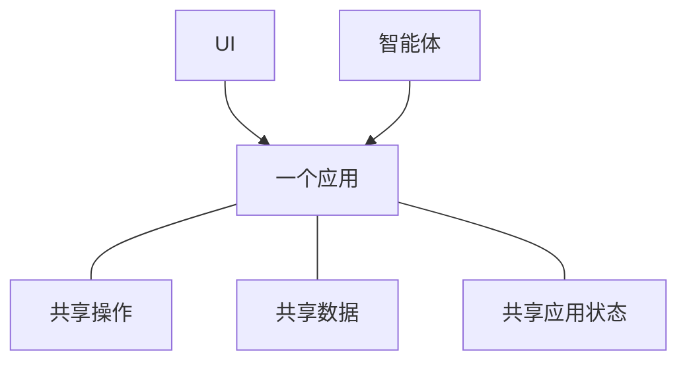

# 什么是 Agent-Native？

Agent-Native 是一个开源 TypeScript 框架，用于构建同时服务于人和 AI 智能体的应用。你只需将应用功能定义一次，作为[动作](/docs/actions-overview)——React UI 从代码中调用的类型化函数，智能体则将其用作工具。

## 为什么要以这种方式构建应用

大多数应用都是围绕人通过 UI 工作而设计的。加入智能体引入了另一种使用产品的方式。要让两者作为一个产品协同工作，必须满足三件事：

- **智能体需要访问产品。** 如果它得到的是较小、独立的一组工具，它仍然会受到限制。随着应用变化，你也会维护两套逐渐偏离的实现。
- **人们仍然需要应用 UI。** 聊天很适合委派工作，但并不总适合浏览信息、比较选项、审查变更或与团队共享结果。
- **工作需要能在两者之间流转。** 人应该能够检查或修改智能体的工作，而智能体应能从那里继续，不必重新开始。

Agent-Native 架构围绕这些要求构建。人们可以直接通过 UI 工作，也可以将结果委派给智能体，然后在两者之间切换而不会丢失进度。

<Video
  src="https://cdn.builder.io/o/assets%2Fc5b47d20f6a943e485717e5895739988%2Fc88d506c160142ae9b8618616ceedcea%2Fcompressed?apiKey=c5b47d20f6a943e485717e5895739988&token=c88d506c160142ae9b8618616ceedcea&alt=media&optimized=true"
  alt="比较人员直接使用应用与通过同一应用中的 AI 智能体工作。"
  align="full"
  caption="观看四分钟的 Agent-Native 架构介绍。"
/>

## Agent-Native 如何工作

Agent-Native 应用为人和智能体提供两种使用同一产品的方式：

- **UI** 为人们提供熟悉的浏览、编辑、审查和共享工作的方法。
- **智能体** 处理人们委派给它的工作。

三个共享基础使之成为可能：

- **共享操作。** 人通过 UI 触发操作，智能体则直接调用它们。Agent-Native 将每个操作只定义一次，作为一个[动作](/docs/actions-overview)。
- **[共享数据](/docs/server-database)** 保存应用需要保留的工作和信息。根据应用的不同，可能是客户记录、项目计划、对话或报告。UI 和智能体都读写这些共享数据。
- **[共享应用状态](/docs/context-awareness)** 描述当前正在发生的事情，例如当前页面、选定记录或活动视图。框架将相关状态作为上下文提供给智能体，使它知道人正在处理什么。

智能体不会通过点击 UI 来操作。它调用与 UI 相同的动作，使用相同的验证、权限和实现。

例如，一个人可以通过 UI 分配支持工单，也可以要求智能体完成此事。两条路径都会运行同一个动作并更新同一张工单。该人可以在 UI 中检查或修改结果，然后让智能体从那里继续。

## 何时应使用 Agent-Native？

以下情况适合使用 Agent-Native：

- 智能体应在应用中完成实际工作，而不仅仅是回答问题。
- 人们需要 UI 来检查、编辑、审批或共享工作。
- 工作应能在 UI 和智能体之间流转，而不会丢失进度或上下文。

如果你只需要一次生成的回答，直接调用模型即可。如果工作流遵循固定且可预测的顺序，普通应用逻辑或自动化会更简单。当 UI 和智能体都需要在同一项工作中持续发挥作用时，请使用 Agent-Native。

## 后续步骤

<Cards>

### [开始使用](/docs/getting-started)

创建应用，并从智能体和 UI 调用同一个动作。

### [核心概念](/docs/key-concepts)

了解动作、SQL 数据、应用上下文、访问控制和实时同步如何协同工作。

### [智能体界面](/docs/agent-surfaces)

了解同一模型如何支持以 UI、聊天、自动化或其他智能体为主导的应用。

### [模板](/docs/cloneable-saas)

从一个完整的 SaaS 产品开始，而不必从 Chat 逐步搭建。

</Cards>
