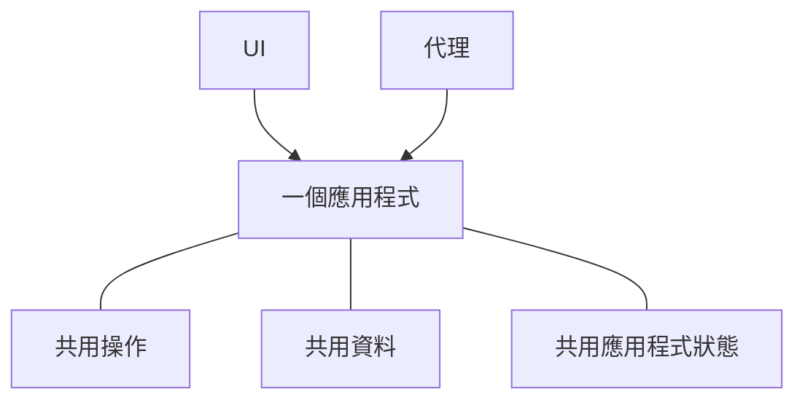

# 什麼是 Agent-Native？

Agent-Native 是一個開放原始碼 TypeScript 框架，用於建置同時服務人們與 AI 代理的應用程式。您只要將應用程式功能定義一次，作為 [actions](/docs/actions-overview)——React UI 從程式碼呼叫的具型別函式，代理則將它們當作工具使用。

## 為什麼要以這種方式建置應用程式

大多數應用程式都是圍繞人員透過 UI 工作而設計。加入代理引入另一種使用產品的方式。要讓兩者作為同一個產品運作，必須滿足三件事：

- **代理需要存取產品。** 如果它取得的是較小、獨立的一組工具，仍會受到限制。隨著應用程式改變，您也會維護兩套逐漸分歧的實作。
- **人們仍需要應用程式 UI。** 聊天很適合委派工作，但不一定適合瀏覽資訊、比較選項、審查變更或與團隊分享結果。
- **工作需要能在兩者之間移動。** 人員應能檢查或變更代理的工作，代理也應能從那裡繼續，而不用重新開始。

Agent-Native 架構圍繞這些需求建置。人們可以直接透過 UI 工作，或將成果委派給代理，接著在兩者之間移動而不會失去進度。

<Video
  src="https://cdn.builder.io/o/assets%2Fc5b47d20f6a943e485717e5895739988%2Fc88d506c160142ae9b8618616ceedcea%2Fcompressed?apiKey=c5b47d20f6a943e485717e5895739988&token=c88d506c160142ae9b8618616ceedcea&alt=media&optimized=true"
  alt="比較人員直接使用應用程式，以及透過同一應用程式中的 AI 代理工作。"
  align="full"
  caption="觀看四分鐘的 Agent-Native 架構介紹。"
/>

## Agent-Native 如何運作

Agent-Native 應用程式提供人員與代理兩種方式來使用同一個產品：

- **UI** 為人員提供熟悉的瀏覽、編輯、審查及分享工作方式。
- **代理** 處理人員委派給它的工作。

三個共用基礎使這成為可能：

- **共用操作。** 人員透過 UI 觸發它們，代理則直接呼叫它們。Agent-Native 將每個操作只定義一次，作為一個 [action](/docs/actions-overview)。
- **[共用資料](/docs/server-database)** 保存應用程式需要保留的工作與資訊。依應用程式而定，可能是客戶紀錄、專案計畫、對話或報告。UI 與代理都讀取及更新這些共用資料。
- **[共用應用程式狀態](/docs/context-awareness)** 描述目前正在發生的事情，例如目前頁面、選取紀錄或作用中視圖。框架將相關狀態作為上下文提供給代理，讓它知道人員正在處理什麼。

代理不會透過點擊 UI 來操作。它會呼叫與 UI 相同的 actions，使用相同的驗證、權限及實作。

例如，人員可以透過 UI 指派支援單，也可以要求代理完成。兩條路徑都會執行相同 action 並更新同一張支援單。人員可在 UI 中檢查或變更結果，然後讓代理從那裡繼續。

## 何時應使用 Agent-Native？

當下列情況成立時，Agent-Native 是合適選擇：

- 代理應在應用程式中完成真正的工作，而不只是回答問題。
- 人們需要 UI 來檢查、編輯、核准或分享工作。
- 工作應在 UI 與代理之間移動，而不會失去進度或上下文。

若您只需要一個生成的回答，直接呼叫模型即可。若工作流程遵循固定、可預測的順序，普通應用程式邏輯或自動化會更簡單。當 UI 與代理都需要在同一項工作中持續扮演角色時，請使用 Agent-Native。

## 下一步

<Cards>

### [開始使用](/docs/getting-started)

建立應用程式，並從代理與 UI 呼叫相同的 action。

### [核心概念](/docs/key-concepts)

了解 actions、SQL 資料、應用程式上下文、存取權及即時同步如何配合運作。

### [Agent 介面](/docs/agent-surfaces)

了解相同模型如何支援由 UI、聊天、自動化或另一個代理主導的應用程式。

### [範本](/docs/cloneable-saas)

從一個完整的 SaaS 產品開始，而不是從 Chat 逐步建立。

</Cards>
