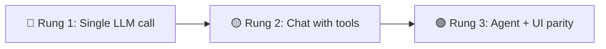

# What Is Agent-Native?

Most "AI features" today are a chat box bolted onto an existing product. You can ask questions and get summaries, but you can't ask the AI to actually _do_ anything in the app — and even when you can, the UI has no idea what the agent just did.

Agent-native is the fix. It's a way of building software where **the AI agent and the UI are equal partners** — they share the same actions, the same database, and the same state. Everything the agent can do is also a button. Everything the user clicks is also something the agent can do. One system, two ways in.

<Callout tone="decision">

If you only remember one thing from this page: most AI apps stop one step short of being useful — and that gap is the biggest mistake in the space right now.

</Callout>

## What it looks like as a user {#what-it-looks-like}

Picture a mail client, analytics dashboard, or project tracker. Chat might be the first screen — or docked on the side of a full app. Either way:

<Cards>

### Just ask

Type "reply to the email from Sara saying I'll be there by 3." The agent opens the thread, drafts the reply, and shows it to you for approval.

### Or click

Every button, list, form, and keyboard shortcut still works — and calls the same operation the agent uses.

### See what it sees

Open an email and the agent knows which one. Highlight a paragraph and press `Cmd+I` — the agent acts on exactly that.

### Watch it work

The UI updates in real time as the agent opens views, edits drafts, and runs reports. Interrupt, redirect, or take over with the mouse at any moment.

### Steer it like a teammate

Give feedback, queue tasks, audit what it did, edit its instructions. It remembers, and it improves.

</Cards>

Here's why most products don't get there.

## Why most "AI apps" fall short {#the-ladder}

There's a progression most teams climb, and most stop one rung too early.



<Callout tone="success">

**Rung 3 is agent-native.** You stopped adding buttons to a chatbot. You added an agent to an app. That's a much higher-quality product on both sides.

</Callout>

<Diagram id="doc-block-19ku4da" title="The Ladder Principle" summary={"Most teams stop at rung 1 or 2. Agent-native is rung 3 — a real app and a real agent over one shared action surface."}>

```html
<div class="diagram-ladder">
  <div class="diagram-card rung rung-3">
    <span class="diagram-pill accent">Rung 3 · agent-native</span
    ><strong>Agent + UI as equal partners</strong
    ><small class="diagram-muted"
      >One action surface. Every agent tool is also a button; every button runs
      the same logic the agent uses.</small
    >
  </div>
  <div class="diagram-card rung rung-2">
    <span class="diagram-pill">Rung 2</span><strong>A chat with tools</strong
    ><small class="diagram-muted"
      >The agent can act — but it is still just a chat window. No dashboards,
      lists, or shortcuts.</small
    >
  </div>
  <div class="diagram-card rung rung-1">
    <span class="diagram-pill warn">Rung 1</span
    ><strong>A single LLM call</strong
    ><small class="diagram-muted"
      >Prompt in, string out. Impressive in a demo; breaks the moment reality
      gets messy.</small
    >
  </div>
</div>
```

```css
.diagram-ladder {
  display: flex;
  flex-direction: column;
  gap: 14px;
}
.diagram-ladder .rung {
  display: flex;
  flex-direction: column;
  gap: 6px;
  padding: 16px 18px;
}
.diagram-ladder .rung-2 {
  margin-inline-end: 48px;
}
.diagram-ladder .rung-1 {
  margin-inline-end: 96px;
}
```

</Diagram>

See [Key Concepts — Protocols](/docs/key-concepts#protocols) for how all of this hangs off the same action definition.

## Agent + UI parity {#agent-ui-parity}

This is the defining principle of agent-native.

- **From the UI** — click buttons, fill forms, navigate views. The UI writes to the database; the agent sees the results instantly.
- **From the agent** — natural language, other agents via A2A, Slack, Telegram. The agent writes to the database; the UI updates automatically.

A good mental model is a **shared state machine**. Both the user surface and the agent surface submit typed actions. Each action validates the input, checks authorization, applies the state update, and broadcasts the result. The UI is a projection of that state. The agent never guesses from the DOM — it interacts through the same typed action layer the UI uses.

<Diagram id="doc-block-1n18itc" title="Shared state machine" summary={"The user and agent both submit typed actions. Actions validate, authorize, apply the SQL-backed state update, then broadcast/render the new state."}>

```html
<div class="diagram-machine">
  <div class="diagram-card surface user" data-rough>
    <span class="diagram-pill">User surface</span>
    <div class="diagram-node diagram-accent">
      Open Design tab<br /><small class="diagram-muted">navigate.panel</small>
    </div>
    <div class="diagram-node">
      Add text block<br /><small class="diagram-muted">plan.addBlock</small>
    </div>
    <div class="diagram-node">
      Remove summary<br /><small class="diagram-muted">plan.removeBlock</small>
    </div>
  </div>
  <div class="core">
    <div class="lane-row">
      <span class="diagram-pill">intent -&gt; action</span
      ><span class="diagram-pill">action &lt;- intent</span>
    </div>
    <div class="diagram-panel action" data-rough>
      <span class="diagram-pill accent">Typed action</span
      ><strong>navigate</strong
      ><small class="diagram-muted"
        >actor: user or agent &middot; input: panel = Design</small
      >
      <div class="steps">
        <span class="diagram-pill">validate</span
        ><span class="diagram-pill">authorize</span
        ><span class="diagram-pill">apply update</span>
      </div>
    </div>
    <div class="diagram-arrow diagram-muted" aria-hidden="true">&darr;</div>
    <div class="diagram-panel state" data-rough>
      <span class="diagram-pill ok">Shared state</span
      ><strong>SQL + app state</strong
      ><code>{ panel: "Design", lastActor: "user" }</code
      ><small class="diagram-muted">broadcast over live sync</small>
    </div>
    <div class="lane-row bottom">
      <span class="diagram-pill ok">state -&gt; UI</span
      ><span class="diagram-pill ok">context -&gt; agent</span>
    </div>
  </div>
  <div class="diagram-card surface agent" data-rough>
    <span class="diagram-pill">Agent surface</span>
    <div class="diagram-node">
      Add diagram block<br /><small class="diagram-muted">plan.addBlock</small>
    </div>
    <div class="diagram-node">
      Remove stale block<br /><small class="diagram-muted"
        >plan.removeBlock</small
      >
    </div>
    <div class="diagram-node diagram-accent">
      Focus review view<br /><small class="diagram-muted"
        >navigate.review</small
      >
    </div>
  </div>
</div>
```

```css
.diagram-machine {
  display: grid;
  grid-template-columns: minmax(150px, 1fr) minmax(300px, 1.45fr) minmax(
      150px,
      1fr
    );
  gap: 12px;
  align-items: stretch;
}
.diagram-machine .surface {
  display: flex;
  flex-direction: column;
  gap: 8px;
  padding: 14px;
}
.diagram-machine .surface .diagram-pill {
  align-self: flex-start;
}
.diagram-machine .diagram-node {
  display: flex;
  flex-direction: column;
  gap: 2px;
  padding: 10px 12px;
}
.diagram-machine .core {
  display: flex;
  flex-direction: column;
  justify-content: center;
  gap: 8px;
  min-width: 0;
}
.diagram-machine .lane-row {
  display: flex;
  justify-content: space-between;
  gap: 8px;
  flex-wrap: wrap;
}
.diagram-machine .lane-row.bottom {
  justify-content: center;
}
.diagram-machine .diagram-arrow {
  font-size: 22px;
  line-height: 1;
  text-align: center;
}
.diagram-machine .diagram-panel {
  display: flex;
  flex-direction: column;
  gap: 8px;
  min-width: 0;
  padding: 14px;
}
.diagram-machine .steps {
  display: flex;
  gap: 6px;
  flex-wrap: wrap;
}
.diagram-machine code {
  align-self: flex-start;
  max-width: 100%;
  white-space: normal;
}
@media (max-width: 760px) {
  .diagram-machine {
    grid-template-columns: 1fr;
  }
  .diagram-machine .lane-row {
    justify-content: flex-start;
  }
  .diagram-machine .lane-row.bottom {
    justify-content: flex-start;
  }
}
```

</Diagram>

When the agent creates a draft email, it appears in the UI. When you click Send, the agent knows it was sent. There's no separate "agent world" and "UI world" — it's one system. See [Key Concepts](/docs/key-concepts) for the architecture.

## Why agents need a UI — and apps need an agent {#why-both}

These two questions answer each other.

**Even when the agent does all the heavy lifting**, humans still need to see what it's doing, steer it, inspect its work, and share its output. At minimum that's an observability and management dashboard. At maximum it's a full app with the agent as a co-pilot. The surface can grow from one to the other without a rewrite.

**Even in a full app with every button working**, natural language makes a huge difference. Agent-native flips the usual limitation: because every action is defined once and exposed as both a button and an agent tool, the agent can do everything the buttons can — and more. Natural language becomes a first-class input alongside clicks, with no separate "AI world" to maintain.

The argument isn't "agents replace UI." It's **agents belong inside applications, as equal partners**. See [Agent Surfaces](/docs/agent-surfaces) for the concrete shapes and APIs.

## Per-user customization — without the complexity {#workspace-customization}

What makes tools like Claude Code feel powerful isn't the model — it's the customization layer: per-project instructions, skills, memory, sub-agents, connected services.

Agent-native gives every user that same layer, inside your app, stored in the database rather than on the filesystem. No dev environment per user, no container per user — just rows in a table. Each user gets:

- Team-wide rules everyone's agent reads
- Personal memory the agent builds automatically as you correct it
- Reusable `/slash` commands for common how-to guides
- Custom `@sub-agents` for specific tasks
- Scheduled jobs (e.g. "every Monday, summarize last week")
- Connected external services via per-user MCP servers

That's Claude Code-level flexibility in a multi-tenant SaaS product. See [Agent Resources](/docs/agent-resources) for the full concept.

## What does it look like in code? {#what-does-it-look-like-in-code}

Every operation in an agent-native app is an **action** — defined once, available to both the agent and the UI.

<AnnotatedCode
  id="doc-block-n4jy5o"
  title="One action, defined once"
  filename="actions/reply-to-email.ts"
  language="ts"
  code={
    'import { defineAction } from "@agent-native/core/action";\nimport { z } from "zod";\n\nimport { getDb, schema } from "../server/db/index.js";\n\nexport default defineAction({\n  description: "Reply to an email thread",\n  schema: z.object({ emailId: z.string(), body: z.string() }),\n  run: async ({ emailId, body }) => {\n    const db = getDb();\n    await db.insert(schema.replies).values({ emailId, body });\n  },\n});'
  }
  annotations={[
    {
      lines: "7",
      label: "Tool surface",
      note: "The `description` is what the agent reads to decide when to call this as a tool.",
    },
    {
      lines: "8",
      label: "Typed contract",
      note: "One zod `schema` validates input from **every** surface — agent, UI, HTTP, MCP, and A2A.",
    },
    {
      lines: "9-12",
      label: "One implementation",
      note: "The `run` body is the single source of truth. The UI button and the agent tool both execute exactly this. `getDb()` and `schema` come from your app's `server/db/index.ts` — see [Database](/docs/database).",
    },
  ]}
/>

The same action is then callable from a React component, from the agent in chat, and from any external agent or MCP host:

```tsx
// In any React component — same action, called from a button
const { mutate } = useActionMutation("reply-to-email");

<Button onClick={() => mutate({ emailId, body: "Thanks!" })}>
  Send Reply
</Button>;
```

```tsx
// And the agent panel mounted anywhere in your app
import { AgentSidebar } from "@agent-native/core/client/agent-chat";
<AgentSidebar />;
```

One action definition powers the UI button, the agent tool, an HTTP endpoint, an MCP surface, an A2A integration, and a CLI command. See [Actions](/docs/actions) for the full reference.

## How to get started {#how-to-get-started}

Agent-native apps follow a start-from-a-working-app model. Pick a template — Calendar, Mail, Analytics, Forms, and more — and make it yours.

<Steps>

### Pick a template

Browse [agent-native.com/templates](/templates) and pick the one closest to what you want to build.

### Use it immediately

Every template deploys as a hosted app (e.g. `mail.agent-native.com`). Try it before you touch any code.

### Clone and customize

When you're ready to change something — "connect our Stripe account," "add a cohort chart" — create your own app from the template and customize the source in your own repository.

### Deploy to your domain

Ship your app to your own domain, or stay on agent-native.com. Because it's _your_ app, you own the source and can evolve it independently.

</Steps>

Not ready for a whole template? Add a **skill** to a coding agent you already use: `npx @agent-native/core@latest skills add visual-plan`. See the [Skills Guide](/docs/skills-guide#app-backed-skills).

## Composable agents {#composable-agents}

Agent-native apps can talk to each other. From inside the mail app, you can tag the analytics agent to query data and include the result in a draft. The agents discover what other agents are available, hand off work, and surface results in the UI you're already in — powered by [A2A](/docs/a2a-protocol) and [MCP](/docs/mcp-protocol) under the hood.

## What's next {#whats-next}

<Cards>

### [Getting Started](/docs/getting-started)

Build a working chat app in under five minutes, then add actions, a database, and a page.

### [Key Concepts](/docs/key-concepts)

The architecture underneath everything on this page: SQL, actions, polling sync, and context awareness.

### [Agent Surfaces](/docs/agent-surfaces)

All the shapes an agent-native app can take: chat, inline UI, full app pages, sidecars, automation, and external agents.

### [Templates](/docs/cloneable-saas)

Complete, working products you own and customize — not blank scaffolds.

### [Agent Resources](/docs/agent-resources)

The per-user customization layer: skills, memory, instructions, and MCP connections — backed by SQL, not files.

### [FAQ](/docs/faq)

Quick answers on cost, hosting, models, and templates.

</Cards>
