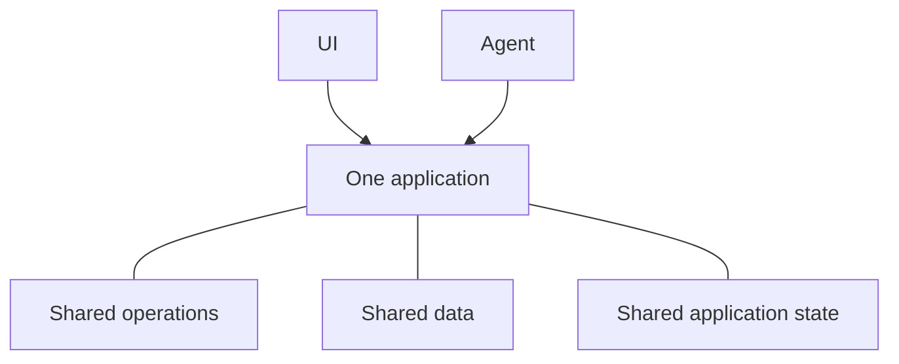

# What is Agent-Native?

Agent-Native is an open-source TypeScript framework for building apps that
serve both people and AI agents. You define your app's functionality once as
[actions](/docs/actions-overview)—typed functions that your React UI calls
from code and agents use as tools.

## Why build apps this way

Most applications are designed around a person working through the UI. Adding
an agent introduces another way to use the product. For both to work as one
product, three things need to be true:

- **The agent needs access to the product.** If it receives a smaller, separate
  set of tools, it remains constrained. You also end up maintaining two
  implementations that drift as the application changes.
- **People still need an application UI.** Chat works well for delegating work,
  but not always for browsing information, comparing options, reviewing
  changes, or sharing results with a team.
- **Work needs to move between them.** A person should be able to inspect or
  change the agent's work, and the agent should be able to continue from there
  without starting over.

Agent-Native architecture is built around these requirements. People can work
directly through the UI or delegate an outcome to the agent, then move between
the two without losing progress.

<Video
  src="https://cdn.builder.io/o/assets%2Fc5b47d20f6a943e485717e5895739988%2Fc88d506c160142ae9b8618616ceedcea%2Fcompressed?apiKey=c5b47d20f6a943e485717e5895739988&token=c88d506c160142ae9b8618616ceedcea&alt=media&optimized=true"
  alt="A comparison of a person using an application directly and working through an AI agent in the same application."
  align="full"
  caption="Watch a four-minute introduction to agent-native architecture."
/>

## How Agent-Native works

An Agent-Native application gives people and agents two ways to work with the
same product:

- **The UI** gives people a familiar way to browse, edit, review, and share
  work.
- **The agent** handles work people delegate to it.

Three shared foundations make this possible:

- **Shared operations.** People trigger them through the UI, while agents call
  them directly. Agent-Native defines each operation once as an
  [action](/docs/actions-overview).
- **[Shared data](/docs/database)** holds the work and information the
  application needs to preserve. Depending on the application, that might be
  customer records, project plans, conversations, or reports. The UI and agent
  both read and update this shared data.
- **[Shared application state](/docs/context-awareness)** describes what is
  happening right now, such as the current page, selected record, or active
  view. The framework gives relevant state to the agent as context, so it knows
  what the person is working with.

The agent does not click through the UI. It calls the same actions as the UI,
with the same validation, permissions, and implementation.

For example, a person can assign a support ticket through the UI or ask the
agent to do it. Both paths run the same action and update the same ticket. The
person can inspect or change the result in the UI, then let the agent continue
from there.

## When should you use Agent-Native?

Agent-Native is a good fit when:

- The agent should do real work in the app, not only answer questions.
- People need a UI to inspect, edit, approve, or share the work.
- Work should move between the UI and agent without losing progress or context.

If you only need one generated response, call a model directly. If the workflow
follows a fixed, predictable sequence, ordinary application logic or automation
is simpler. Use Agent-Native when the UI and agent both need an ongoing role in
the same work.

## Next steps

<Cards>

### [Getting Started](/docs/getting-started)

Create an app and call the same action from the agent and UI.

### [Key Concepts](/docs/key-concepts)

Learn how actions, SQL data, application context, access, and live sync fit
together.

### [Agent Surfaces](/docs/agent-surfaces)

See how the same model supports apps led by a UI, chat, automation, or another
agent.

</Cards>
