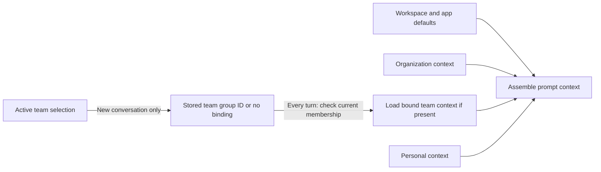
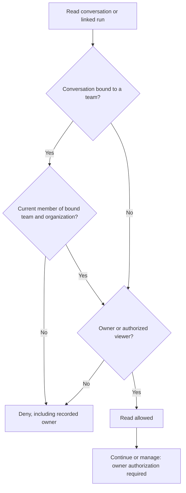

# ADR: Opt-In Organization Teams Built on Workspace Groups

Status: Proposed

Date: 2026-09-25

## Context

[Issue #5611](https://github.com/BuilderIO/agent-native/issues/5611) asks for one organization with people in several teams. Each team needs agent context that inherits from the organization. Leads need a central view of team work. Today, organization-scoped `workspace_user_groups` can grant supported resource shares and access to workspace connections. They have no team roles or team agent context, so they cannot provide the requested workflow on their own. An organization-wide resource does not need to become team-owned to meet these needs. [Review feedback on PR #5777](https://github.com/BuilderIO/agent-native/pull/5777#pullrequestreview-5311752444) calls for a smaller first release instead of a second membership system and generic resource tenancy.

## Decision and V1 boundary

Organization owners and admins can create a marked group or explicitly convert an existing group into a team. A converted group keeps its ID, members, shares, and connection allow-lists. Ordinary groups stay ordinary access lists. People can belong to several teams, and organizations without teams keep their current behavior.

V1 adds team instructions, skills, and memory. Users select an active team for new conversations and explicitly share conversations with a team. A team-wide list shows shared conversations and their linked runs. A team is a group with additional behavior, not a new organization or a default grant to its members.

V1 does not add a general `personal`/`organization`/`team` resource ownership scope, separate `teams` and `team_members` records, resource moves, or a new automation identity.

### Who can manage a team?

Extend `workspace_user_groups` additively with a team marker (proposed `is_team BOOLEAN NOT NULL DEFAULT false`) and lead membership (proposed `lead_emails_json`, default empty). Existing `member_emails_json` remains the only membership list used by group grants and connection checks. Lead emails must be a subset of that list. A member of a marked group is a `lead` if listed as a lead, or a `member` otherwise. Removing a member also removes their lead role in the same operation. A team can have several leads or none. Do not convert an existing group without an explicit choice or maintain a second membership list.

Reuse the existing group list/create/update/delete and membership operations as the authoritative action surface. Extend them to create a marked team, convert a group, delete a team, and list team membership and roles. Add an operation to change lead roles. Every write path for a marked group, including bulk updates, must enforce team roles. Update membership and leads atomically so leads remain members. For every mutation, validate the group and the actor's current organization membership. Record membership and lead changes in the audit history.

Authority depends on the actor:

- Organization owners and admins create, convert, and delete teams. They appoint and remove leads and manage membership when a team has no leads.
- Leads add existing organization members and remove ordinary members in their own team. They cannot appoint or remove leads or invite someone to the organization.
- Every current member can edit the team's shared agent context. This does not grant membership-management authority.

A lead cannot read an unshared conversation merely because they lead its team. An organization admin who is not a team member cannot read team-shared work merely because they administer the organization. An admin can join the team through a recorded membership change and then has ordinary member access.

### Which team context loads?

Store team instructions, skills, and memory against the marked group's stable ID in a team-specific agent-resource namespace. Keep it separate from organization and personal resources. Current members can read and edit team context, but the namespace does not make every app resource team-owned. Organization resources remain the inherited source; nothing is copied into a team. A team cannot edit organization defaults.

The user selects one active team in the current organization. The selection stays in place until the user changes it. It determines the team binding only when a new conversation starts. On every turn, the server validates current membership and loads context from the conversation's stored binding, regardless of the current selection. An unbound conversation loads organization and personal context only. Selection does not grant resource or connection access. Membership in several teams does not load all their context at once.

For overridable instruction guidance, load workspace and app defaults, organization, the conversation's bound team if any, then personal instructions. Personal guidance takes precedence over conflicting team guidance. Team guidance takes precedence over conflicting organization guidance. Check enforced organization and team permissions and policies outside the prompt; instruction text cannot override them.

For stored skills with the same exact name, keep one in this order: personal, bound team if any, organization, then workspace/app defaults. Keep organization, team, and personal memory sources distinct and identified by origin. V1 does not reconcile contradictory facts in memory.

Organization-owned connections remain organization-owned. Reuse existing group connection allow-lists alongside existing app, actor, and organization authorization; selecting a team is not a substitute for those checks. Do not copy credentials into team resources or prompts.

### Who can read a team conversation?

Conversations remain person-owned and private at creation. Add a nullable, stable bound-group ID to each conversation (proposed `team_group_id`). When a user starts one with an active team, validate the marked group, its organization, and the creator's current membership. Then record that ID. A conversation started without a team has no binding. Binding selects prompt context. It does not share the conversation or introduce a generic resource ownership scope.

Switching the active team never rebinds an existing conversation. Reading, listing, or continuing a team-bound conversation requires current membership in both its organization and bound team, even for its recorded owner. If membership is absent or the bound team no longer exists, deny access. Do not silently drop team context or substitute another team's context. Never infer an older conversation's binding from the user's current selection.

Only the recorded owner can explicitly grant viewer access, one conversation at a time. The target must be a marked team in the conversation's organization. The owner must currently belong to both the organization and that team. A bound conversation can be shared only with its bound team. An unbound conversation can be shared with one allowed team without gaining a binding or changing its personal ownership and organization/personal context.

The grant gives all current team members, including leads, read access to that conversation. It does not grant continuation, management, or access to other conversations. Only the recorded owner can revoke the team grant. Team membership and active-team selection alone never share a conversation.

Add a chat-thread-specific policy at the action boundary for team grants and revocations. Do not enable the generic group-share action unchanged: it accepts `commenter`, `editor`, and `admin` as well as `viewer`, and lets resource admins manage shares. Chat team grants must reject every role except `viewer`. Both grant and revocation require recorded-owner authority, not merely resource-admin access. Organization and resource admins get no exception.

At grant time, validate the marked team, its match to the conversation's organization, and the owner's current organization and team membership. On every direct read and list, check the viewer's current organization and team membership. Offer all current team members, including leads, one list of explicitly shared conversations and their linked runs. This list discovers authorized shares; it does not grant access. A private conversation does not appear merely because it is bound to the team. Generic group principals alone cannot provide this list: chat group grants are not currently enabled, and chat list filtering does not yet admit group shares.

Linked runs inherit the conversation's read access; V1 has no independent run-sharing control. Show linked runs of shared conversations without exposing runs of private conversations. Check every run read and listing path against current access to its conversation. Keep the general permission recheck rules in `durable-agent-runs.md` rather than defining a new run identity here.

If the recorded owner leaves the bound team, they lose read, continuation, and management access until they rejoin. An explicitly shared conversation remains readable to current members but becomes read-only when its owner cannot act. V1 does not make a lead a successor or transfer ownership automatically. Organization offboarding remains a separate flow; any deliberate successor must pass the bound-team membership check. An unbound conversation keeps its personal-owner rules even if its team share is revoked.

### What happens to other resources and deleted teams?

Resource families that already support group shares can grant their existing group principal to a marked team, including on an existing private organization-associated resource. This needs no move, new ownership scope, or family-wide migration. A group grant adds access; it cannot hide an already organization-visible resource from other organization members. Families without group-share support do not gain it implicitly. Unknown resource types and invalid new team grants fail closed. Older records without team bindings keep their ownership, organization association, visibility, and access rules.

Organization owners and admins can delete a marked team even when conversations are bound to it. Deletion removes the group and ends group-based access and connection permission. It does not delete conversations or inherited organization resources.

After deletion, bound conversations retain their recorded group ID but become inaccessible. They are not rebound to another team. Team instructions, skills, and memory remain stored but inaccessible; they are not copied to organization or personal context. An unbound personal conversation shared with the deleted group keeps its personal-owner access, but the deleted group's share no longer grants access.

Never reuse a deleted team's ID or infer a replacement from its name. Group creation generates a new server-side ID. A supplied ID is update-only and must fail if the group no longer exists in the organization. Future import or restore paths must preserve this rule. No archival tombstone, blocker inventory, or automatic resource move is part of V1.

## Current implementation seams

These are existing surfaces to extend, not claims that V1 is implemented:

- Workspace groups and connection allow-lists: `packages/core/src/workspace-connections/groups.ts`, `packages/core/src/workspace-connections/store.ts`
- Shared principals, list and direct access: `packages/core/src/sharing/access.ts`, `packages/core/src/sharing/actions/share-resource.ts`
- Agent resources and prompt assembly: `packages/core/src/resources/store.ts`, `packages/core/src/server/agent-chat/prompt-resources.ts`
- Conversation persistence and access: `packages/core/src/chat-threads/store.ts`, `packages/core/src/server/agent-chat-plugin.ts`
- Run access through conversations: `packages/core/src/agent/run-ownership.ts`

## Implementation and proof boundary

Implement the group/role and team-context layer in Core first. Then enable chat-thread group sharing, stable conversation binding, and the authorized team work list with linked runs. Reuse group-share access for other resource families where it is already supported. Agent and UI operations use the same actions and current-membership checks. Expose the active selection to the agent through application state, but never treat it as proof of authority.

Before offering V1, prove these boundaries:

- Existing groups and older conversations are unchanged. Converted groups retain grants and connection permissions.
- Only the selected team's context loads alongside organization and personal context for a new conversation. Personal, team, and organization instructions and skills have a deterministic order. Switching teams never changes an existing conversation's bound context.
- A former member, including the owner, cannot read or continue a bound conversation. Unshared work stays private.
- Only the recorded owner can grant or revoke a chat team share, only for an allowed team, and only as `viewer`. Reject `commenter`, `editor`, and `admin` grants, and reject callers relying only on resource-admin authority.
- Team-shared work and linked runs are visible only to current members across direct, list, and background paths.
- Deletion makes bound context and conversations inaccessible without deleting unrelated resources.

Test changes to group and organization membership against cached and listed access as well as direct access. A failed or incomplete team-context lookup must not look like empty context or successful authorization.

## Consequences and revisit criteria

V1 supplies team context and a central view of explicitly shared work without making all app resources team-owned. When an owner leaves, shared conversations can remain readable without anyone able to continue them. Deleting a team can strand bound conversations and context. Neither owner departure nor team deletion automatically purges or reassigns the affected conversations or context. A later team-owned lifecycle needs a separate decision on ownership, transfer, deletion, access, and migration of these bindings and grants.

Revisit generic team ownership and family-specific moves only when a concrete workflow needs team-owned resources or recovery after owner departure. Revisit a separate automation identity, automatic sharing, cross-team conversation sharing, all-teams prompt context, or rules that hide inherited organization resources only for demonstrated needs; none is implied by this proposal.
