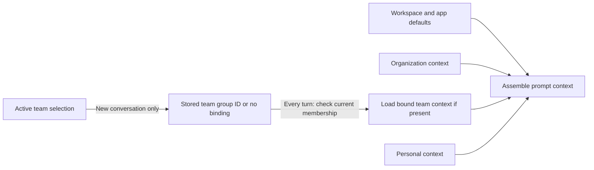
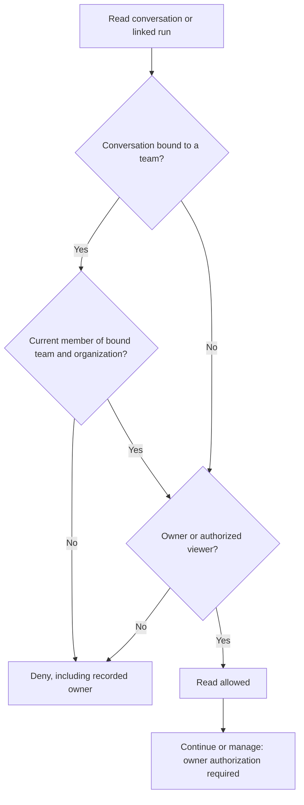

# ADR: Opt-In Organization Teams Built on Workspace Groups

Status: Proposed

Date: 2026-09-25

## Context

[Issue #5611](https://github.com/BuilderIO/agent-native/issues/5611) asks for one organization with people in several teams. Each team needs agent context inherited from the organization, and leads need a central view of team work. An organization-wide resource need not become team-owned to serve these needs. The existing organization-scoped `workspace_user_groups` provide group principals for supported resource shares and allow-lists for workspace connections. They have no team roles or team agent context. [Review feedback on PR #5777](https://github.com/BuilderIO/agent-native/pull/5777#pullrequestreview-5311752444) calls for a smaller first release rather than a second membership system and generic resource tenancy.

## Decision and V1 boundary

An organization may explicitly mark a workspace user group as a team. Existing groups remain ordinary access lists unless an organization owner or admin converts them. A converted group retains its ID, members, shares, and connection allow-lists. A person may belong to several teams. Organizations that do not use teams keep their existing behavior.

V1 adds team instructions, skills, and memory. Users select an active team for new conversations and explicitly share conversations with a team. A team-wide list shows shared conversations and their linked runs. V1 does not add a general `personal`/`organization`/`team` resource ownership scope, separate `teams` and `team_members` records, resource moves, or a new automation identity. A team is a group with additional behavior, not a new organization or a default grant to its members.

### Membership, roles, and operations

Extend `workspace_user_groups` additively with a team marker (proposed `is_team BOOLEAN NOT NULL DEFAULT false`) and lead membership (proposed `lead_emails_json`, default empty). Existing `member_emails_json` stays the single membership list used by group grants and connection checks; lead emails must be a subset of that list. The role of a member on a marked group is `lead` if listed as a lead, otherwise `member`. Removing a member removes any lead role in the same operation. A team may have several leads or none. Do not silently turn an existing group into a team or maintain a parallel membership list.

Reuse the existing group list/create/update/delete and membership operations as the authoritative action surface. Extend them to create a marked team, convert a group, delete a team, and list team membership and roles. Add a lead-role change operation. Every write path for a marked group, including bulk updates, must enforce team roles. Update membership and leads atomically so leads remain members. Validate the group and actor's current organization membership for every mutation. Record membership and lead changes in the audit history.

Organization owners and admins create, convert, and delete teams and appoint or remove leads. Leads can add existing organization members and remove ordinary members in their own team. They cannot appoint or remove leads or invite someone to the organization. Owners and admins manage membership when a team has no leads.

Every current team member can edit that team's shared agent context, but this does not grant membership-management authority. A lead does not automatically gain access to unshared conversations. An organization admin who is not a team member does not gain access to team-shared work merely by being an admin. They can join the team with a recorded membership change and then have ordinary member access.

### Agent context and active selection

Store team instructions, skills, and memory against the marked group's stable ID in a team-specific agent-resource namespace, separate from organization and personal resources. This namespace is for agent context only: it does not introduce team ownership for every app resource. Current members can read and edit it. Organization resources remain the inherited source; nothing is copied into a team. A team cannot edit organization defaults.

The user selects one active team in the current organization, retained until changed. That selection determines the team binding **only when a new conversation starts**. On every turn, the server validates current membership and loads context from the conversation's stored binding, regardless of the current selection; an unbound conversation loads organization and personal context only. Selection does not grant resource or connection access, and a person in several teams does not automatically load all their teams' context.

For overridable instruction guidance, load workspace and app defaults, organization, the conversation's bound team if any, then personal instructions. Personal guidance takes precedence over conflicting team guidance, and team guidance over conflicting organization guidance. Enforced organization or team permissions and policies are checked outside the prompt and cannot be overridden by instruction text. For stored skills with the same exact name, keep one in this order: personal, bound team if any, organization, then workspace/app defaults. Keep organization, team, and personal memory sources distinct and identified by origin. V1 adds no semantic reconciliation of contradictory facts in memory.

Organization-owned connections remain organization-owned. Reuse existing group connection allow-lists alongside existing app, actor, and organization authorization; selecting a team is not a substitute for those checks. Do not copy credentials into team resources or prompts.

### Conversation binding and sharing

Conversations remain person-owned and private at creation. Add a nullable, stable bound-group ID to each conversation (proposed `team_group_id`). When starting one with an active team, validate the marked group, its organization, and the creator's current membership, then record that ID. Starting without a team records no binding. Binding selects prompt context; it is **not** a share grant or generic resource ownership scope.

Switching the active team never rebinds an existing conversation. On read, list, and continuation, a team-bound conversation requires current membership in both its organization and its bound team **even for its recorded owner**. If that membership is absent or the bound team no longer exists, deny access rather than silently dropping team context or replacing it with another team's context. Never infer a binding for an older conversation from the user's current selection.

The author can explicitly grant **viewer** access to the conversation's bound team, one conversation at a time. This grants read access to all current team members, including leads. It grants nobody continuation, management, or access to other conversations. A team-bound conversation cannot be shared with another team in V1. A conversation created without a team can later receive the same viewer-only share with a team. It remains unbound and personally owned, and it uses organization and personal context. Revoking a group share removes that grant under the existing share rules. Team membership and active-team selection alone never share a conversation.

Enable the existing group-principal sharing path for chat threads, including direct reads and list filtering. Check current organization and group membership on every team grant; a nonmember admin gets no exception. Offer one team-wide list of explicitly shared conversations and their linked runs to all current members, including leads. This is a discovery surface over authorized shares, not a new visibility grant. A private conversation does not appear in it merely because it is bound to the team.

Linked runs inherit the conversation's read access; V1 has no independent run-sharing control. The shared-work list must surface linked runs of shared conversations without exposing runs of private conversations. Verify every run read and listing path against the linked conversation's current access; preserve the general permission recheck rules in `durable-agent-runs.md` rather than defining a new run identity here.

If a recorded owner leaves the bound team, they lose read, continuation, and management access until they rejoin. An explicitly shared conversation stays readable to current members but becomes read-only when its owner cannot act. V1 does not make a lead a successor or require an automatic transfer when membership changes. Existing organization offboarding is a separate flow; any deliberate successor must also pass the bound-team membership check. A conversation with no team binding retains its existing personal-owner rules even if a team share is later revoked.

### Other resources and deletion

Any resource family that **already** supports group shares may grant its existing group principal to a marked team, including on an existing private organization-associated resource. No move, new ownership scope, or family-wide data migration is needed. A group grant adds access; it cannot hide an already organization-visible resource from other organization members. Families without group-share support do not gain it implicitly. Unknown resource types or invalid new team grants fail closed, while older records without team bindings keep their previous ownership, organization association, visibility, and access rules.

Organization owners/admins can delete a marked team even if conversations are bound to it. Deletion removes the group and ends group-based access and connection permission. It does not delete conversations or inherited organization resources.

Bound conversations retain their recorded group ID but become inaccessible rather than being rebound to another team. Team instructions, skills, and memory remain stored but inaccessible. They are not copied to organization or personal context. An unbound personal conversation shared with the deleted group keeps its personal-owner access, but that group's share no longer grants access.

Never reuse a deleted team's ID or infer a replacement from its name. Group creation generates a new server-side ID. A supplied ID is update-only and must fail if the group no longer exists in the organization. Future import or restore paths must preserve this rule. No archival tombstone, blocker inventory, or automatic resource move is part of V1.

## Current implementation seams

These are existing surfaces to extend, not claims that V1 is implemented:

- Workspace groups and connection allow-lists: `packages/core/src/workspace-connections/groups.ts`, `packages/core/src/workspace-connections/store.ts`
- Shared principals, list and direct access: `packages/core/src/sharing/access.ts`, `packages/core/src/sharing/actions/share-resource.ts`
- Agent resources and prompt assembly: `packages/core/src/resources/store.ts`, `packages/core/src/server/agent-chat/prompt-resources.ts`
- Conversation persistence and access: `packages/core/src/chat-threads/store.ts`, `packages/core/src/server/agent-chat-plugin.ts`
- Run access through conversations: `packages/core/src/agent/run-ownership.ts`

## Implementation and proof boundary

Implement the group/role and team-context layer in Core, then enable chat-thread group sharing, stable conversation binding, and the authorized team work list with linked runs. Reuse existing group-share access for other resource families where it is already supported. Agent and UI operations use the same actions and current-membership checks. The active selection must be visible to the agent through application state but is never proof of authority.

Before offering this V1, prove: existing groups and older conversations are unchanged; converted groups retain grants and connection permissions; only the selected team's context loads; personal/team/organization instruction and skill order is deterministic; a former member (including the owner) cannot read or continue a bound conversation; unshared work stays private; team-shared work and linked runs are visible only to current members across direct, list, and background paths; switching teams never changes a conversation's bound context; and deletion makes bound context and conversations inaccessible without deleting unrelated resources. Test changes to group membership and org membership against cached/listed as well as direct access. A failed or incomplete team-context lookup must not masquerade as an empty context or a successful authorization.

## Consequences and revisit criteria

This V1 supplies team context and a central view of explicitly shared work without making all app resources team-owned. It intentionally permits read-only shared conversations with no available owner when the owner leaves. Deleting a team can strand bound conversations and context; this is an explicit consequence, not an automatic purge or reassignment. A later team-owned lifecycle would require a separate decision on ownership, transfer, deletion, access, and migration of these existing bindings and grants.

Revisit generic team ownership and family-specific moves only when a concrete workflow needs team-owned resources or recovery after owner departure. Revisit a separate automation identity, automatic sharing, cross-team conversation sharing, all-teams prompt context, or rules that hide inherited organization resources only for demonstrated needs; none is implied by this proposal.
