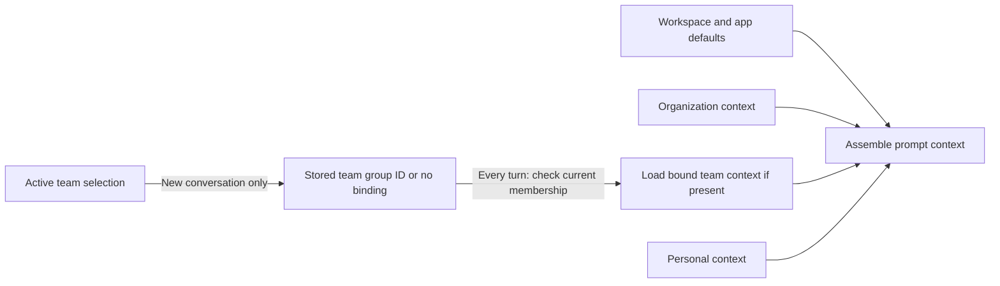
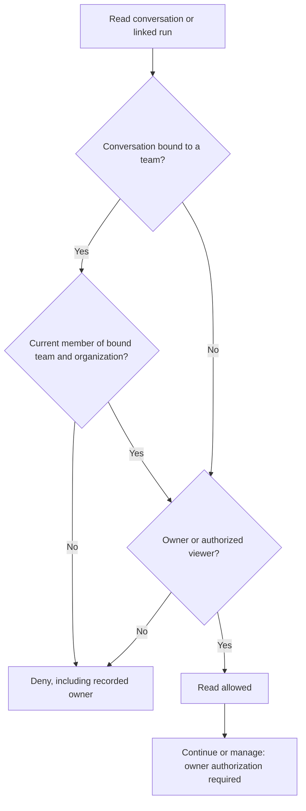

# ADR: Opt-In Organization Teams Built on Workspace Groups

Status: Proposed

Date: 2026-09-25

## Context

[Issue #5611](https://github.com/BuilderIO/agent-native/issues/5611) asks for one organization with people in several teams. Each team needs its own agent instructions, skills, and memory alongside the organization's. Leads need a central view of team work.

Today, `workspace_user_groups` within an organization can share supported resources and grant access to workspace connections. They do not assign team roles or store team instructions, skills, and memory, so they cannot provide the requested workflow on their own.

An organization-wide resource does not need to become team-owned to meet these needs. [Review feedback on PR #5777](https://github.com/BuilderIO/agent-native/pull/5777#pullrequestreview-5311752444) calls for a smaller first release instead of another place to track members and a new team ownership model for every resource.

## Decision and V1 boundary

Organization owners and admins can create a group designated as a team or explicitly convert an existing group into one. A converted group keeps its ID, members, shares, and connection allow-lists. Ordinary groups stay ordinary access lists. People can belong to several teams, and organizations without teams keep their current behavior.

V1 adds team instructions, skills, and memory. Users select a team for new conversations and explicitly share conversations with a team. A team-wide list shows shared conversations and their linked runs. A team is an existing group with added features. Membership alone does not grant access to every resource or conversation.

When someone starts a conversation with a team selected, the agent uses that team's instructions, skills, and memory for that conversation. Selecting another team later does not change it. The conversation stays private until its owner shares it with the team. If the owner leaves the team recorded on the conversation, they lose access until they rejoin. Deleting that team leaves conversations started with it stored but inaccessible. A personal conversation started without a team keeps its owner's access even if a team it was shared with is deleted.

V1 does not add a general `personal`/`organization`/`team` resource ownership scope, separate `teams` and `team_members` records, resource moves, or a new automation identity.

### Who can manage a team?

Extend `workspace_user_groups` additively with a team marker (proposed `is_team BOOLEAN NOT NULL DEFAULT false`) and lead membership (proposed `lead_emails_json`, default empty). Existing `member_emails_json` remains the only membership list used by group grants and connection checks. Lead emails must be a subset of that list. A member of a marked group is a `lead` if listed as a lead, or a `member` otherwise.

Removing a member also removes their lead role in the same operation. A team can have several leads or none. Do not convert an existing group without an explicit choice or maintain a second membership list.

Keep the existing group actions as the single way to list, create, update, delete, and change group membership. Extend them to create a team, convert a group, delete a team, and list team membership and roles. Add an action to change lead roles.

Every write path for a marked group, including bulk updates, must enforce team roles. Update membership and leads atomically so leads remain members. For every mutation, validate the group and the actor's current organization membership. Record membership and lead changes in the audit history. The concrete storage and action changes are listed below.

Authority depends on the actor:

- Organization owners and admins create, convert, and delete teams. They appoint and remove leads and can manage team membership whether or not the team has leads.
- Leads can manage ordinary membership in their own team: add existing organization members and remove ordinary members. They cannot appoint or remove leads or invite someone to the organization.
- Every current member can edit the team's shared agent context. This does not grant membership-management authority.

A lead cannot read an unshared conversation merely because they lead its team. An organization admin who is not a team member cannot read team-shared work merely because they administer the organization. An admin can join the team through a recorded membership change and then has ordinary member access.

### V1 schema and action contract

These are proposed additive changes to existing Core storage, not a new team ownership model:

| Storage                 | V1 contract                                                                                                                                                                                                                                        |
| ----------------------- | -------------------------------------------------------------------------------------------------------------------------------------------------------------------------------------------------------------------------------------------------- |
| `workspace_user_groups` | Add `is_team BOOLEAN NOT NULL DEFAULT false` and `lead_emails_json TEXT NOT NULL DEFAULT '[]'`. Keep the existing group ID, organization ID, and member list authoritative. Ordinary groups have no leads.                                         |
| `chat_threads`          | Add `team_group_id TEXT NULL` and an index for bound-team lookups. Record the ID at creation, not from later selections. Keep the existing owner and visibility; do not add a deletion-blocking or cascading foreign key.                          |
| `chat_thread_shares`    | Reuse share rows with `principal_type = 'group'`, `principal_id` set to the recipient group ID, and `role = 'viewer'`. Allow at most one explicit team grant per thread. Keep existing non-team shares.                                            |
| Agent `resources`       | Reuse `(owner, path)` and content fields. Store team instructions, `skills/…`, and `memory/…` at their existing paths under `__team__:<group-id>`. No new table or copied organization resources.                                                  |
| Application state       | Store the active team ID per user and organization across sessions and devices. Reflect it in each current session; a session-only key is not the durable source. Clear or reject an invalid selection. It never grants access or rebinds threads. |

Use the same JSON email encoding for `lead_emails_json` and `member_emails_json`. All group write paths preserve `lead_emails_json ⊆ member_emails_json`. An unbound thread's recipient group ID is a share target, not a binding. Do not add a team-share or run-share table. Resolve group existence and current membership before reading or writing team resources. A deleted group's ID remains on its bound threads, which become inaccessible.

The shared action surface must expose these operations; names below are the V1 contract, not claims that they already exist:

| Action                                                                    | V1 contract                                                                                                                                                                                                                                            |
| ------------------------------------------------------------------------- | ------------------------------------------------------------------------------------------------------------------------------------------------------------------------------------------------------------------------------------------------------ |
| Existing `list-workspace-user-groups`                                     | Return each group's ID, `isTeam`, members, and lead emails/roles. Keep existing organization visibility; ordinary groups stay ordinary.                                                                                                                |
| Existing `upsert-workspace-user-group`                                    | Accept optional `isTeam`: false by default on create, unchanged if omitted on update. Only owners/admins create or explicitly convert teams. Return the group; a missing supplied ID fails, and conversion keeps existing grants.                      |
| Existing `bulk-update-workspace-user-groups` and group membership updates | Add/remove existing organization members; return membership and leads. Enforce roles on every bulk item; removing a member also removes their lead role atomically.                                                                                    |
| New `set-workspace-team-leads`                                            | Accept `teamGroupId` and the complete lead list; return membership and leads. Owners/admins only; reject ordinary groups and nonmember leads. Update atomically and audit changes.                                                                     |
| Existing `delete-workspace-user-group`                                    | Accept a team ID; return the deletion result. Owners/admins only; bound threads do not block deletion. Remove connection allow-list references first; never reuse the ID.                                                                              |
| Existing resource list/read/write/delete operations                       | Accept a team resource owner scope derived from `teamGroupId` and a resource path; return existing resource shapes. Current members read/edit team context; authorize every operation, including prompt loading. A failed lookup is not empty context. |
| New `set-active-workspace-team`                                           | Accept `teamGroupId` or `null`; return the per-user/organization selection and reflect it in the session. Non-null selection requires current membership and affects new threads only.                                                                 |
| Existing conversation creation path                                       | Accept the active team ID or no team; return the new thread with its stored binding. Validate the marked group and creator's current membership server-side before insertion.                                                                          |
| New `share-chat-thread-with-team` / `unshare-chat-thread-from-team`       | Accept `threadId` and `teamGroupId`; return the resulting share state. Recorded owner only, with current organization and target-team membership. Bound threads target only their bound team; grant `viewer` only.                                     |
| New `list-team-shared-chat-threads`                                       | Accept `teamGroupId` and pagination; return explicitly shared threads. Current organization and team membership required; linked runs use existing read/list paths and the same access checks.                                                         |

For group writes, owners/admins manage membership. Leads can add existing organization members or remove ordinary members only in their own team; they cannot remove another lead. Conversion retains the group's ID and connection allow-lists. Do not implicitly convert teams back to ordinary groups.

Chat shares reject a second team grant, non-`viewer` roles, and generic resource-admin authority. Binding supplied by a client is never proof of access. A merely bound, private thread never appears in the team-shared list.

Direct thread reads, existing thread lists, prompt assembly, and run reads/lists must apply the same current-membership and share policy; these are extensions of their existing paths, not separate team access bypasses. Do not expose the generic `share-resource` action unchanged for chat grants.

### Which team context loads?

Store a team's instructions, skills, and memory under its group ID, separate from organization and personal agent resources. Current members can read and edit them, but other app resources do not become team-owned. The agent still uses organization resources alongside the team's; nothing is copied into the team. A team cannot edit organization defaults.

The user selects one active team in the current organization. The choice follows them across sessions and devices until they change it. Switching organizations uses the choice saved for that organization, not the previous organization's team.

The selected team is recorded only when a new conversation starts. On every turn of a conversation started with a team, the server checks current membership and loads the team instructions, skills, and memory recorded for that conversation, even if the user has since selected another team. A conversation started without a team uses organization and personal context only. Selecting a team does not grant access to resources or connections. Belonging to several teams does not load all their context at once.

Load instructions in this order: workspace and app defaults, organization, the team recorded on the conversation if any, then personal instructions. If instructions conflict, personal instructions take precedence over team instructions, and team instructions take precedence over organization instructions. Check organization and team permissions separately; instructions cannot override them.

For skills with the same exact name, keep the first available in this order: personal, the team recorded on the conversation if any, organization, then workspace/app defaults. Keep organization, team, and personal memory separate and label where each memory came from. V1 does not resolve contradictory facts in memory.

Organization-owned connections remain organization-owned. Reuse existing group connection allow-lists alongside existing app, actor, and organization authorization; selecting a team is not a substitute for those checks. Do not copy credentials into team resources or prompts.

### Who can read a team conversation?

Conversations remain person-owned and private at creation. Add a nullable, stable team group ID to each conversation (proposed `team_group_id`). When a user starts one with an active team, check that the group is a team in the current organization and that the creator belongs to it. Then record its ID. A conversation started without a team records no team ID. The recorded team determines which team instructions, skills, and memory the agent uses. It does not share the conversation or change who owns it.

Switching the active team never changes the team recorded on an existing conversation. Reading, listing, or continuing a conversation started with a team requires current membership in both its organization and that team, even for its recorded owner. If membership is absent or the team no longer exists, deny access. Do not silently omit the team's instructions, skills, or memory or use another team's instead. Never assign a team to an older conversation from the user's current selection.

Only the recorded owner can explicitly grant viewer access, one conversation at a time. The target must be a marked team in the conversation's organization. The owner must currently belong to both the organization and that team. A bound conversation can be shared only with its bound team. An unbound conversation can be shared with one allowed team without gaining a binding or changing its personal ownership and organization/personal context.

The grant gives all current team members, including leads, read access to that conversation. It does not grant continuation, management, or access to other conversations. Only the recorded owner can revoke the team grant. Team membership and active-team selection alone never share a conversation.

Public share tokens are not available for a conversation bound to a team. Reject new token creation and refuse redemption of any existing token whenever the conversation is bound, including after membership loss or team deletion; the public route must not expose its transcript or linked runs. An unbound conversation shared with a team keeps its existing public-link behavior; the team share alone does not bind it.

Add a chat-thread-specific policy at the action boundary for team grants and revocations. Do not enable the generic group-share action unchanged: it accepts `commenter`, `editor`, and `admin` as well as `viewer`, and lets resource admins manage shares. Chat team grants must reject every role except `viewer`. Both grant and revocation require recorded-owner authority, not merely resource-admin access. Organization and resource admins get no exception.

At grant time, validate the marked team, its match to the conversation's organization, and the owner's current organization and team membership. On every direct read and list, check the viewer's current organization and team membership. Offer all current team members, including leads, one list of explicitly shared conversations and their linked runs. This list discovers authorized shares; it does not grant access. A private conversation does not appear merely because it is bound to the team. Generic group principals alone cannot provide this list: chat group grants are not currently enabled, and chat list filtering does not yet admit group shares.

Linked runs inherit their conversation's read access; V1 does not share runs separately. On each new read, list, stream connection (including reconnect and replay), or background response request, resolve the linked conversation and apply its current read rules: organization and team membership where applicable, plus owner or share access. Deny the request if the conversation is missing or inaccessible; cached results and background paths cannot bypass this check. An already-open run stream is authorized when it connects, not continuously: it can continue delivering events after access is lost until it disconnects. A reconnect must check access again. Keep the general run transport rules in `durable-agent-runs.md`, but define caller access to runs here through the linked conversation.

If the recorded owner leaves the team recorded on the conversation, they cannot read, continue, or manage it until they rejoin. Current members can still read it if the owner shared it with the team, but they cannot continue or manage it for the owner. V1 does not make a lead a successor or transfer ownership automatically. Removing someone from the organization remains a separate flow; any deliberate successor must belong to the team recorded on the conversation. A conversation started without a team keeps its personal-owner rules even if its team share is revoked.

### What happens to other resources and deleted teams?

Resource families that already support group shares can grant their existing group principal to a marked team, including on an existing private organization-associated resource. This needs no move, new ownership scope, or family-wide migration. A group grant adds access; it cannot hide an already organization-visible resource from other organization members. Families without group-share support do not gain it implicitly. Reject unknown resource types and invalid new team grants; neither creates access. Older records without team bindings keep their ownership, organization association, visibility, and access rules.

Organization owners and admins can delete a marked team even when conversations are bound to it, after removing any connection allow-list references required by the existing group deletion action. Bound conversations are not a deletion blocker. Deletion removes the group and ends group-based access and connection permission. It does not delete conversations or inherited organization resources.

After deletion, bound conversations retain their recorded group ID but become inaccessible. They are not rebound to another team. Team instructions, skills, and memory remain stored but inaccessible; they are not copied to organization or personal context. An unbound personal conversation shared with the deleted group keeps its personal-owner access, but the deleted group's share no longer grants access.

Never reuse a deleted team's ID or infer a replacement from its name. Group creation generates a new server-side ID. A supplied ID is update-only and must fail if the group no longer exists in the organization. Future import or restore paths must preserve this rule. No archival tombstone, blocker inventory, or automatic resource move is part of V1.

## Current implementation seams

These are existing surfaces to extend, not claims that V1 is implemented:

- Workspace groups and connection allow-lists: `packages/core/src/workspace-connections/groups.ts`, `packages/core/src/workspace-connections/store.ts`
- Shared principals, list and direct access: `packages/core/src/sharing/access.ts`, `packages/core/src/sharing/actions/share-resource.ts`
- Agent resources and prompt assembly: `packages/core/src/resources/store.ts`, `packages/core/src/server/agent-chat/prompt-resources.ts`
- Session application state and user/organization selection: `packages/core/src/application-state/store.ts` (currently session-keyed; extend persistence without replacing session behavior)
- Conversation persistence and access: `packages/core/src/chat-threads/store.ts`, `packages/core/src/server/agent-chat-plugin.ts`
- Run access through conversations: `packages/core/src/agent/run-ownership.ts`

## Implementation and proof boundary

Implement group roles and team instructions, skills, and memory in Core first. Then let owners share conversations with a team, record the team used when each conversation starts, and list shared team work with its linked runs. Reuse group-share access for other resource families where it is already supported. Agent and UI operations use the same actions and current-membership checks. Save each user's active-team choice for each organization across sessions and make it available to the agent in the current session. Always check current organization and team membership separately; the saved choice does not prove access.

Before offering V1, prove these boundaries:

- Existing groups and older conversations are unchanged. Converted groups retain grants and connection permissions.
- Owners/admins can manage team members even when leads exist; leads can manage ordinary members only in their own team. Both paths preserve lead/member invariants, including bulk updates.
- Active-team selection follows the user within each organization across sessions and devices; switching organizations does not carry another organization's selection into the current session.
- Only the selected team's context loads alongside organization and personal context for a new conversation. Personal, team, and organization instructions and skills have a deterministic order. Switching teams never changes an existing conversation's bound context.
- A former member, including the owner, cannot read or continue a bound conversation. Unshared work stays private.
- Only the recorded owner can grant or revoke a chat team share, only for an allowed team, and only as `viewer`. Reject `commenter`, `editor`, and `admin` grants, and reject callers relying only on resource-admin authority.
- Bound conversations cannot issue public share tokens, and tokens issued before binding cannot expose their transcript or linked runs after binding, membership loss, or team deletion.
- New run reads, lists, stream connections (including reconnect and replay), and background response requests deny access after the caller loses access to the linked conversation, including after membership changes or team deletion. An already-open stream is not required to stop before it disconnects.
- Deletion makes bound context and conversations inaccessible without deleting unrelated resources.

Test changes to group and organization membership against cached and listed access as well as direct access. A failed or incomplete team-context lookup must not look like empty context or successful authorization.

## Consequences and revisit criteria

V1 supplies team context and a central view of explicitly shared work without making all app resources team-owned. When an owner leaves, shared conversations can remain readable without anyone able to continue them. Deleting a team can strand bound conversations and context. Neither owner departure nor team deletion automatically purges or reassigns the affected conversations or context. A later team-owned lifecycle needs a separate decision on ownership, transfer, deletion, access, and migration of these bindings and grants.

Revisit generic team ownership and family-specific moves only when a concrete workflow needs team-owned resources or recovery after owner departure. Revisit a separate automation identity, automatic sharing, cross-team conversation sharing, all-teams prompt context, or rules that hide inherited organization resources only for demonstrated needs; none is implied by this proposal.
