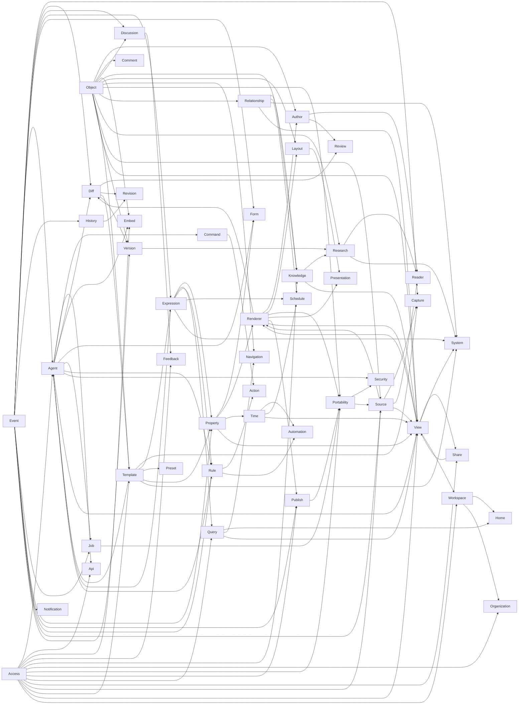

# Agent Native Content capability encyclopedia

<!-- Generated from the atomic records in chapters/, features/, and capabilities/. Do not edit this projection directly. -->

This index summarizes the atomic product contracts beneath the public roadmap. Each linked record owns its promise, dependencies, state, proof boundary, and relationship to complete Features.

## Catalog summary

- Chapters: 6
- Features: 32
- Named increments: 1
- Capabilities: 124

| Capability state | Count |
| --- | ---: |
| Verified | 3 |
| Failing | 1 |
| Stale | 0 |
| In Progress | 15 |
| Approved Shape | 92 |
| Exploring | 9 |
| Deferred | 0 |
| Superseded | 4 |

## Dependency overview

## Access

| Capability | State | User promise |
| --- | --- | --- |
| [Page and Database access](capabilities/content.access.page-database.md) | Approved Shape | Page and Database access separates view/comment/data editing from schema authority |
| [Row-level privacy](capabilities/content.access.row-private.md) | Approved Shape | Row/Page sharing can override inherited Database visibility |
| [Access-safe computation](capabilities/content.access.safe-aggregate.md) | Exploring | Access applies before relation traversal, count, rollup, group, and aggregate |
| [Visibility closure](capabilities/content.access.visibility-closure.md) | Approved Shape | Traversal, export, embedding, search, and derived results omit inaccessible objects while known direct links return an honest denial. |

## Action

| Capability | State | User promise |
| --- | --- | --- |
| [Action Buttons](capabilities/content.action.button.md) | Approved Shape | An owner-governed Button invokes an ordinary action/Rule with typed inputs and visible authority |

## Agent

| Capability | State | User promise |
| --- | --- | --- |
| [Agent and UI parity](capabilities/content.agent.action-parity.md) | In Progress | Humans and agents use the same operations and visible state |
| [Audience-safe synthesis](capabilities/content.agent.audience-safe.md) | Approved Shape | A governed agent run can restrict its inputs to information every intended viewer of the output may access. |
| [Agent-run automation](capabilities/content.agent.automation.md) | Approved Shape | AI work composes Event → expression/query → action → mutation → Event |
| [Agent-authored Expressions](capabilities/content.agent.expression-authoring.md) | Approved Shape | AI generates, validates, previews, repairs, and saves typed expressions |
| [Agent presence](capabilities/content.agent.presence.md) | In Progress | One accountable agent presence shows every location a run is editing without replacing durable attribution or delaying the real change. |
| [Agent resource consent](capabilities/content.agent.resource-consent.md) | Approved Shape | Resources independently declare whether agents may use them as context and whether agents may edit them, with inheritable policy ceilings. |
| [Skills catalog](capabilities/content.agent.skill-catalog.md) | Approved Shape | Governed reusable agent instructions/capabilities can be invoked against compatible Content targets |

## API

| Capability | State | User promise |
| --- | --- | --- |
| [Content API and CMS](capabilities/content.api.cms.md) | Approved Shape | External clients and websites can read and mutate Content through the same typed Actions, permissions, validation, and audit behavior as people and agents. |

## Author

| Capability | State | User promise |
| --- | --- | --- |
| [Executable Code blocks](capabilities/content.author.code.md) | Approved Shape | Powerful inline Code blocks highlight any recognized language and may become isolated, composable mini-sandboxes with compatible renderers and execution runtimes |
| [Document editor](capabilities/content.author.document-editor.md) | In Progress | A humane visual document editor with blocks, comments, media, collaboration, and agent co-editing |
| [Footnotes](capabilities/content.author.footnotes.md) | Approved Shape | Footnotes remain humane to author, navigate, render, and round-trip |
| [Math and equations](capabilities/content.author.math.md) | In Progress | Inline and block math render faithfully in editor, reader, and export |
| [Media Blocks](capabilities/content.author.media.md) | In Progress | Images, audio, video, files, embeds, captions, and source-aware assets travel through one storage/rendering contract |
| [Mermaid diagrams](capabilities/content.author.mermaid.md) | Approved Shape | Mermaid source renders through a normal built-in Code-block renderer and round-trips through ordinary fenced source |

## Automation

| Capability | State | User promise |
| --- | --- | --- |
| [Scheduled automation](capabilities/content.automation.scheduled.md) | In Progress | Scheduled queries and recurring heartbeats over current state |

## Capture

| Capability | State | User promise |
| --- | --- | --- |
| [Capture and enrichment](capabilities/content.capture.enrich.md) | Approved Shape | Send anything to a chosen Content Database and let its Rules and agents immediately turn it into durable, structured context |

## Command

| Capability | State | User promise |
| --- | --- | --- |
| [Unified commands](capabilities/content.command.fabric.md) | Approved Shape | Slash, Cmd+K, menus, shortcuts, Buttons, and agents discover the same scoped commands/actions |

## Comment

| Capability | State | User promise |
| --- | --- | --- |
| [Comments](capabilities/content.comment.page-owned.md) | Approved Shape | Page-owned threaded comments targeting one or several Blocks |

## Diff

| Capability | State | User promise |
| --- | --- | --- |
| [Agent-assisted review](capabilities/content.diff.ai-assist.md) | Approved Shape | AI summaries and guided review for large change sets |
| [Filtered change review](capabilities/content.diff.filtered-review.md) | Approved Shape | Accept/reject individual or all visible changes in a filtered set |
| [In-place typed review](capabilities/content.diff.in-place.md) | Approved Shape | Typed changes rendered inside the ordinary editor/view |

## Discussion

| Capability | State | User promise |
| --- | --- | --- |
| [Page Discussion](capabilities/content.discussion.page.md) | Approved Shape | One universal Page Discussion combining threaded collaboration with curated activity context |

## Embed

| Capability | State | User promise |
| --- | --- | --- |
| [Embedded host grants](capabilities/content.embed.host-grant.md) | Approved Shape | An embedded host receives only the named mount and Action capabilities it needs and can never widen the signed-in viewer's authority. |
| [MCP App embedding](capabilities/content.embed.mcp-app.md) | Approved Shape | Content itself can appear as a focused MCP App inside compatible external agent hosts |
| [Embeddable Content surfaces](capabilities/content.embed.surface.md) | Approved Shape | Mountable editor/page/view/expression/history surface across Agent Native apps |

## Event

| Capability | State | User promise |
| --- | --- | --- |
| [Committed Events](capabilities/content.event.committed.md) | In Progress | Canonical actor-aware committed Event spine |

## Expression

| Capability | State | User promise |
| --- | --- | --- |
| [Cached expression results](capabilities/content.expression.cached-result.md) | Approved Shape | Content renders the last valid expression result immediately, marks it stale, and refreshes it without turning ordinary loading into an error. |
| [Expression catalog](capabilities/content.expression.catalog.md) | Approved Shape | Governed reusable Expressions and Variables |
| [Typed expression language](capabilities/content.expression.language.md) | Approved Shape | One typed language across formulas, views, validation, Rules, schedules, and body |

## Feedback

| Capability | State | User promise |
| --- | --- | --- |
| [Reactions and Polls](capabilities/content.feedback.signal.md) | Approved Shape | Structured reactions and option-based Polls live inside the Page Discussion and can render through views or embeds |

## Form

| Capability | State | User promise |
| --- | --- | --- |
| [Shared Form engine](capabilities/content.form.shared-engine.md) | Approved Shape | Content Form Views and Agent Native Forms use one schema, validation, permission, and idempotent submission engine. |

## History

| Capability | State | User promise |
| --- | --- | --- |
| [History](capabilities/content.history.queryable.md) | Approved Shape | Full-height queryable History surface over revisions/events |

## Home

| Capability | State | User promise |
| --- | --- | --- |
| [Global Home](capabilities/content.home.global.md) | Approved Shape | Home belongs to the person and composes authorized work across Personal and organization contexts without pretending it all shares one Workspace. |

## Job

| Capability | State | User promise |
| --- | --- | --- |
| [Durable background jobs](capabilities/content.job.durable.md) | Approved Shape | Imports, exports, migrations, capture, and backfills survive interruption, report honest progress, and resume without duplicate work. |

## Knowledge

| Capability | State | User promise |
| --- | --- | --- |
| [Graph queries](capabilities/content.knowledge.graph.md) | Exploring | Graph navigation and query over typed links, mentions, relations, and authority edges |
| [Links and backlinks](capabilities/content.knowledge.links.md) | Approved Shape | Stable links, outline, backlinks, forward links, external-link health, and link-aware navigation through the Page Info rail |
| [Search](capabilities/content.knowledge.search.md) | In Progress | Fast access-aware search across titles, bodies, rows, sources, and later comments/review |

## Layout

| Capability | State | User promise |
| --- | --- | --- |
| [Responsive Page layout](capabilities/content.layout.responsive.md) | Approved Shape | Pages arrange, resize, and reorder Blocks in columns that remain coherent on smaller screens and in exports. |

## Navigation

| Capability | State | User promise |
| --- | --- | --- |
| [Personal sidebar](capabilities/content.navigation.sidebar.md) | Approved Shape | The sidebar is a personal navigation surface with pinned references and query-backed dynamic sections, not object hierarchy. |

## Notification

| Capability | State | User promise |
| --- | --- | --- |
| [Notifications](capabilities/content.notification.source.md) | Approved Shape | Canonical notifications exposed as queryable Content source/views |

## Object

| Capability | State | User promise |
| --- | --- | --- |
| [Blocks](capabilities/content.object.block.md) | Approved Shape | Stable addressable Block inside a Page |
| [Blocks fields](capabilities/content.object.blocks-field.md) | Approved Shape | Every editable rich-content body uses the same Blocks-field grammar and owns its own stable revision history. |
| [Databases](capabilities/content.object.database.md) | Verified | Database as a Page-backed typed collection |
| [Multiple Database memberships](capabilities/content.object.multi-membership.md) | In Progress | One Page participating in several Databases without copies |
| [Pages](capabilities/content.object.page.md) | Verified | Durable Page with body, properties, permissions, comments, URL, and source/export identity |
| [References](capabilities/content.object.reference.md) | Approved Shape | Stable Page/Database/Block references distinct from expressions |
| [Synced Blocks and live embeds](capabilities/content.object.transclusion.md) | Approved Shape | A Page or Block can be included by reference and edited from every authorized rendering without creating synchronized copies |

## Organization

| Capability | State | User promise |
| --- | --- | --- |
| [Organization teams](capabilities/content.organization.teams.md) | Approved Shape | Canonical framework-wide Team membership can be managed through Content without giving each app a conflicting identity system. |

## Portability

| Capability | State | User promise |
| --- | --- | --- |
| [PDF and print export](capabilities/content.portability.pdf-export.md) | Approved Shape | Real PDF export uses the same rendering truth as editor, reader, and HTML export |
| [Faithful round-tripping](capabilities/content.portability.roundtrip.md) | Approved Shape | Canonical Content data imports/exports through humane Markdown/MDX and structured sidecars |
| [Portable source representation](capabilities/content.portability.source-representation.md) | Approved Shape | One lossless, provider-neutral Content source representation with humane Markdown as its base |
| [Whole-vault export](capabilities/content.portability.vault-export.md) | Approved Shape | An authorized person can export a static snapshot as an open vault, a lossless Content archive, or a destination-specific package. |

## Presentation

| Capability | State | User promise |
| --- | --- | --- |
| [Presentation mode](capabilities/content.presentation.mode.md) | Approved Shape | Pages and ordered records can present through shared Slides primitives without creating slide-only content. |

## Preset

| Capability | State | User promise |
| --- | --- | --- |
| [Presets](capabilities/content.preset.catalog.md) | Superseded | Governed preassembled ordinary primitives, always inspectable |

## Property

| Capability | State | User promise |
| --- | --- | --- |
| [Actor properties](capabilities/content.property.actor.md) | Approved Shape | Created by and Last edited by record the actual human, agent, automation, or integration actor. |
| [Custom Properties](capabilities/content.property.catalog.md) | Exploring | Governed Custom Properties can be deliberately reused across Databases without making ordinary same-named columns secretly equivalent |
| [Property validation and defaults](capabilities/content.property.constraints.md) | Approved Shape | Required, default, validation, formatting, edit policy in column configuration |
| [Guarded property changes](capabilities/content.property.guarded-change.md) | Approved Shape | Any Property can validate values and require an explained confirmation or policy check before a sensitive transition. |
| [Typed locations](capabilities/content.property.location.md) | Approved Shape | Location Properties preserve structured places and coordinates for maps, queries, sources, and portable export. |
| [Typed Properties](capabilities/content.property.typed.md) | In Progress | Typed stored and computed properties with descriptions |

## Publish

| Capability | State | User promise |
| --- | --- | --- |
| [Public publishing](capabilities/content.publish.public.md) | Approved Shape | Internal sharing and public publishing remain separate, explicit, auditable planes |
| [Public reading](capabilities/content.publish.reading.md) | In Progress | Shareable/public reading surfaces render the same document truth as the editor/exporter |

## Query

| Capability | State | User promise |
| --- | --- | --- |
| [Reusable Query objects](capabilities/content.query.object.md) | Approved Shape | A one-off inline Query can be promoted into a named reusable Content object that behaves like a dynamic Database without owning its source records |

## Reader

| Capability | State | User promise |
| --- | --- | --- |
| [Document Reader](capabilities/content.reader.documents.md) | Superseded | Native PDF/EPUB reading and annotation |
| [Reader surface](capabilities/content.reader.surface.md) | Approved Shape | One specialized Reader surface renders and annotates Content Sources across text, PDF, EPUB, web, audio, video, and transcripts |

## Relationship

| Capability | State | User promise |
| --- | --- | --- |
| [Typed Relationships](capabilities/content.relationship.edge.md) | Approved Shape | One typed edge substrate powers relation Properties, inline typed Page references, backlinks, Info, graph queries, and Graph editing |

## Renderer

| Capability | State | User promise |
| --- | --- | --- |
| [Artifact Blocks](capabilities/content.renderer.artifact-block.md) | Approved Shape | Page-owned one-off HTML/CSS/JS artifact using the Custom Block sandbox format without entering the reusable catalog |
| [Custom Blocks](capabilities/content.renderer.custom-block.md) | Approved Shape | One Custom Block model for Content-managed and source-backed reusable components, with optional typed props and a strict origin-aware runtime boundary |
| [Collection graph renderers](capabilities/content.renderer.graph.md) | Exploring | Graph/chart renderers for typed collection results |
| [Typed renderers](capabilities/content.renderer.typed.md) | Approved Shape | Render any typed value using compatible built-in presentations |

## Research

| Capability | State | User promise |
| --- | --- | --- |
| [Annotations](capabilities/content.research.annotation.md) | Approved Shape | Highlights, excerpts, and research notes remain anchored to the exact source representation and named Page version they interpret |
| [Citations](capabilities/content.research.citation.md) | Approved Shape | A semantic citation references a durable source record plus an optional locator, independently of how it is rendered |

## Review

| Capability | State | User promise |
| --- | --- | --- |
| [Code review](capabilities/content.review.code.md) | Exploring | Review typed code/file changes in the same in-place, filterable, durable-decision interface |

## Revision

| Capability | State | User promise |
| --- | --- | --- |
| [Suggestions](capabilities/content.revision.suggestions.md) | Approved Shape | Suggested changes as authored pending revisions with accept/reject history |

## Rule

| Capability | State | User promise |
| --- | --- | --- |
| [Rules](capabilities/content.rule.deterministic.md) | In Progress | Event + typed condition + action |

## Schedule

| Capability | State | User promise |
| --- | --- | --- |
| [Schedule constraints](capabilities/content.schedule.constraints.md) | Exploring | Planning surfaces detect dependency and date violations, explain them, and apply only explicit policy or accepted repairs. |

## Security

| Capability | State | User promise |
| --- | --- | --- |
| [Private vault encryption](capabilities/content.security.private-vault.md) | In Progress | User-held private-vault/E2EE custody with fail-closed enrollment, recovery, and authorization |

## Share

| Capability | State | User promise |
| --- | --- | --- |
| [Shared Views](capabilities/content.share.views.md) | Approved Shape | A shared Database view preserves its configuration while defaulting to the viewer's existing row access |

## Source

| Capability | State | User promise |
| --- | --- | --- |
| [Source adapters](capabilities/content.source.adapters.md) | In Progress | Local folder, Builder, Notion, and future typed source adapters |
| [Builder round-trip codec](capabilities/content.source.builder-codec.md) | Approved Shape | Builder JSON blocks round-trip through one pure typed codec shared by repo-backed docs and CMS-backed databases |
| [Sources catalog](capabilities/content.source.catalog.md) | Approved Shape | One governed top-level Content Database of local, provider, and native Sources |
| [Files and folders as Sources](capabilities/content.source.file-folder.md) | Exploring | A person can open a folder as a Source without assuming every file shares one Database schema. |
| [Local Source bridge](capabilities/content.source.local-bridge.md) | Approved Shape | A desktop app or small trusted service can synchronize selected local Sources for browsers that cannot access files directly. |
| [Local project mode](capabilities/content.source.local-project.md) | Superseded | Opt-in local/git workspace where files are the single truth domain |
| [Page-linked Sources](capabilities/content.source.page-link.md) | Exploring | A single Page can bind to one external source item without inventing a separate source architecture. |
| [Materialized multi-source Databases](capabilities/content.source.row-union.md) | Superseded | One Database materializing rows from several source-owned collections with a Source tag and per-source column bindings |
| [Content spaces and Files](capabilities/content.source.spaces-files.md) | Verified | Database-backed Content spaces, Files, Workspaces, and Sidebar views |
| [Source sync policy](capabilities/content.source.sync-policy.md) | Approved Shape | Each connected Source declares one plain-language truth policy: view only, keep in sync, or review before write-back. |

## System

| Capability | State | User promise |
| --- | --- | --- |
| [Task dependencies](capabilities/content.system.dependencies.md) | Approved Shape | Parent/subtask and blocked/blocking relations with constraints |
| [My Tasks](capabilities/content.system.my-tasks.md) | Approved Shape | “My Tasks” as an access-scoped dynamic saved view |
| [Project status](capabilities/content.system.project-status.md) | Approved Shape | Project status updates and rollups as ordinary Content views/pages |
| [Research workspace Template](capabilities/content.system.research-workspace.md) | Exploring | A blessed editable research template composes Sources, Notes, Projects, reading queues, citations, capture, and synthesis views over one Content datastore |
| [Blessed Task and Project Template](capabilities/content.system.task-project.md) | Approved Shape | Blessed editable Task/Project template over Content |

## Template

| Capability | State | User promise |
| --- | --- | --- |
| [Template governance](capabilities/content.template.governance.md) | Approved Shape | Private/org-approved/Agent Native–published template catalog |
| [Multi-object Templates](capabilities/content.template.graph.md) | Approved Shape | Multi-object template snapshots Pages/Databases/views/Rules/expressions/body templates |
| [Database item Templates](capabilities/content.template.item-body.md) | Approved Shape | Multiple database-item body templates with one default and dynamic embedded views |
| [Template updates](capabilities/content.template.update.md) | Approved Shape | Never-auto update notice, structural diff, selective apply/reset |

## Time

| Capability | State | User promise |
| --- | --- | --- |
| [Dates, times, and durations](capabilities/content.time.types.md) | Approved Shape | Date, Instant, ranges, Duration, and explicit timezone conversion |

## Version

| Capability | State | User promise |
| --- | --- | --- |
| [Named Page Versions](capabilities/content.version.branching.md) | Approved Shape | Multiple named body versions evolve in parallel under one Page identity and shared properties |
| [Blocks-field revision history](capabilities/content.version.field-history.md) | Approved Shape | Every Blocks field preserves attributable comparison and recovery independently of later named Page Versions. |

## View

| Capability | State | User promise |
| --- | --- | --- |
| [Canvas](capabilities/content.view.canvas.md) | Approved Shape | A spatial Canvas, semantic Graph, and mind-map family arranges reusable Pages, Blocks, Sources, Annotations, views, and media without copying them |
| [Chart View](capabilities/content.view.chart.md) | Approved Shape | Charts share one typed specification across saved Views, embeddable Blocks, dashboards, Analytics, static output, and drill-down. |
| [View-derived creation defaults](capabilities/content.view.dynamic-create.md) | Approved Shape | New rows inherit unambiguous equality constraints from the active view |
| [Fast keyboard capture](capabilities/content.view.fast-capture.md) | Approved Shape | Keyboard-fluent List and Table capture |
| [Graph View](capabilities/content.view.graph.md) | Approved Shape | Graph lays out query-selected canonical objects and typed Relationships for access-safe exploration and editing. |
| [Grouping and aggregation](capabilities/content.view.grouping-aggregation.md) | Approved Shape | Views group across several dimensions and compute access-safe totals, subtotals, rollups, and measures. |
| [Map View](capabilities/content.view.map.md) | Approved Shape | Map renders typed locations with points, clustering, filtering, and record previews before adding richer geographic layers. |
| [Personal View state](capabilities/content.view.personal-state.md) | Approved Shape | A shared View remembers one private arrangement per person and supports named Only-me Views without copying records. |
| [Pivot View](capabilities/content.view.pivot.md) | Approved Shape | Pivot places dimensions on rows and columns, typed aggregations in cells, and drills back to canonical records. |
| [Database and Query Views](capabilities/content.view.query.md) | Approved Shape | Saved typed queries rendered as Table/Board/List/Gallery/Calendar/Timeline/Form/Sidebar and later Graph/Canvas views |
| [View renderer conformance](capabilities/content.view.renderer-conformance.md) | Approved Shape | Every View obeys the same permissions, Actions, agent context, accessibility, persistence, performance, and recovery contract. |
| [Large Database performance](capabilities/content.view.scale.md) | Failing | Databases stay responsive and incrementally queryable well beyond a few hundred rows |
| [Cross-source Queries](capabilities/content.view.source-query.md) | Approved Shape | One saved typed query composes local Databases and provider collections through unions, joins, filters, relations, and explicit field alignment, then renders through any compatible view |
| [Timeline View](capabilities/content.view.timeline.md) | In Progress | Timeline places and directly edits canonical records across typed dates and ranges while obeying the View conformance contract. |
| [Tree View](capabilities/content.view.tree.md) | Approved Shape | Tree renders any suitable hierarchical Relationship without creating a parallel parent system. |

## Workspace

| Capability | State | User promise |
| --- | --- | --- |
| [Personal and organization contexts](capabilities/content.workspace.multi-scope.md) | Approved Shape | One identity can hold personal Content plus several workspaces without account switching |
| [Session resumption](capabilities/content.workspace.session-restore.md) | Approved Shape | Content reopens the authorized object and focused View a person was using without requiring them to reconstruct the route. |
| [View instances](capabilities/content.workspace.view-instance.md) | Approved Shape | Tabs, panes, embeds, and windows can show independent focused instances of the same canonical object without duplicating it. |
| [Working set](capabilities/content.workspace.working-set.md) | Approved Shape | Tabs, split panes, and later windows are views over one persisted working set with explicit agent scope |
